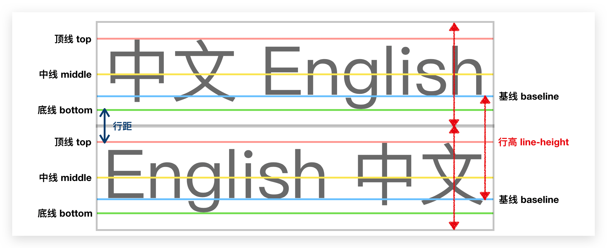
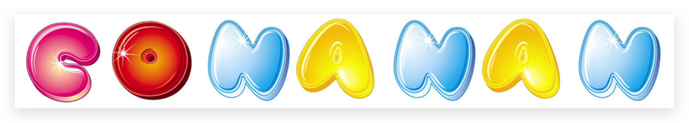

# 属性

## 长度单位 🔥

- px：像素（不是物理像素，是逻辑像素）
- em：相对于自己元素`font-size`的倍数
  - `font-size`：相对于自己元素`font-size`的倍数
  - `width`：相对于自己元素`font-size`的倍数，自己没有则继承父元素的
- rem：相对于**根元素**，具体哪个元素参考上面 em
- %：不同场景相对的不同！太多了需查文档！举例如下两个：
  - `width`：相对于父元素的`width`
  - `margin-top`：相对于父元素的`width`！

## `color` 颜色单位 🔥

其实是**前景色**，包括`border`的颜色。很多元素都可以使用。

### 颜色关键字

如`red`、`green`、`blue`、`black`、`white`、`yellow`、`purple`、`skyblue`等

### RGB

- 十进制：`rgb(red,green,blue)`

  - red：0~255
  - green：0~255
  - blue：0~255

  每个颜色使用一个字节表示，所以为 0~255

- **十六进制**：`#rrggbb`或`#rgb`

  每个颜色使用`0~F`表示，比十进制表示多些，**推荐使用**

### RGBA

`rgba(red,green,blue,alpha)`

- alpha 表示**透明度**，值范围为 0 ～ 1，0 即完全透明，1 即完全不透明

  还有个特别的属性`opacity: .5`可以为整个元素设置透明度

- **transparent**：如下两种表示方式结果一样

  ```css
  div {
    background-color: rgba(0, 0, 0, 0);
    background-color: transparent;
  }
  ```

### HSL & HSLA

- H 色相(0 - 360)\*

- S 饱和度，颜色的浓度 0% - 100%

- L 亮度，颜色的亮度 0% - 100%

  ```css
  background-color: hsla(98, 48%, 40%, 0.658);
  ```

## `font` 字体 🔥

用于定义字体系列、大小、粗细、和文字样式(如斜体)

### `font` 缩写 🔥

```css
选择器 {
  font: [font-style] [font-variant] [font-weight] font-size/line-height
    font-family;
}
```

- 其中不需要设置的属性可以省略（取默认值），但**必须包含**`font-size`、`font-family`，否则 font 属性将不起作用。
- `font-style`、`font-variant`、 `font-weight`顺序可以随意更换，但是必须在`font-size/line-height`之前，`font-family` 必须最后指定

### `font-style` 倾斜

- `normal`正常，默认值
- `italic`斜体，推荐。**字体本身支持斜体，否则无效**
- `oblique`倾斜，**无论字体本身是否支持斜体，都倾斜显示**
- `inherit`

::: tip 注意

平时我们很少给文字加斜体，反而要给斜体标签(em，i)改为不倾斜字体

:::

### `font-variant` 小写字母显示方式

使用很少

- `normal`默认正常显示

- `small-cap`小写字母按照大写字母全大写显示

### `font-weight` 粗细

- `normal` 400，默认值
- `bold` 700
- `100~900`
- 一般使用单词表示

### `font-size` 字号

可以使用相对长度单位，也可以使用绝对长度单位。

- 具体数值+单位

* `%`：设置为基于父元素的一个百分比值，具体相对于什么属性根据文档来看
* `xx-small`、`x-small`、`small`、`medium`、`large`、`x-large`、`xx-large`
* `inherit`：规定应该从父元素继承字体尺寸，**默认**

| 长度单位名称 | 说明                                                                      |
| ------------ | ------------------------------------------------------------------------- |
| **px**       | 相对长度单位，像素，推荐使用                                              |
| **em**       | 相对长度单位，相对于自己元素的`font-size`大小\*em                         |
| **rem**      | 相对长度单位，相对于 root 元素的`font-size`大小\*em，浏览器中为`html`元素 |
| in           | 绝对长度单位，英寸                                                        |
| cm           | 绝对长度单位，厘米                                                        |
| mm           | 绝对长度单位，毫米                                                        |
| pt           | 绝对长度单位，点                                                          |

::: tip 注意

Chrome 默认的普通文字（如段落）大小为**16px**，但是不同浏览器可能默认显示的字号大小不一致，**一般给 body 指定整个页面文字的大小**。

Chrome 默认最小`font-size`是 12px，注意使用`em`、`rem`和`%`时的字体大小

:::

### `font-family` 字体

- 各种字体之间必须使用**英文状态下的逗号隔开**，**以第一个为准，找不到则找下一个**，以此类推
- 一般如果字体名中包含`空格`、`#`、`$`等符号或是 `中文字体`，**加引号**（单双都可），有**连接符号**则不用加引号
- 在设置多个字体时，一般**建议先写英文字体，后写中文字体**，否则容易造成中文字体覆盖了英文字体
- 尽量使用系统默认自带字体，保证在任何用户的浏览器中都能正确显示

::: tip 注意

在 CSS 中设置字体名称，直接写中文是可以的。但是在文件编码（GB2312、UTF-8 等）不匹配时会产生乱码的错误。XP 系统不支持类似**微软雅黑**的中文。解决如下：

- 使用英文来替代。 比如`font-family:"Microsoft Yahei"`。
- 在 CSS 直接使用 Unicode 编码来写字体名称可以避免这些错误。使用 Unicode 写中文字体名称，浏览器是可以正确的解析的。

| 字体名称     | 英文名称        | Unicode 编码         |
| ------------ | --------------- | -------------------- |
| 宋体         | SimSun          | \5B8B\4F53           |
| 新宋体       | NSimSun         | \65B0\5B8B\4F53      |
| 黑体         | SimHei          | \9ED1\4F53           |
| 微软雅黑     | Microsoft YaHei | \5FAE\8F6F\96C5\9ED1 |
| 楷体\_GB2312 | KaiTi_GB2312    | \6977\4F53_GB2312    |
| 隶书         | LiSu            | \96B6\4E66           |
| 幼园         | YouYuan         | \5E7C\5706           |
| 华文细黑     | STXihei         | \534E\6587\7EC6\9ED1 |
| 细明体       | MingLiU         | \7EC6\660E\4F53      |
| 新细明体     | PMingLiU        | \65B0\7EC6\660E\4F53 |

:::

## `@font-face` 网络字体

@font-face 可以让网页支持网络字体（Web Font），不再局限于系统自带的字体

```css
@font-face {
  font-family: 'conanan';
  src: url('./font/conanan.ttf'), url('./font/conanan.otf');
}

p {
  font-family: 'conanan';
}
```

常见的字体种类：

- TrueType：.ttf
- OpenType：.ttf、.otf，建立在 TrueType 之上
- Embedded OpenType：.eot，OpenType 字体的压缩版
- SVG：.svg、.svgz
- web 开放字体：.woff，建立在 TrueType 字体之上

注意加载速度和版权问题！

根据浏览器的支持，准备多种字体

Google Fonts 下载：https://fonts.google.com

## 字体图标

### 发展

字体图标使用场景：主要用于显示网页中通用、常用的一些小图标。

精灵图是有诸多优点的，但是缺点很明显。

- 图片文件还是比较大的。
- 图片本身放大和缩小会失真。
- 一旦图片制作完毕想要更换非常复杂。

此时，有一种技术的出现很好的解决了以上问题，就是字体图标 iconfont。字体图标可以为前端工程师提供一种方便高效的图标使用方式，展示的是图标，本质属于字体。

### 优点

- 轻量级：一个图标字体要比一系列的图像要小。一旦字体加载了，图标就会马上渲染出来，减少了服务器请求
- 灵活性：本质其实是文字，可以很随意的改变颜色、产生阴影、透明效果、旋转等
- 兼容性：几乎支持所有的浏览器，请放心使用

注意：**字体图标不能替代精灵技术**，只是对工作中图标部分技术的提升和优化。

- 如果遇到一些结构和样式比较简单的小图标，就用字体图标。
- 如果遇到一些结构和样式复杂一点的小图片，就用精灵图。

### 使用

字体图标是一些网页常见的小图标，我们直接网上下载即可。 因此使用可以分为:

1. 字体图标的下载，把下载包里面的 fonts 文件夹放入**页面根目录**下

   不同浏览器所支持的字体格式是不一样的，字体图标之所以兼容就是因为包含了主流浏览器支持的字体文件。

   - TureType(.ttf)格式.ttf 字体是 Windows 和 Mac 的最常见的字体，支持这种字体的浏览器有 IE9+、Firefox3.5+、 Chrome4+、Safari3+、Opera10+、iOS Mobile、Safari4.2+;
   - Web Open Font Format(.woff)格式 woff 字体，支持这种字体的浏览器有 IE9+、Firefox3.5+、Chrome6+、 Safari3.6+、Opera11.1+;
   - Embedded Open Type(.eot)格式.eot 字体是 IE 专用字体，支持这种字体的浏览器有 IE4+;
   - SVG(.svg)格式.svg 字体是基于 SVG 字体渲染的一种格式，支持这种字体的浏览器有 Chrome4+、Safari3.1+、 Opera10.0+、iOS Mobile Safari3.2+;

2. 字体图标的引入 (引入到我们 html 页面中)

   一般下载的 demo 会有介绍

3. 字体图标的追加 (以后添加新的小图标)

### 推荐下载网站

- [Font Awesome](https://fontawesome.com/)

  别进中文网站了，版本太低！

- [icomoon](http://icomoon.io)

  IcoMoon 成立于 2011 年，推出了第一个自定义图标字体生成器，它允许用户选择所需要的图标，使它们成

  一字型。该字库内容种类繁多，非常全面，唯一的遗憾是国外服务器，打开网速较慢。

- [iconfont](http://www.iconfont.cn/)

  这个是阿里妈妈 M2UX 的一个 iconfont 字体图标字库，包含了淘宝图标库和阿里妈妈图标库。可以使用 AI 制作图标上传生成。 重点是，免费!

## `text` 文本 🔥

定义文本的外观

### `text-decoration` 修饰 🔥

简写方式，可以使用普通属性三个值中的任何一个，可以组合使用

```
<'text-decoration-line'> || <'text-decoration-style'> || <'text-decoration-color'> || <'text-decoration-thickness'>
```

- `text-decoration-line` 文本修饰线的位置
  - `none`表示没有文本修饰效果。**默认，常用**。一般给所有`a`标签去掉下划线时使用
  - `underline` 在文本的下方有一条修饰线。**常用**
  - `overline` 在文本的上方有一条修饰线。
  - `line-through` 有一条贯穿文本中间的修饰线
  - ~~`blink` 文本闪烁（文本交替处于显示与隐藏状态），不宜使用。~~
- `text-decoration-colo` 设置文本修饰线的颜色
- `text-decoration-style` 设置文本修饰线的样式
  - `solid` 画一条实线。
  - `double` 画一条双实线。
  - `dotted` 画一条点划线。
  - `dashed` 画一条虚线。
  - `wavy` 画一条波浪线。
  - `-moz-none` 不画线。亦可用 `text-decoration-line : none` 替代。

### `text-align` 元素内元素水平对齐 🔥

让**元素里**的**内容（可能还是元素，不一定非是文本，其实文本是文本元素）**水平对齐

- `left`
- `right`
- `center`
- `justify`：两端对齐，但是对最后一行没有效果，可以使用`text-align-last: justify`解决
- `inherit`
- ...

```html
<style>
    .outer {
        height: 100px;
        background-color: skyblue;
        text-align: center;
    }
    .inner {
        background-color: palegreen;
    }
</style>
<div class="outer">
    <div class="inner">haha</div>
</div>
```

此时 haha 会居中显示，如下：

::: demo [vanilla]

```html
<html>
    <div class="demo1">
        <div class="outer">
        <div class="inner">haha</div>
    </div>
    </div>
</html>

<style>
  .demo1 .outer {
    height: 100px;
    background-color: skyblue;
    text-align: center;
  }
  .demo1 .inner {
    background-color: palegreen;
  }
</style>
```

:::


若改变下 inner 的宽度

```html
<style>
  .outer {
    height: 100px;
    background-color: skyblue;
    text-align: center;
  }
  .inner {
    width: 200px;
    background-color: palegreen;
  }
</style>
<div class="outer">
  <div class="inner">haha</div>
</div>
```

显示如下

::: demo [vanilla]

```html
<html>
    <div class="demo2">
        <div class="outer">
        <div class="inner">haha</div>
    </div>
    </div>
</html>

<style>
  .demo2 .outer {
    height: 100px;
    background-color: skyblue;
    text-align: center;
  }
  .demo2 .inner {
    width: 200px;
    background-color: palegreen;
  }
</style>
```

:::

这是由于`div`是**块级元素**，独占一行（即使`width`缩小），且`text-align: center;`只是让`.outer`的内部元素即`.inner`居中对齐。由于此时`.inner`还是独占一行，所以`.outer`认为`.inner`已经居中对齐了，所以`.inner`元素的位置不会改变，`haha`居中是由于`.inner`继承了`.outer`的居中对齐样式！

可以给`.inner`使用`display: inline-block`即可解决。

### `line-height` 行高 🔥

::: tip 提示

行高即行间距影响阅读顺序，横读或竖读

:::

行高的严格定义：两行文字**基线（baseline）**之间的**间距**。由下图可得：**行高 = 上空隙 + 下空隙 + 文字本身高度**。



**行高小于盒子高度则文字偏上，否则文字偏下**，前提是行高小于等于盒子高度。否则行高将撑开盒子，不用设置盒子高度了。

可据此来间接实现**盒子中的文本垂直居中**，让其等于块级盒子的`height`即可。也可以在 `font` 中 `font-size` 指定：`font-size: 16px/1.5`即文字大小的 1.5 倍

- `normal` 默认
- `px`
- `em`
- `%` 不跟单位，倍数关系
- 没有单位，表示`font-size`的**倍数**
- `inherit`
- ...

### `text-indent` 缩进

- `px`：一般在 Chrome 中设置 32px 即可，因为 Chrome 中一个字符是 16px

- `em`，em 是一个相对单位，就是当前元素的`font-size` 倍数的大小，如果当前元素没有设置大小，则会按照父元素的 1 个文字大小。

  ```css
  p {
    text-indent: 2em; /*相对 p 元素 font-size 大小的 2 倍*/
  }
  ```

- `rem`：相对`root`在浏览器中即`html`的大小

- `%`

- `inherit`，默认继承父类

- ...

### `text-shadow` 文字阴影

不常用

```css
text-shadow: h-shadow v-shadow blur color;
```

| 值         | 描述                                                                                           |
| :--------- | :--------------------------------------------------------------------------------------------- |
| _h-shadow_ | 必需。水平阴影的位置。允许负值。                                                               |
| _v-shadow_ | 必需。垂直阴影的位置。允许负值。                                                               |
| _blur_     | 可选。模糊的距离。                                                                             |
| _color_    | 可选。阴影的颜色。参阅 [CSS 颜色值](https://www.w3school.com.cn/cssref/css_colors_legal.asp)。 |

### `letter-spacing` 字符间距

每个字符（单个字母、单个汉字等）之间的间距

- `normal`，默认即 0
- `[length]`，单位`px`，可以为负值（挤压一起）
- `inherit`

### `word-spacing` 字间距

每个单词（一个英文单词、没有空格的一组汉字）之间的间距

- `normal`，默认即 0
- `[length]`，单位`px`，可以为负值（挤压一起）
- `inherit`

### `text-transform` 大小写转换

- `none`：没有任何影响，默认

- `capitalize`：**每个单词首字母大写**
- `uppercase` ：**全大写**
- `lowercase`：**全小写**

## `vertical-align` 与文字垂直对齐

### 介绍

一般**重置元素**时使用，实际使用不多。

其会影响**行内元素**在一个**行盒**`line-box`中垂直方向的位置。经常用于**设置图片或者表单**（行内块元素）和**文字**垂直对齐。

思考：一个 div 没有设置`height`时，会不会有`height`？

- 没有内容，则没有`height`

- 有内容，则有内容撑起来的`height`

  内容撑起来的高度的本质是？内容有`line-height`，撑起来 div 的`height`

`line-height`为什么可以撑起`div`的高度？

- 这是因为`line-box`的存在，且`line-box`有一个特性，包裹每行的`inline-level`元素
- 而其中的文字是有`line-height`的，必须将整个`line-height`包裹进去，才算包裹这个`inline-leve`元素

| 值          | 描述                                                                             |
| :---------- | :------------------------------------------------------------------------------- |
| baseline🔥  | 默认。元素放置在父元素的**基线**上。                                             |
| sub         | 垂直对齐文本的下标。                                                             |
| super       | 垂直对齐文本的上标                                                               |
| top🔥       | 把元素的顶端与行中最高元素的顶端对齐                                             |
| text-top    | 把元素的顶端与父元素字体的顶端对齐                                               |
| middle🔥    | 行内盒子的中心点与父盒子基线加上`x`height 一半的线对齐（文字下沉，不一定是中线） |
| bottom🔥    | 把元素的顶端与行中最低的元素的顶端对齐。                                         |
| text-bottom | 把元素的底端与父元素字体的底端对齐。                                             |
| length      |                                                                                  |
| %           | 使用 "line-height" 属性的百分比值来排列此元素。允许使用负值。                    |
| inherit     | 规定应该从父元素继承 vertical-align 属性的值。                                   |


### 案例 1：图片底部默认空白缝隙

**解决图片底部默认空白缝隙问题**

bug：div（不指定 height）包裹图片时底侧会有一个**空白缝隙**，原因是**行内块元素会和文字的基线对齐**，解决方法如下：

- 给图片添加 `vertical-align: middle | top| bottom` 等，**推荐**
- 或把图片转换为块级元素`display: block;`不推荐

### 图片在盒子中垂直居中对齐

```html
<style>
  div {
    height: 600px;
    background-color: skyblue;
    line-height: 600px;
    font-size: 0;
  }

  img {
    vertical-align: middle;
  }
</style>
<div>
  
</div>
```

### 盒子中有文字

则不能这样做，因为`font-size: 0;`，需使用定位

```html
<style>
  div {
    height: 600px;
    background-color: skyblue;
  }

  img {
    position: relative;
    top: 50%;
    transform: translate(0, -50%);
  }
</style>
<div>
  
  <span>XxsfsfsfsfSFsF</span>
</div>
```

## `background` 背景 🔥

### `background` 缩写 🔥

```css
div {
  background: image position[/size] repeat attachment color; /* 常用的 */
}
```

background 属性被指定多个背景层时，使用逗号分隔每个背景层。每一层的语法如下：

- 在每一层中，下列的值可以出现 0 次或 1 次：
  - `<bg-image>`
  - `<position>`
  - `<bg-size>`
  - `<repeat-style>`
  - `<attachment>`
- `<bg-size>` 只能紧接着 `<position>` 出现，以`/`分割，如： `center/80%`.
- `<box>` 可能出现 0 次、1 次或 2 次。如果出现 1 次，它同时设定 `background-origin` 和 `background-clip`。如果出现 2 次，第一次的出现设置 `background-origin`，第二次的出现设置 `background-clip`。
- `<background-color>` **只能被包含在最后一层**。

### `background-image` 背景图片 🔥

常用于 **logo、装饰性小图片、超大背景图、精灵图**，相比 img 非常**便于控制位置**。

会**盖在（不是覆盖，不会替换，会有多层，图片没占满空间则后面会显示背景颜色）`background-color`上**。

**元素必须有宽高**，否则背景图片显示不出来。

- 默认为`nono`；
- `url(test.png)`，也可以加引号。可写多个`url`，默认显示第一张，除非第一张显示不了

### `background-position` 背景定位 🔥

#### 使用

```css
background-position: x y;
```

参数代表 x，y 坐标，可以使用**方位名词**或**精确单位**。可用于**精灵图**（Sprite）

- `position` ：`left` 、`center` 、`right` ；`top` 、`center` 、`bottom` 。

  分号前后可两两组合，与**顺序无关**，因为上下左右用词不一样；

  若只指定了一个方位名词，另一个省略，则第二个值默认居中对齐

- `length` ：百分数｜由浮点数和单位标识符组成的长度值。

  第一个必须是 x 坐标，第二个必须是 y 坐标。图像的左上角距盒子左上角的偏移。

  若只指定了一个精确值，另一个省略，则第二个值默认居中对齐

- **混合单位**：混合上述两个，但第一个必须是 x 坐标，第二个必须是 y 坐标

#### 为什么需要精灵图 Sprite

一个网页中往往会应用很多小的背景图像作为修饰，当网页中的图像过多时，服务器就会频繁地接收和发送请求图片，造成服务器请求压力过大，这将大大降低页面的加载速度。因此，为了有效地减少服务器接收和发送请求的次数，提高页面的加载速度，出现了 **CSS 精灵技术**（也称 **CSS Sprites**、**CSS 雪碧**）。

核心原理：**将网页中的一些小背景图像整合到一张大图中** ，这样服务器只需要一次请求就可以了。

在王者荣耀官网和淘宝官网中可看到应用。

#### 精灵图 Sprite 的使用

使用精灵图核心:

- 精灵图主要针对于**小的背景图片使用**。
- 移动背景图片位置， 此时可以使用 `background-position` 。
- 一般情况下精灵图都是**负值（距离父盒子距离）**。千万注意网页中的坐标：x 轴右边走是正值，左边走是负值， y 轴同理。

```html
<!DOCTYPE html>
<html lang="en">
  <head>
    <meta charset="UTF-8" />
    <meta name="viewport" content="width=device-width, initial-scale=1.0" />
    <meta http-equiv="X-UA-Compatible" content="ie=edge" />
    <title>精灵图</title>
    <style>
      .sprites {
        width: 1200px;
        height: 100px;
        margin: 100px auto;
      }

      .sprites .c {
        display: inline-block;
        width: 120px;
        height: 120px;
        background: url(./images/abcd.jpg) -230px 0;
      }

      .sprites .o {
        display: inline-block;
        width: 120px;
        height: 120px;
        background: url(./images/abcd.jpg) -370px -270px;
      }

      .sprites .n {
        display: inline-block;
        width: 120px;
        height: 120px;
        background: url(./images/abcd.jpg) -250px -270px;
      }

      .sprites .a {
        display: inline-block;
        width: 120px;
        height: 120px;
        background: url(./images/abcd.jpg) 0 -5px;
      }
    </style>
  </head>

  <body>
    <div class="sprites">
      <span class="c"></span>
      <span class="o"></span>
      <span class="n"></span>
      <span class="a"></span>
      <span class="n"></span>
      <span class="a"></span>
      <span class="n"></span>
    </div>
  </body>
</html>
```



### `background-size` 背景大小 🔥

设置背景图片大小。图片可以保有其原有的尺寸，或拉伸到新的尺寸，或在保持其原有比例的同时缩放到元素的可用空间的尺寸。

- `auto`：以背景图片的比例缩放背景图片，原始大小
- `cover`：缩放背景图片以**完全覆盖背景区**，**可能背景图片部分看不到**。和 `contain` 值相反，`cover` 值**尽可能大的缩放背景图像**并保持图像的宽高比例（图像不会被压扁）。该背景图以它的全部宽或者高覆盖所在容器。当容器和背景图大小不同时，背景图的 左/右 或者 上/下 部分会被**裁剪**。
- `contain`：缩放背景图片以**完全装入背景区**，**可能背景区部分空白**。`contain` 尽可能的缩放背景并**保持图像的宽高比例**（图像不会被压缩）。该背景图会填充所在的容器。当背景图和容器的大小的不同时，容器的空白区域（上/下或者左/右）会显示由 background-color 设置的背景颜色。
- `<percentage>`即百分比：指定背景图片相对**背景区**（background positioning area）的百分比。背景区由 background-origin 设置，**默认为盒模型的内容区与内边距**，也可设置为只有内容区，或者还包括边框。如果 attachment 为 fixed，背景区为浏览器可视区（即视口），不包括滚动条。不能为负值。若**只有一个值，则表示按宽度缩放**；有两个值，则按宽高缩放
- `<length>` ：**指定背景图片大小**，不能为负值。写一个值，则另一个默认为 auto。多个值则按照值计算。

### `background-repeat` 背景平铺 🔥

- `repeat` 平铺，默认值
- `no-repeat` 不平铺，**常用**
- `repeat-x` 水平方向上重复
- `repeat-y` 垂直方向上重复

### `background-attachment` 背景附着 🔥

决定背景图像的位置是**在视口内固定**，还是随着**包含它的区块滚动**。常用于**视差滚动效果**，如下载 QQ 首页。

查看[MDN 文档演示](https://developer.mozilla.org/zh-CN/docs/Web/CSS/background-attachment)

- `scroll`： 默认，此关键字表示**背景相对于元素本身固定**， 而不是随着它的内容滚动（对元素边框是有效的）。
- `fixed`：此关键字表示**背景相对于视口固定**。即使一个元素拥有滚动机制，背景也不会随着元素的内容滚动。
- `local`：此关键字表示**背景相对于元素的内容固定**。如果一个元素拥有滚动机制，背景将会随着元素的内容滚动， 并且背景的绘制区域和定位区域是相对于可滚动的区域而不是包含他们的边框。

### `background-origin`偏移原点

背景图片的偏移量计算的原点，注意兼容性

- `padding-box` 默认值，background-position 从内边距处开始计算
- `content-box` 背景图片的偏移量从内容区处计算
- `border-box` 背景图片的变量从边框处开始计算

### `background-clip`背景范围

设置背景的范围，注意兼容性

- `border-box` 默认值，背景会出现在边框的下边
- `padding-box` 背景不会出现在边框，只出现在内容区和内边距
- `content-box` 背景只会出现在内容区

### `background-color` 背景颜色

- 默认值为`transparent` 透明；
- 预设值；
- #FFFFFF；
- RGB；
- RGBA，A 代表 alpha 不透明度，即 0 代表透明，1 代表不透明。**影响的只有背景色**。0.3 可省略为.3

### img 和 background-image 选择

|                        |         img         |       background-image       |
| :--------------------: | :-----------------: | :--------------------------: |
|          性质          |      HTML 元素      |           CSS 样式           |
|    图片是否占用空间    |         ✅          |              ❌              |
|   浏览器右键复制图片   |         ✅          |              ❌              |
|    支持 CSS Sprite     |         ❌          |              ✅              |
| 更有可能被搜索引擎收录 | ✅（配合 alt 属性） |              ❌              |
|        加载顺序        |      优先加载       | 等加载完 HTML 元素后按需加载 |

- img：作为网页重要组成部分，如广告图片、LOGO 图片、文章配图、产品图片
- bgi：可有可无，有使网页更美观，无也不影响用户获取完整网页内容信息

### `gradient`图片渐变 🔥

通过渐变可以设置一些复杂的背景颜色，可以实现从一个颜色向其他颜色过渡的效果。**渐变是图片**，通过`background-image`设置。详细看文档吧。

- `linear-gradient()` 线性渐变，颜色沿着一条直线发生变化

  ```css
  linear-gradient(red,yellow) /* 红色在开头，黄色在结尾，中间是过渡区域 */
  ```

  渐变可以同时指定多个颜色，多个颜色默认情况下平均分布，也可以手动指定渐变的分布情况

  线性渐变的开头，我们可以指定一个渐变的方向：

  - to left
  - to right
  - to bottom
  - to top
  - deg deg 表示度数
  - turn 表示圈

- `repeating-linear-gradient()` 可以平铺的线性渐变

  ```html
  <style>
    .box1 {
      width: 200px;
      height: 200px;
      /* background-image: linear-gradient(red,yellow,#bfa,orange); */
      /* background-image: linear-gradient(red 50px,yellow 100px, green 120px, orange 200px); */
      background-image: repeating-linear-gradient(to right, red, yellow 50px);
    }
  </style>
  <div class="box1"></div>
  ```

- `radial-gradient()` 径向渐变（**放射性**的效果）

  默认情况下径向渐变的形状根据元素的形状来计算的：

  - 正方形 --> 圆形
  - 长方形 --> 椭圆形

  我们也可以手动指定径向渐变的大小：

  - circle
  - ellipse

  也可以指定渐变的位置

  ```css
  radial-gradient(大小 at 位置, 颜色 位置 ,颜色 位置 ,颜色 位置)
  ```

  大小：

  - circle 圆形
  - ellipse 椭圆
  - closest-side 近边
  - closest-corner 近角
  - farthest-side 远边
  - farthest-corner 远角

  位置：

  - top right left center bottom

- `repeating-radial-gradient()` 可以平铺的径向渐变

## `list-style` 列表 🔥

### `list-style` 缩写 🔥

语法，一般就写`list-style-type`的值`none`

```css
list-style: list-style-type list-style-position list-style-image;
```

### `list-style-type` 类型

- `none` 去掉样式，**常用于取消列表左侧样式**
- `circle` 空圆
- `disc` 实圆
- `square` 实方块
- `decimal` 数字
- ...

### `list-style-position` 放置位置

- `outside` 默认列表标记放置文本以外
- `inside` 默认列表标记放置文本以内

### `list-style-image` 图片样式

基本不用

- `url("test.gif")`

## `display` & `visibility` & `overflow` 🔥

### `display`

`display`属性有两个作用：

- **一是定义元素的类型**（块元素或行内元素，只改变显示角色，不改变固有性质），规定元素的[流式布局](https://wiki.developer.mozilla.org/zh-CN/docs/Web/CSS/CSS_Flow_Layout)。此处只介绍该作用
- 二是控制其**子元素的布局**（[Flex](https://wiki.developer.mozilla.org/zh-CN/docs/Web/CSS/CSS_Flexible_Box_Layout) 或 [Grid](https://wiki.developer.mozilla.org/zh-CN/docs/Web/CSS/CSS_Grid_Layout)）

**常见属性值**有：

- `block` 转换为块级元素。有些块级元素默认不是设置的该值

- `inline` 转换为行内元素

- `inline-block` 同时具备块级、行内元素特性，即同一行显示，也可设置宽高内外边距。

  主要**用于行内非替换元素的宽高内外边距设置**和**块级元素同一行显示**

- `none` **隐藏**元素，**不再占有原来的位置**，但是元素**还存在于 DOM 中**。也可以通过设置`width`或`height`来隐藏！

若`display`设置为如下值，则等同于某些 HTML 元素，但是基本不用

- `table`：`<table>`，一个块级表格
- `inline-table`：`<table>`，一个行内表格，基本不用
- `table-row`：`<tr>`
- `table-row-group`：`<tbody>`
- `table-header-group`：`<thead>`
- `table-footer-group`：`<tfoot>`
- `table-cell`：`<th>` `<td>`
- `table-caption`：`<caption>`，表格的标题
- `list-item`：`<li>`

如 a 标签为行内元素，不能设置宽、高之类的，需要转换为块级元素。

```css
a {
  display: block;
  width: 100px;
  background-color: pink;
  text-decoration: underline red double;
}
```

### `visibility`

`visibility` 属性用于控制一个元素的可见性

- `visible` 元素可见
- `hidden` 元素隐藏，**隐藏元素后，继续占有原有 DOM 位置**

### `overflow`

overflow 属性指定了**内容溢出**一个元素的框（超过其指定高度及宽度）时，会发生什么。

可以区分 x,y 轴（但是没成为标准，不推荐），取值同`overflow`

- `overflow-x`
- `overflow-y`

| 值       | 描述                                                                                         |
| :------- | :------------------------------------------------------------------------------------------- |
| visible  | 默认值。内容不会被修剪，**会呈现在元素框之外**。                                             |
| hidden🔥 | 内容会被修剪，并且其余内容是不可见的。                                                       |
| scroll   | 内容会被修剪，但是浏览器**总是会显示滚动条**以便查看其余的内容。                             |
| auto🔥   | **自动**。如果内容被修剪，则浏览器会显示滚动条（滚动条也属于宽高一部分）以便查看其余的内容。 |
| inherit  | 规定应该从父元素继承 overflow 属性的值。                                                     |

一般情况下，我们都不想让溢出的内容显示出来，因为溢出的部分会影响布局。

**如果有定位的盒子**，请**慎用**`overflow:hidden`，因为它会隐藏多余的部分。此时利用其副作用对首页大图进行定位微调

### 遮罩案例

核心原理：原先半透明的黑色遮罩看不见，鼠标经过大盒子，就显示出来。 遮罩的盒子不占有位置，就需要用**绝对定位 和 display 配合**。详细查看学成在线代码

```css
/* mask遮罩 */
.box .box-body .mask {
  /* 隐藏遮罩 */
  display: none;
  position: absolute;
  width: 228px;
  height: 270px;
  background: rgba(0, 0, 0, 0.4) url(./images/arr.png) no-repeat 100px 60px;
}

/* 鼠标经过li盒子时（不能是经过mask），才让mask显示，和以往不同的写法，注意 */
.box .box-body ul li:hover .mask {
  display: block;
}
```

学习了伪元素选择器后，改写为

```css
/* mask遮罩 */
.box .box-body ul li::before {
  /* 必须加content */
  content: '';
  /* 隐藏遮罩 */
  display: none;
  position: absolute;
  width: 228px;
  height: 270px;
  background: rgba(0, 0, 0, 0.4) url(./images/arr.png) no-repeat 100px 60px;
}

/* 鼠标经过li盒子时（不能是经过mask），才让mask显示，和以往不同的写法，注意 */
.box .box-body ul li:hover::before {
  display: block;
}
```

## `word-break` 单词换行

- `break-all`强制换行。默认单词（或一个汉字）就会换行，但是若是遇到`aaaaa...`这种可使用该属性解决

## 溢出文字隐藏 🔥

### `white-space`

用于设置**空白处理**和**换行规则**

- `normal`：合并所有连续的空白，允许单词超屏时自动换行
- `mowrap`：合并所有连续的空白，不允许单词超屏时自动换行

### `text-overflow`

用来设置文字溢出时的行为（处理那部分不可见的内容）。生效的前提是`overflow`不为`visible`

- `clip`：溢出的内容直接裁剪掉（字符可能显示不完整）
- `ellipsis`：溢出的那行的结尾用省略号表示

### 单行文本溢出显示省略号

必须满足三个条件

```html
<style>
  p {
    width: 100px;
    margin: 0 auto;
    background-color: skyblue;

    /*1. 先强制一行内显示文本，默认 normal 自动换行*/
    white-space: nowrap;
    /*2. 超出的部分隐藏*/
    overflow: hidden;
    /*3. 文字用省略号替代超出的部分*/
    text-overflow: ellipsis;
  }
</style>
<p>
  哈哈哈哈哈段落哈哈哈哈哈段落哈哈哈哈哈段落
</p>
```

::: demo [vanilla]

```html
<html>
    <div class="demo3">
        <p>
            哈哈哈哈哈段落哈哈哈哈哈段落哈哈哈哈哈段落
        </p>
    </div>
</html>

<style>
    .demo3 p {
        width: 100px;
        margin: 0 auto;
        background-color: skyblue;

        /*1. 先强制一行内显示文本，默认 normal 自动换行*/
        white-space: nowrap;
        /*2. 超出的部分隐藏*/
        overflow: hidden;
        /*3. 文字用省略号替代超出的部分*/
        text-overflow: ellipsis;
    }
</style>

```

:::

### 多行文本溢出显示省略号

多行文本溢出显示省略号，有较大兼容性问题

```html
<style>
  p {
    width: 100px;
    /* 不能指定高度，否则虽然第二行末尾省略号显示，但是之后的行还是会显示所有文字 */
    margin: 0 auto;
    background-color: skyblue;

    /* 1. 弹性伸缩盒子模型显示 */
    display: -webkit-box;
    /* 2. 超出的部分隐藏*/
    overflow: hidden;
    /* 3. 文字用省略号替代超出的部分*/
    text-overflow: ellipsis;
    /* 4. 限制在一个块元素显示的文本的行数 */
    -webkit-line-clamp: 2;
    /* 5. 设置或检索伸缩盒对象的子元素的排列方式 */
    -webkit-box-orient: vertical;
  }
</style>
<p>
  哈哈哈哈哈段落哈哈哈哈哈段落哈哈哈哈哈段落哈哈哈哈哈段落哈哈哈哈哈段落哈哈哈哈哈段落
</p>
```

::: demo [vanilla]

```html
<html>
    <div class="demo4">
        <p>
            哈哈哈哈哈段落哈哈哈哈哈段落哈哈哈哈哈段落哈哈哈哈哈段落哈哈哈哈哈段落哈哈哈哈哈段落
        </p>
    </div>

</html>
<style>
    .demo4 p {
        width: 100px;
        /* 不能指定高度，否则虽然第二行末尾省略号显示，但是之后的行还是会显示所有文字 */
        margin: 0 auto;
        background-color: skyblue;

        /* 1. 弹性伸缩盒子模型显示 */
        display: -webkit-box;
        /* 2. 超出的部分隐藏*/
        overflow: hidden;
        /* 3. 文字用省略号替代超出的部分*/
        text-overflow: ellipsis;
        /* 4. 限制在一个块元素显示的文本的行数 */
        -webkit-line-clamp: 2;
        /* 5. 设置或检索伸缩盒对象的子元素的排列方式 */
        -webkit-box-orient: vertical;
    }
</style>

```

:::

更推荐让后台人员来做这个效果，因为后台人员可以设置显示多少个字，操作更简单。

## `cursor` 光标 🔥

- `auto` ：默认，浏览器设置的光标
- `default`：默认为小白箭头
- `pointer`：指示链接的手型，**常用**
- `text`：文本
- `move`：四方箭头
- `not-allowed`：禁止
- `wait`：沙漏、转圈、表
- `help`：箭头带问号
- `crosshair`：十字架
- `url`：自定义光标的 url
- `none`：没有任何显示

## `resize` 防止拖拽

防止拖拽 textarea（textarea 标签放在同一行即可没有类似 padding 的空白距离）

- `none`：禁止拖拽，右下角那个功能也就没有了

## 浏览器私有前缀

模块化打包工具如 Webpack 会自动添加前缀，不使用则需要自己查看文档添加
