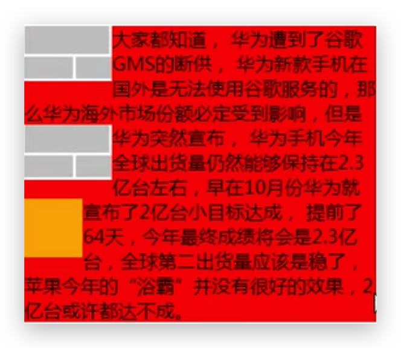
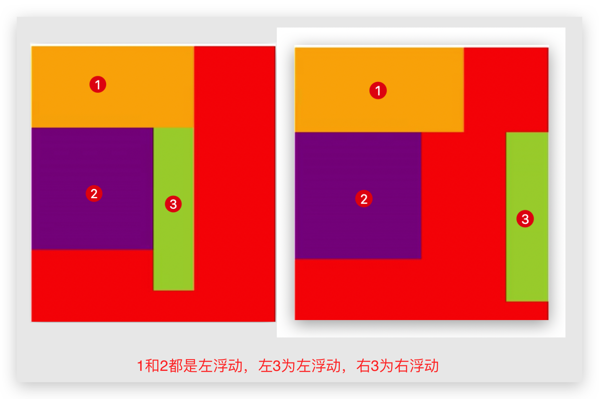
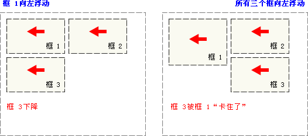

# Float 浮动

## 浮动规则

```css
选择器 {
  float: 属性值;
}
```

| 值      | 描述                                                 |
| :------ | :--------------------------------------------------- |
| left    | 元素向左浮动。                                       |
| right   | 元素向右浮动。                                       |
| none    | 默认值。元素不浮动，并会显示在其在文本中出现的位置。 |
| inherit | 规定应该从父元素继承 float 属性的值。                |

- **脱标**。查看脱离标准流元素特点总结元素类型

- 浮动用于**创建浮动框**，将元素**横向移到一边**，直到左边缘或右边缘触及 **包含块（容器或父元素）** 或 **另一个浮动框** 的边缘。

- 浮动的元素允许**文本和行内元素（inline 或 inline-block 等）环绕**它

- **行内元素（inline 或 inline-block 等）浮动后**，其**顶部将与所在行的顶部对齐，不会朝上浮**

  

- **定位元素（非 static）会层叠在浮动元素上**（按标准流——浮动——定位的顺序）。**浮动元素间不能层叠（不多解释）**。

- 浮动元素的**顶端不能超过包含块的顶端**，也**不能超过之前所有浮动元素的的顶端（以最低的为界限）**

  

- 如果包含框太窄，无法容纳水平排列的三个浮动元素，那么其它**浮动块向下移动**，直到有足够的空间；如果浮动元素的高度不同，那么当它们向下移动时可能被其它浮动元素“**卡住**”

  

## 脱离标准流元素特点—重复 🔥

- 可以设置`width`、`height`
- 默认`width`、`height`由内容决定
- 不再给父元素汇报`width`、`height`数据，即父元素也不知道该元素了
- 类似`inline-block`，但是不是！是`block`！

::: tip 注意

display、position、float 都都影响盒子的生成和布局：

- 当 display 为 none 时，就不会生成盒子，对 position 和 float 无影响
- 当 postion 为 absolute 或 fixed 时，或 float 为 left 或 right 时，元素基本都变为 block 类型（除了布局类型）详细参考文档

:::

## 现象思考 🤔

```html
<div class="box">
  <div class="inner1"></div>
  <div class="inner2">
    我是inner2的文本
  </div>
</div>
```

- 当 inner1 进行左浮动/右浮动时，只会在当前自己行中浮动
- 当 inner1 进行左浮动时，inner2 在没有浮动时，inner1 和 2 会如何排布
- 当 inner1 进行左浮动时，inner2 在没有浮动时，但是 inner2 中有文字，文字会如何排布（假设 inner2 面积大于 inner1）
- 当 inner1 进行左浮动时，inner2 也进行左浮动，那么 inner1 和 inner2 依次在地一行排布
- 当 inner1 进行左浮动时，inner2 也进行左浮动，但是父元素没有设置高度，此时父元素的高度会消失（**高度的坍塌**）

## 浮动的应用

- 解决**行内元素**（包括`inline-block`）的**水平间隙**问题
- **布局**

## 高度坍塌 🔥

由于**父级盒子很多情况下，不方便给高度**，但是子盒子**浮动又不占有位置**，所以由于**父级盒子高度为 0**，就影响了下面的标准流盒子。

## BFC 🔥

BFC（Block Formatting Context）**块级格式化环境**，BFC 是一个 CSS 中的一个隐含的属性，可以为一个元素开启 BFC，开启 BFC 该元素会变成一个**独立的布局区域**。**未开启时，整个页面是一个布局整体**。

可以通过一些特殊方式来**开启**元素的 BFC（可参考[MDN](https://developer.mozilla.org/zh-CN/docs/Web/Guide/CSS/Block_formatting_context)文档）：

- 设置元素的**浮动**（不推荐，高度不会坍塌，但是脱离标准流后 width 随即丢失）

- 将元素设置为**行内块元素**（不推荐，不推荐用于外部容器，且 width 也丢失了）

- 绝对定位（不推荐）

- **将元素的 overflow 设置为一个非 visible 的值**（也不完美，最终推荐 clear ）

  常用的方式即为要开启 BFC 的元素设置 `overflow:hidden`，以使其可以包含浮动元素

**元素开启 BFC**后的**特点**：

- 开启 BFC 的元素**可以包含浮动的子元素**，即**解决高度塌陷问题**

  ```css
  <style>
  .outer {
    border: 10px red solid;
    overflow: hidden;
  }
  .inner {
    float: left;
    width: 100px;
    height: 100px;
    background-color: skyblue;
  }
  </style>
  <div class="outer">
  	<div class="inner"></div>
  </div>
  <div style="width: 200px; height: 200px; background-color: yellow;"></div>
  ```

- 开启 BFC 的元素**不会被浮动元素所覆盖**（兄弟元素）

  ```html
  <style>
    .box1 {
      width: 200px;
      height: 200px;
      background-color: skyblue;
      float: left;
    }

    .box2 {
      width: 200px;
      height: 200px;
      background-color: orange;
      overflow: hidden;
    }
  </style>
  <div class="box1"></div>
  <div class="box2"></div>
  ```

- 开启 BFC 的元素**子元素和父元素外边距不会重叠**

  本来是 box1 带着 box3 往下移动 100px；之后正常

  ```css
  <style>
  .box1 {
    width: 200px;
    height: 200px;
    background-color: skyblue;
    overflow: hidden;
  }

  .box3 {
    width: 100px;
    height: 100px;
    background-color: yellow;
    margin-top: 100px;
  }
  </style>
  <div class="box1">
  	<div class="box3"></div>
  </div>
  ```

## 清除浮动 🔥

### 简介

清除浮动的本质是清除浮动元素造成的影响。**如果父盒子本身有高度，则不需要清除浮动**

**设置清除浮动**之后，浏览器会自动为元素**添加一个上外边距**，父级就会根据浮动的子盒子自动检测高度。父级有了高度，就不会影响下面的标准流了

```css
选择器 {
  clear: 属性值;
}
```

| 值       | 描述                                                                                   |
| :------- | :------------------------------------------------------------------------------------- |
| left     | 在左侧不允许浮动元素。要求元素（新）的顶部低于之前生成的所有左浮动元素的底部。其他同理 |
| right    | 在右侧不允许浮动元素。                                                                 |
| **both** | 清除两侧中最大影响的那侧。实际工作中， **几乎只用 both**                               |
| none     | 默认值。允许浮动元素出现在两侧。                                                       |
| inherit  | 规定应该从父元素继承 clear 属性的值。                                                  |

清除浮动的策略是：**闭合浮动**，将浮动元素只限制到父元素中

### 父元素增加 height—不推荐

略

### 额外块元素法—隔墙法

**额外标签法也称为隔墙法**，是 W3C 推荐的做法。但是**不常用**。额外标签法会在浮动元素末尾添加一个**空的块级元素**。例如

```html
<div style="clear:both"></div>
```

或者`br`标签（没见过这种写法）

```html
<br clear="all" />
```

- 优点: 通俗易懂，书写方便

- 缺点: **添加许多无意义的标签，且样式与结构耦合**。

### 父级添加`::after`伪元素

**父级添加`::after`伪元素**，是额外标签法的升级版。**给父元素添加。强烈推荐**！🔥

```css
/* 为了兼容IE8可以写单冒号 */
.clearfix::after {
  /* content是使用伪元素必须出现的 */
  content: '';
  /* 伪元素默认为行内元素，需改为块级元素 */
  display: block;
  clear: both;

  /* 为了兼容旧浏览器，需写下面2行代码，代表不看到该元素 */
  height: 0;
  visibility: hidden;
}
.clearfix {
  /* 兼容 IE6、7，禁止缩放 */
  *zoom: 1;
}
```

- 优点：没有增加标签，结构更简单

- 缺点：照顾低版本浏览器

  代表网站：百度、淘宝网、网易

### 父级添加双伪元素 🔥

**父级添加双伪元素**，可以看作上述升级版。**给父元素添加。强烈推荐**！🔥

```css
/* 为了兼容IE8可以写单冒号 */
.clearfix::before,
.clearfix::after {
  content: '';
  /* 直接使用block，则before和after会在两行显示，不适用 */
  display: table;
}
.clearfix:after {
  clear: both;
}
.clearfix {
  /* IE6、7 专有 */
  *zoom: 1;
}
```

`.clearfix::before`可以解决父子元素**边界折叠**问题：添加了一个空元素，子元素的`margin-top`相对于该元素

`.clearfix::after`可以解决**高度塌陷**问题，添加了一个空块元素，并清除浮动

- 优点：代码更简洁

- 缺点：照顾低版本浏览器

  代表网站：小米、腾讯等
