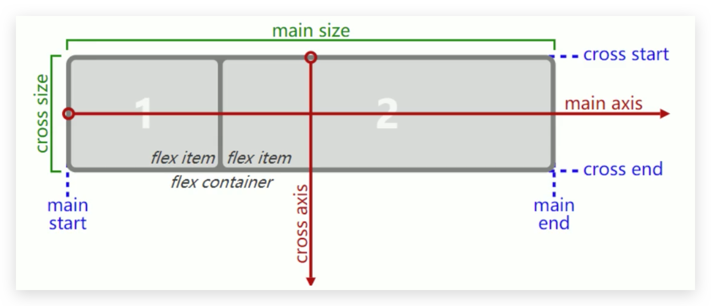

# Flexible 弹性布局

## 简介

移动端使用最多，但 PC 端的 IE10+ 才可以

两个重要概念：

- `flex-container`：开启的 flex 布局的元素
- `flex items`：`flex-container`里面的**直接子元素**

如何开启 Flex ？使用`display`属性

- `flex`：`flex-container`为块元素
- `inline-flex`：`flex-container`为行内元素

## Flex 布局模型



主要区分 main axis（主轴）和 cross axis（交叉轴）

## 用于 `flex-container` 的属性

### flex-direction 🔥

flex-items 默认沿着 **main axis** 从 main start 开始往 main end 方向排布。flex-direction 决定了 main axis 的方向：

- row：默认。行排布，主轴将沿着 **inline** 方向延伸
- row-reverse：反向行排布，主轴将沿着 **inline** 方向延伸。main start 和 main end **交换位置**
- column：列排布，主轴会沿着上下方向延伸 — 也就是 **block 排列的方向。**
- column-reverse：反向列排布，主轴会沿着上下方向延伸 — 也就是 **block 排列的方向。**main start 和 main end **交换位置**

### justify-content 🔥

该属性**决定了 flex items 在 main axis 上的对齐方式**

- flex-start：默认，与 main start 对齐
- flex-end：与 main end 对齐
- center：居中对齐
- space-between：flex items 之间的距离相等；与 main start 、main end **两端对齐**
- space-evenly：flex items 之间的距离相等；flex items 与 main start 、main end 之间的距离**等于** flex items 之间的距离
- space-around：flex items 之间的距离相等；flex items 与 main start 、main end 之间的距离是 flex items 之间距离的**一半**

### align-items 🔥

align-items **决定了 flex-items 在 cross axis 上的对齐方式**

- normal：在弹性布局中，效果和 stretch 一样
- stretch：**当 flex-items 在 cross axis 方向的 size 为 auto 时（不指定）**，会自动**拉伸**至填充 flex container
- flex-start：与 corss start 对齐
- flex-end：与 cross end 对齐
- center：居中对齐
- baseline：与基线对齐（与之前的不同，此处是以第一行文本的基线对齐）

### align-content

align-content **决定了多行 flex items 在 cross axis 上的对齐方式**，用法与 justify-content 类似。**cross axis 一般不会有空隙**。使用较少。

- stretch：与 align-items 的 stretch 类似。基本不使用，因为 div 一般都给高度，不会拉伸填充
- flex-start：与 corss start 对齐
- flex-end：与 cross end 对齐
- center：居中对齐
- space-between：flex items 之间的距离相等；与 main start 、main end **两端对齐**
- space-evenly：flex items 之间的距离相等；flex items 与 main start 、main end 之间的距离**等于** flex items 之间的距离
- space-around：flex items 之间的距离相等；flex items 与 main start 、main end 之间的距离是 flex items 之间距离的**一半**

### flex-wrap 🔥

**默认情况下，所有 flex items 都会在同一行显示，即使指定了 width 也有可能缩小！**flex-wrap 就是解决此问题的

- nowrap：不换行显示，单行
- wrap：换行显示，多行
- wrap-reverse：换行显示，多行（对比 wrap，cross start 与 cross end 相反）使用很少

### flex-flow 缩写

缩写属性，即 flex-direction 或 flex-wrap 的缩写，如

```css
flex-flow: row-reverse wrap;
```

## 用于 `flex items` 的属性

### flex 简写 🔥

是 flex-grow || flex-shrink || flex-basis 的简写，可以值指定 1 个、2 个或 3 个

单值语法，值必须是以下其中之一：

- **一个无单位数**，会被当作 **flex-grow** 的值
- 一个**有效宽度（width）值**，会被当作 **flex-basis** 的值
- 关键字 none，auto 或 initial

双值语法：

- 第一个值必须是一个无单位数，并且它会被当作 flex-grow 的值
- 第二个值必须为：
  - 一个无单位数：被当作 flex-shrink
  - 一个有效单位数：被当作 flex-basis

三值语法：

- 第一个值必须是**一个无单位数**，会被当作 **flex-grow** 的值
- 第二个值必须是**一个无单位数**，会被当作 **flex-shrink** 的值
- 第三个值必须是**一个有效的宽度值**，会被当作 **flex-basis** 的值

### order 🔥

决定 flex items 的排布顺序

- 可以设置任意整数，值越小则排越前
- 默认值 0

### align-self 覆盖 align-items 🔥

flex items 可以通过 align-self 覆盖 flex container 设置的 align-items

- auto：默认，遵从 flex container 的 align-items 设置
- stretch、flex-start、flex-end、center、baseline，效果和 align-items 一致

### flex-grow

决定了 flex items 如何**扩展**

- 可以设置任意**非负数字**，默认值 0
- 当 flex container **在 main axis 方向上有剩余 size 时**，flex-grow 才会生效

如果所有的 flex items 的 flex-grow 总和 sum 大于 1，每个 flex item 扩展的 size 为：

- flex container 的剩余 size \* flex-grow / sum，即根据权重分，**能分完**！

如果所有的 flex items 的 flex-grow 总和 sum 小于等于 1，每个 flex item 扩展的 size 为：

- flex container 的剩余 size \* flex-grow，根据占比分，**可能分不完**！

flex items 扩展后的最终 size 不能大于 max-width / max-height

### flex-shrink

决定了 flex items 如何**收缩**

- 可以设置任意**非负数字**，默认值 1
- 当 flex items **在 main axis 方向超过了 flex container 的 size 时**，flex-shrink 才会生效

如果所有的 flex items 的 flex-shrink 总和 sum 大于 1，每个 flex item 收缩的 size 为：

- flex items 超出 flex container 的 size \* 收缩比例 / 所有 flex item 收缩比例之和

如果所有的 flex items 的 flex-shrink 总和 sum 小于等于 1，每个 flex item 收缩的 size 为：

- flex items 超出 flex container 的 size _ sum _ 收缩比例 / 所有 flex item 收缩比例之和
- 收缩比例 = flex shrink \* flex item 的 base size
- base size 就是 flex item 放入 flex container 之前的 size

flex items 收缩后的最终 size 不能小于 min-width / min-height

### flex-basis

用来设置 flex items 在 main axis 方向上的 base size（**宽度**）

- auto：默认值
- 具体**宽度**数值：如 100 px

决定 flex items 最终 base size 的因素，优先级高到低：

- max-width、max-height、min-width、min-height
- flex-basis
- width、height
- 内容本身的 size
