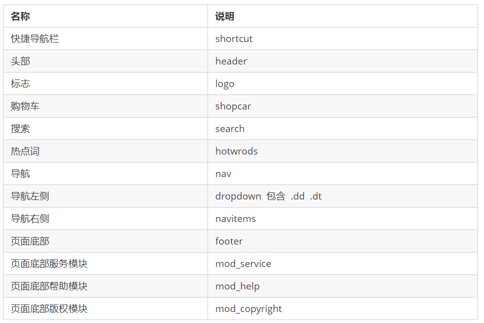
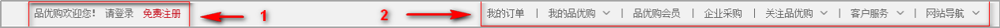
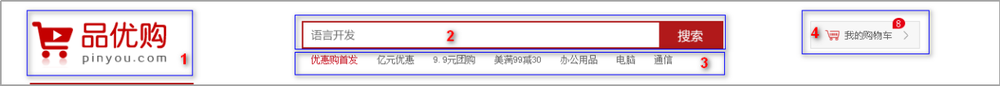
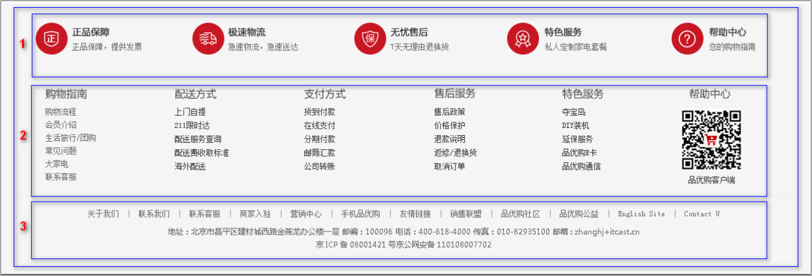
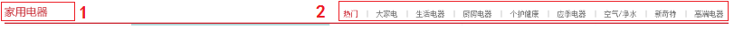
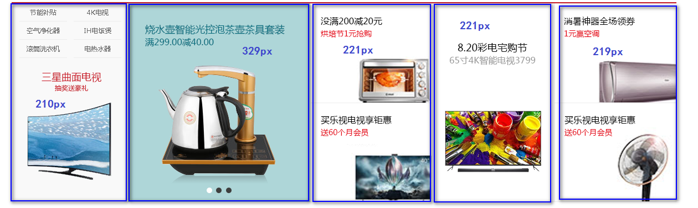
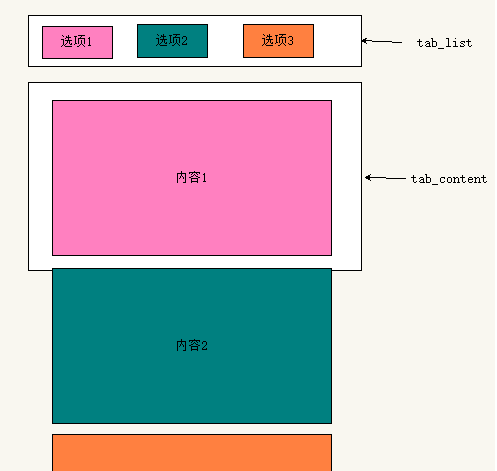

# 京东

## 项目搭建

> 采用模块化开发

- 首页 `index.html`

- CSS 初始化样式文件 `reset.css`，还有`normalize.css`类似（统一样式）

  ```css
  @charset "utf-8";

  /* 把我们所有标签的内外边距清零 */
  * {
    margin: 0;
    padding: 0;
    /* 指定CSS3盒子模型 */
    box-sizing: border-box;
  }

  /* 去掉li 的小圆点 */
  ul,
  ol,
  li {
    list-style: none;
  }

  a,
  input,
  select,
  textarea,
  button {
    /* 去掉蓝色边框 */
    outline: none;
    /* 去掉默认的灰色边框，不一定使用 */
    border: none;
  }

  /* 去掉a的下划线 */
  a {
    text-decoration: none;
    color: #333;
  }

  button {
    /* 当我们鼠标经过button 按钮的时候，鼠标变成小手 */
    cursor: pointer;
  }

  img {
    /* 取消图片底侧有空白缝隙的问题；图片和文字一起布局时，需要修改非基线对齐 */
    vertical-align: middle;
    /* border 0 或 none 照顾低版本浏览器 如果 图片外面包含了链接会有边框的问题 */
    border: none;
  }

  /* em 和 i 斜体的文字不倾斜 */
  em,
  i {
    font-style: normal;
  }

  /* 表格 */
  table {
    border-collapse: collapse;
    border-spacing: 0;
  }

  body {
    /* CSS3 抗锯齿形 让文字显示的更加清晰 */
    -webkit-font-smoothing: antialiased;
    background-color: #fff;
  }

  .hide,
  .none {
    display: none;
  }

  /* ============= 浮动有关 start ============= */
  .f-left {
    float: left;
  }

  .f-right {
    float: right;
  }

  /* 清除浮动 */
  .clearfix:after {
    visibility: hidden;
    clear: both;
    display: block;
    content: '.';
    height: 0;
  }

  .clearfix {
    *zoom: 1;
  }
  /* ============= 浮动有关 end ============= */
  ```

- CSS 公共样式文件 `common.css`

  公共样式里面包含**页面头部、底部、版心宽度、清除浮动、页面文字颜色等**公共样式

  > 有些网站初始化的不太提倡 \* { margin: 0; padding: 0; }。比如新浪，将所有标签都写出来 html,body,ul,li,ol,dl,dd,dt,p,h1,h2,h3,h4,h5,h6,form,fieldset,legend,img{margin:0;padding:0}

## favicon 图标 🔥🔥🔥

favicon.ico 一般用于作为缩略的网站标志，它显示在浏览器的地址栏或者标签上。目前主要的浏览器都支持 favicon.ico 图标。制作 favicon 图标如下：

- 把图标切成 `png` 图片

- 把 `png` 图片转换为 `ico` 图标，这需要借助于第三方转换网站，例如比特虫：http://www.bitbug.net/

- favicon 图标放到网站**根目录下**

- 在 html 页面里面的 `<head> </head>`元素之间引入代码

  ```html
  <link rel="shortcut icon" href="favicon.ico" type="image/x-icon" />
  ```

## TDK 三大标签 SEO 优化 🔥🔥

**SEO（Search Engine Optimization）**汉译为搜索引擎优化，是一种利用搜索引擎的规则提高网站在有关搜索引擎内自然排名的方式。其目的是对网站进行深度的优化，从而帮助网站获取免费的流量，进而在搜索引擎上提升网站的排名，提高网站的知名度。页面必须有三个标签用来符合 SEO 优化：

- `title`

  具有不可替代性，是我们内页的第一个重要标签，是搜索引擎了解网页的入口和对网页主题归属的最佳判断点。建议使用**网站名（产品名）- 网站的介绍** （尽量不要超过 30 个汉字）

- `description` 是 `meta` 中的 name 值

  简要说明我们网站主要是做什么的。作为网站的总体业务和主题概括，多采用“我们是…”、“我们提供…”、“××× 网作为…”、“电话：010…”之类语句。

- `keywords` 是 `meta` 中的 name 值

  页面关键词，是搜索引擎的关注点之一。最好限制为 6 ～ 8 个关键词，关键词之间用英文逗号隔开，采用关键词 1,关键词 2 的形式。

> 一般由专门的 SEO 人员准备

```html
<head>
  <title>京东(JD.COM)-正品低价、品质保障、配送及时、轻松购物！</title>
  <meta
    name="description"
    content="京东JD.COM-专业的综合网上购物商城,销售家电、数码通讯、电脑、家居百货、服装服饰、母婴、图书、食品等数万个品牌优质商品.便捷、诚信的服务，为您提供愉悦的网上购物体验!"
  />
  <meta
    name="keywords"
    content="网上购物,网上商城,手机,笔记本,电脑,MP3,CD,VCD,DV,相机,数码,配件,手表,存储卡,京东"
  />
</head>
```

## 首页制作

我们开始制作首页的头部和底部的时候，根据模块化开发，样式要写到`common.css`里面

### 常用模块类名命名



### 公共部分 — header 头部制作

#### 快捷导航 shortcut 制作 🔥🔥



**布局思路**

- 通栏的盒子命名为 shortcut ，是快捷导航的意思。 注意这里的行高，可以继承给里面的子盒子
- 里面包含版心的盒子
- 版心盒子里面包含 1 号左侧盒子左浮动
  - 1 号盒子 里面包含一个`ul`，`ul`包裹 li，第一个 li 里面包裹文字就行，因为不能点击，第二个 li 包含两个 a 标签
  - 里面的内容是水平排列，所以需要给`li`设置浮动
  - 文字要垂直居中，我们可以给 shortcut 设置行高，因为行高可以继承，里面的孩子就不需要设置了
- 版心盒子里面包含 2 号右侧盒子右浮动
  - 2 号盒子 里面包含一个`ul`，`ul`包裹`li`，中间的`|`可以用样式去设置`div`，也可以用字符 `|`
  - 里面内容水平排列，给`li`设置浮动
  - 找到里面所有偶数的 `li` 设置样式（偶数的 `li` 显示是一个 | 竖线，所以需要单独选择出来设置样式，利用 nth-child 就可以实现）
- 需要用到字体图标
  - 利用伪元素的方式来实现字体图标，给需要添加的标签设置类名为 ： `arrow-icon`
  - 先要引入字体图片的资源
  - 在样式里面利用 font-face 来进行声明
  - 在伪元素的 content 属性设置 图标的编码
  - 给伪元素设置 font-family 属性

#### header 头部模块搭建 🔥🔥🔥



- header 盒子必须要有高度

- 1 号盒子是 `logo` 标志定位，在正常开发过程中，**logo 的布局其实是有讲究的，需要进行 `logoSEO`的优化 （★★★）**

  - `logo` 里面首先放一个 `h1` 标签，目的是为了提权，告诉搜索引擎，这个地方很重要
  - `h1` 里面再放一个链接，可以返回首页的，把 `logo` 的背景图片给链接即可
  - 为了搜索引擎收录我们，我们链接里面要放文字（网站名称），但是文字不要显示出来
    - 方法 1：`text-indent` 移到盒子外面（`text-indent: -9999px`) ，然后 `overflow:hidden` ，淘宝的做法
    - 方法 2：直接给 `font-size: 0;` 就看不到文字了，京东的做法
  - 最后给链接一个 `title` 属性，这样鼠标放到 `logo` 上就可以看到提示文字了

* 2 号盒子是 `search` 搜索模块定位

  - search 盒子利用定位的方式放在对应的位置
  - search 盒子设置绝对定位，header 盒子设置相对定位
  - search 盒子里面包含两个子元素，一个是输入框，一个是按钮，分别跟定固定的宽高（搜索框 宽度：454px；按钮宽度：80px）
  - 输入框和按钮本来就是行内块元素，在一行显示，但是中间会有间隙，所以我们可以让让这两个元素浮动起来

* 3 号盒子是 `hotwords` 热词模块定位

  - 热词模块怎么简单怎么来，直接在里面放 a 标签即可
  - 给里面所有的 a 标签设置 左右 10px 的外边距
  - 给第一个 a 标签设置文字变红色（#c81623）

* 4 号盒子是 `shopcar` 购物车模块

  - 在`shopcar`里面添加一个 before 伪元素和 after 伪元素，分别放置 购物车的图标和 右箭头
  - count 统计部分用绝对定位做
  - count 统计部分不要给宽度，因为可能买的件数比较多，让件数撑开就好了，给一个高度
  - 一定注意左下角不是圆角，其余三个是圆角 写法： border-radius: 7px 7px 7px 0;

#### nav 导航模块制作 🔥🔥🔥

`nav` 盒子通栏有高度，而且有个下边框，里面包含版心，版心里面包含 1 号盒子 和 2 号盒子

- 1 号盒子左侧浮动，`dropdown`
  - 1 号盒子有讲究，根据相关性 里面包含 `.dt` 和 `.dd` 两个盒子
  - `.dt` 内容是全部商品分类，然后把这个盒子的宽高设置跟父亲一样，这样就把 `.dd` 挤到下面去了
  - 给 `.dd` 盒子设置宽度 和 高度，以及背景颜色
  - 给 `.dd` 盒子里面定义 无序列表 （`ul > li > a`）
  - 每个 `li` 都有一个高度（`31px`），宽度可以不用设置，让文字垂直居中，左边设置 2 个像素的 margin 值
  - 给 `li` 里面的 a 设置文字大小（`14px`）
  - 给 `li` 设置 `hover`，当鼠标移入的时候，让`li`的背景变成白色，让里面的文字变成红色
  - `li` 右侧的三角 就可以利用 伪元素来实现，给伪元素设置字体图标，利用定位的方式放在`li`的右侧，那么给`li`设置相对定位
- 2 号盒子左侧浮动，`navitems` 导航栏组

  - 里面结构是 `ul > li > a`
  - 导航栏都是能点击的，所以我们不能给定宽度，给`a`左右的`padding`把两侧撑开
  - 让文字垂直居中（行高等于高度）

### 公共部分 — footer 底部制作



- `footer` 页面底部盒子通栏给一个高度（415px）和灰色的背景
- `footer` 里面有一个大的版心
- 版心里面包含 1 号盒子，`mod_service` 是服务模块，mod 是模块的意思

  - 给 `mod_service` 设置高度（80px）和下边框
  - 在里面定义 `ul > li` ,每个`li` 宽度是 300px 高度是 50px，给每个`li`设置 35px 的左内边距
  - 在每个`li`里面，放一个 `h5`（里面放图标），一个`div`（里面放`div`和`p`）
  - 给 `h5`设置浮动，让 h5 与这个 div 左右排列
  - 通过精灵图技术（核心思路：利用 background-position 来实现），把图标设置给 h5

- 版心里面包含 2 号盒子，mod_help 是帮助模块

  - 给 mod_help 设置 50px 的左内边距和 20px 的上内边距，给定高度（185px）
  - 里面的布局利用 自定义列表来实现（`dl > dt + dd`）
  - 给 `dl` 设置浮动，让其可以水平排列，给每个 dl 盒子设置宽度
  - 给 `dt` 设置文字大小（16px），设置下外边距（10px），让`dt`和`dd`之间有些距离
  - 最后一个 dl 结构和样式不一样，需要单独设置

- 版心里面包含 3 号盒子，mod_copyright 是版权模块

  - 分为上下两块，上面是 `links` 友情链接，下面是 `copyright`，给 mod_copyright 大盒子设置 文字水平居中，20px 的上内边距，让上面内容和下面内容之间有些间隙
  - 把内容分别复制到相应模块中
  - 给 `links` 设置 15px 的下外边距，给`links` 里面 的 `a` 标签设置 左右 3px 的外边距
  - 给`copyright` 设置 20px 的行高

### main 主体模块制作

**main** 主体模块是 **index** 里面专有的，注意需要新的样式文件 **index.css**

- main 盒子宽度为 980 像素，高度是 455 像素，位置距离左边 220px (margin-left ) ，给高度就不用清除浮动

- main 里面包含左侧盒子，宽度为 721 像素，左浮动，focus 焦点图模块

- main 里面包含右侧盒子，宽度为 250 像素，右浮动，newsflash 新闻快报模块

### 家用电器模块 🔥🔥🔥

**注意这个 floor ，不要给高度，内容有多少，算多少**

第一楼是家用电器模块： 里面包含两个盒子

#### `box_hd` 制作

- 1 号盒子 `box_hd`，给一个高度，有个下边框，里面分为左右 2 个盒子

  

  - `box_hd` 给 30px 的高度，2 个像素的下边框
  - 里面放一个左侧 h3 的盒子，右侧一个 div 盒子，div 盒子里面放 `ul > li > a`
  - 左侧盒左浮动，右侧盒子右浮动
  - `a`标签之间的距离用左右的`padding`撑开即可

#### `box_bd` 制作

- 2 号盒子 `box_bd`，不要给高度

  

  - `box_bd` 属于是 tab 栏的内容区域，所以在这个里面先嵌套一个盒子 `tab_content`，在`tab_content` 里面包裹 tab 选项卡对应的内容
  - 内容被一个大盒子包裹（`tab_list_item`），里面是 `ul` 包裹 5 个 `li`，每个`li`设置对应的宽度，然后设置浮动
  - 而这 5 个`li`的宽度是不一致的，在这里我们的做法是 先把宽度的样式列出来，然后给对应的`li`设置
    - 第一个小 `li` 分为上下结构，上面是 `ul` 包裹 `li` ，`li`里面包裹 `a`，下面插入一张图片
    - 上面的 li 设置宽高，设置浮动，这样就排列下来了
    - 后面的小 `li` 里面先放一个`a`标签，然后在`a`标签里面插入图片即可

#### tab 栏切换需求 🔥🔥🔥



- `tab`栏的布局是 `ul > li > a`
- 有多少个`tab`选项卡，那么对应就有多少个内容
- 但是每一次只会显示一个内容块，其他内容进行的隐藏
- 等后面我们学习了`js`之后，我们就会配合`js`来实现，`tab`栏的切换
