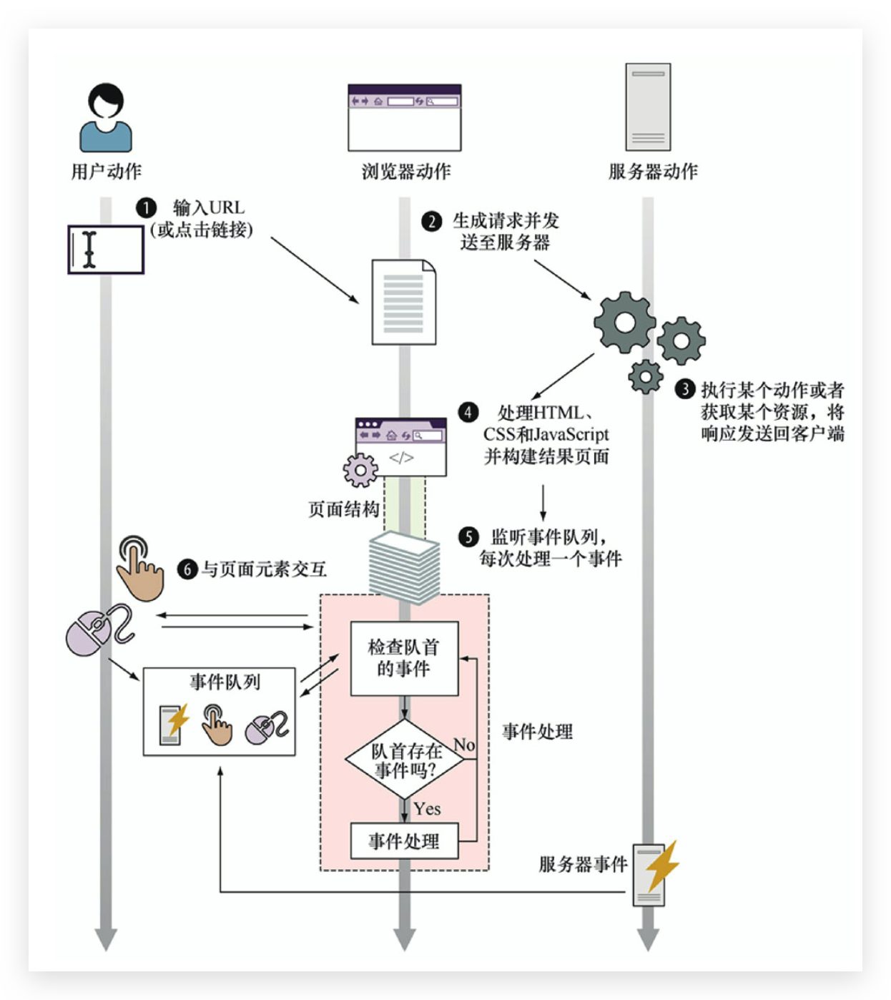

# Web 应用的生命周期 🔥

## 页面构建阶段

- **解析 HTML，构建 DOM**

  按顺序解析，即使是 script 标签（只不过会**阻塞执行**）。遇到标签放置错误，浏览器会修复并放入该放的位置

- **执行 JavaScript（可能会注册事件监听器）**

**全局 window 对象会存在于整个页面的生存期之间**，在它上面**存储着所有的 JavaScript 变量**。只要还有没处理完的 HTML 元素和没执行完的 JavaScript 代码，上面两个步骤都会一直交替执行。

当浏览器处理完所有 HTML 元素后，页面构建阶段就结束了。

## 事件处理阶段—事件队列

### 事件处理器概览

在页面构建阶段执行的 JavaScript 代码，除了会**影响全局应用状态和修改 DOM**外，还会**注册事件监听器**（或处理器）。这类监听器会在事件发生时，由**浏览器调用执行**。

浏览器执行环境的核心思想基于：**同一时刻只能执行一个代码片段，即所谓的单线程执行模型**。事件处理流程如下：

- 浏览器**检查事件队列头**；
- 如果浏览器没有在队列中检测到事件，则继续检查；
- 如果浏览器在队列头中检测到了事件，则**取出该事件并执行相应的事件处理器**（如果存在）。

在这个过程中，**余下的事件在事件队列中耐心等待**，直到轮到它们被处理。



重点注意浏览器在这个过程中的机制，**其放置事件的队列是在页面构建阶段和事件处理阶段以外**的。这个过程对于决定事件何时发生并将其推入事件队列很重要，**这个过程不会参与事件处理线程**。

#### 异步事件

事件可能会以难以预计的时间和顺序发生（强制用户以某个顺序按键或单击是非常奇怪的）。我们对事件的处理，以及处理函数的调用是异步的。如下类型的事件会在其他类型事件中发生。

- 浏览器事件，例如当页面加载完成后或无法加载时；
- 网络事件，例如来自服务器的响应（Ajax 事件和服务器端事件）；
- 用户事件，例如鼠标单击、鼠标移动和键盘事件；
- 计时器事件，当 timeout 时间到期或又触发了一次时间间隔。

Web 应用的 JavaScript 代码中，大部分内容都是对上述事件的处理！

**除了全局代码，页面中的大部分代码都将作为某个事件的结果执行**。

### 注册事件处理器

事件处理器是**当某个特定事件发生后我们希望执行的函数**。**告知浏览器要处理哪个事件的过程叫做注册事件处理器**。

- 通过把函数赋给某个特殊属性。**不推荐**，因为**对于某个事件只能注册一个事件处理器**，可能会覆盖掉上一个事件处理器

  ```js
  window.onload = function() {}
  // 当DOM已经就绪并全部构建完成，就会触发这个事件
  ```

  ```js
  document.body.onclick = function() {}
  // 为在文档中body元素的单击事件注册处理器
  ```

- 通过使用内置 addEventListener 方法。**推荐**，可以**注册多个事件处理器**。

### 处理事件

事件处理背后的的主要思想是：当事件发生时，**浏览器调用相应的事件处理器**。由于**单线程执行模型**，所以**同一时刻只能处理一个事件**。任何后面的事件都只能在当前事件处理器完全结束执行后才能被处理！
