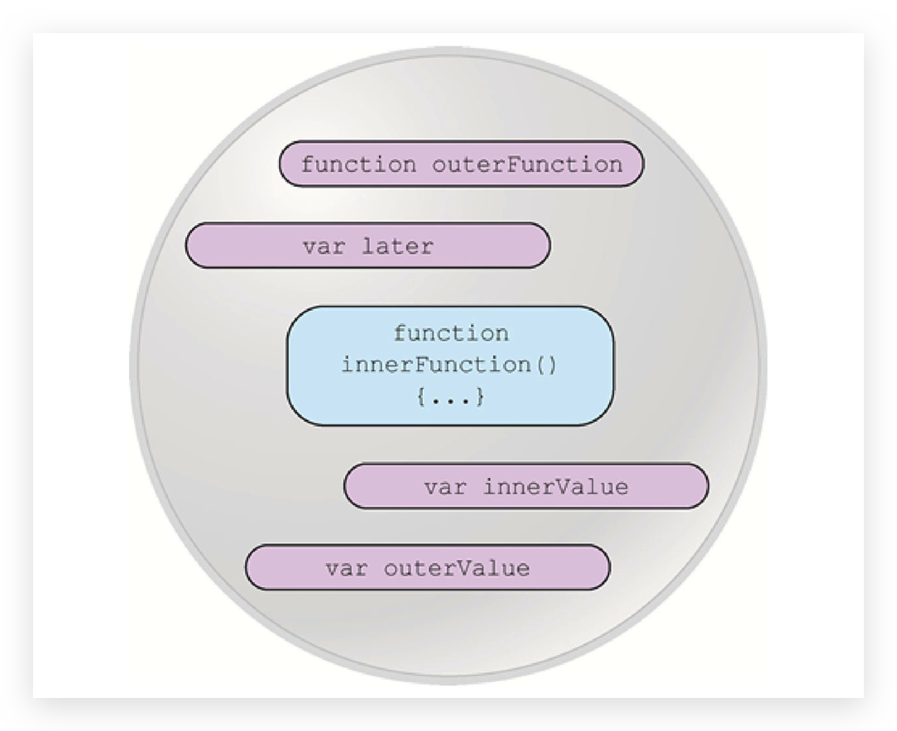
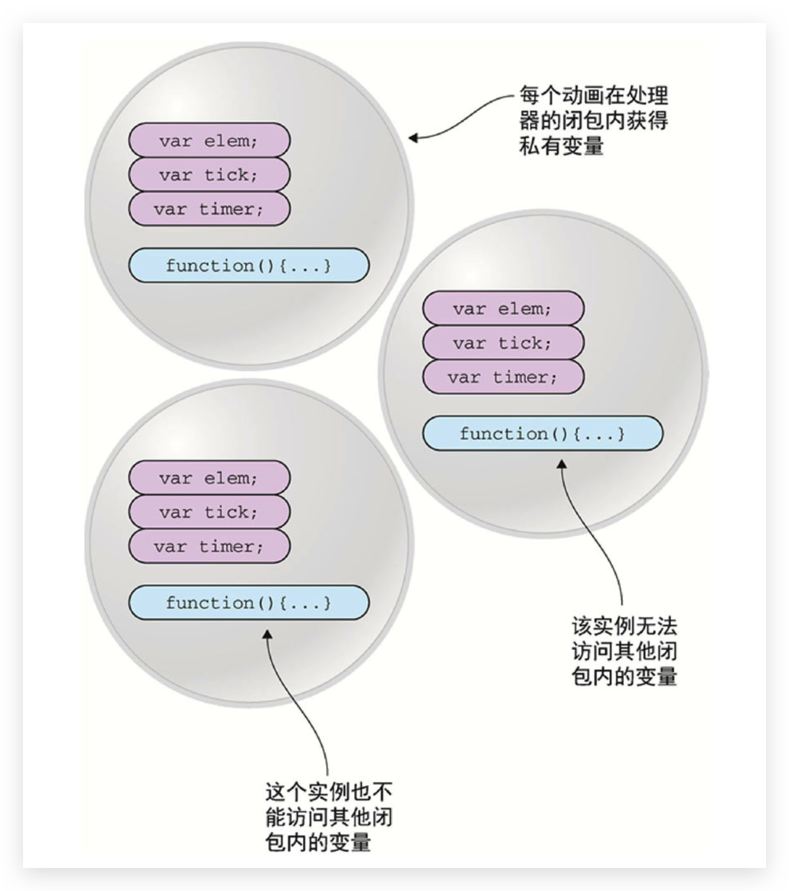

# 闭包 🔥

**了解词法作用域对于理解闭包的概念几乎是不言自明的！**

闭包是**基于词法作用域书写代码**时所产生的**自然结果**，你甚至不需要为了利用它们而有意识地创建闭包。闭包的创建和使用在你的代码中随处可见。你缺少的是根据你自己的意愿来识别、拥抱和影响闭包的思维环境。

当**函数可以记住并访问所在的词法作用域（包括其中的变量、函数等）**时，就产生了闭包，即使函数是在当前词法作用域之外执行。

```js
var outerValue = 'ninja'
function outerFunction() {
  console.log(outerValue)
}
outerFunction()
```

使用闭包，不仅可以通过减少代码数量和复杂度来添加高级特性，还能实现不太可能完成的功能:

- 如果没有闭包，事件处理和动画等包含回调函数的任务，它们的实现将变得复杂得多
- **如果没有闭包，将完全不可能实现私有变量**

## 实质问题

```js
function foo() {
  var a = 2
  function bar() {
    console.log(a) // 2
  }
  bar()
}
foo()
```

基于词法作用域的查找规则，函数 `bar()` 可以访问外部作用域中的变量 a（这个例子中的是一个 RHS 引用查询）。这是闭包吗 ? 技术上来讲，也许是。但根据前面的定义，确切地说并不是。我认为最准确地用来解释 bar() 对 a 的引用的方法是词法作用域的查找规则，而这些规则只是闭包的一部分。(但却是非常重要的一部分!)

从纯学术的角度说，在上面的代码片段中，函数 bar() 具有一个涵盖 foo() 作用域的闭包 (事实上，涵盖了它能访问的所有作用域，比如全局作用域)。也可以认为 bar() 被封闭在了 foo() 的作用域中。为什么呢?原因简单明了，因为 bar() 嵌套在 foo() 内部。

但是通过这种方式定义的闭包并不能直接进行观察，也无法明白在这个代码片段中闭包是如何工作的。我们可以很容易地理解词法作用域，而闭包则隐藏在代码之后的神秘阴影里，并不那么容易理解。

下面的代码清晰地展示了闭包:

```js
function foo() {
  var a = 2
  function bar() {
    console.log(a)
  }
  return bar
}
var baz = foo()
baz() // 2 —— 朋友，这就是闭包的效果。
```

函数 bar() 的词法作用域能够访问 foo() 的内部作用域。然后我们将 bar() 函数本身当作一个值类型进行传递。在这个例子中，我们将 bar 所引用的函数对象本身当作返回值。在 foo() 执行后，其返回值(也就是内部的 bar() 函数)赋值给变量 baz 并调用 baz()，实际上只是通过不同的标识符引用调用了内部的函数 bar()。bar() 显然可以被正常执行。但是在这个例子中，它在自己定义的词法作用域以外的地方执行。

在 foo() 执行后，通常会期待 foo() 的整个内部作用域都被销毁，因为我们知道引擎有垃圾回收器用来释放不再使用的内存空间。由于看上去 foo() 的内容不会再被使用，所以很自然地会考虑对其进行回收。而闭包的“神奇”之处正是可以阻止这件事情的发生。事实上内部作用域依然存在，因此没有被回收。谁在使用这个内部作用域? 原来是 bar() 本身在使用。拜 bar() 所声明的位置所赐，它拥有涵盖 foo() 内部作用域的闭包，使得该作用域能够一直存活，以供 bar() 在之后任何时间进行引用。

**bar() 依然持有对该作用域的引用，而这个引用就叫作闭包。**

因此，在几微秒之后变量 baz 被实际调用(调用内部函数 bar)，不出意料它可以访问定义时的词法作用域，因此它也可以如预期般访问变量 a。这个函数在定义时的词法作用域以外的地方被调用。**闭包使得函数可以继续访问定义时的词法作用域**。

当然，无论使用何种方式对函数类型的值进行传递，当函数在别处被调用时都可以观察到闭包。

```js
function foo() {
  var a = 2
  function baz() {
    console.log(a) // 2
  }
  bar(baz)
}
function bar(fn) {
  fn() // 妈妈快看呀，这就是闭包!
}
```

把内部函数 baz 传递给 bar，当调用这个内部函数时(现在叫作 fn)，它涵盖的 foo() 内部作用域的闭包就可以观察到了，因为它能够访问 a。

传递函数当然也可以是间接的。

```js
var fn
function foo() {
  var a = 2
  function baz() {
    console.log(a)
  }
  fn = baz // 将 baz 分配给全局变量
}
function bar() {
  fn() // 妈妈快看呀，这就是闭包!
}
foo()
bar() // 2
```

无论通过何种手段**将内部函数传递到所在的词法作用域以外**，它都会**持有对原始定义作用域的引用**，**无论在何处执行这个函数**都会使用闭包。

## 理解闭包 🔥

上面的看不懂？继续

**闭包允许函数访问并操作函数外部的变量或函数**。只要变量或函数存在于声明函数时的作用域内，闭包即可使函数能够访问这些变量或函数。记住，所声明的函数可以在声明之后的任何时间被调用，**甚至当该函数声明的作用域消失之后仍然可以调用**

```js
var outerValue = 'samurai'
var later

function outerFunction() {
  var innerValue = 'ninja'

  function innerFunction() {
    console.log(outerValue === 'samurai') // true
    console.log(innerValue === 'ninja') // true
  }
  later = innerFunction
}

outerFunction()
later()
```

outerFunction 都执行完毕了，按理说其中的 innerValue 已经不存在，但是为什么 later 执行后还能打印？

当在外部函数中**声明内部函数时**，不仅定义了函数的声明，而且还创建了一个闭包。该闭包不仅包含了函数的声明，还包含了在函数声明时该作用域中的所有变量。当最终执行内部函数时，**尽管声明时的作用域已经消失了，但是通过闭包，仍然能够访问到原始作用域（包括变量和函数）**



谨记每一个通过闭包访问变量的函数都具有一个作用域链，作用域链包含闭包的全部信息，存储和引用这些信息会直接影响性能。

## 使用闭包 🔥

### 封装私有变量

原生 JavaScript 不支持私有变量。但是，通过使用闭包，我们可以实现很接近的的私有变量（可以 getter 访问）

```js
function Ninja() {
  var feints = 0
  this.getFeints = function() {
    return feints
  }
  this.feint = function() {
    feints++
  }
}

var ninja1 = new Ninja()
ninja1.feint()
console.log(ninja1.feints) // undefined，feints无法直接访问
console.log(ninja1.getFeints() === 1) // true

var ninja2 = new Ninja()
console.log(ninja2.getFeints() === 0) // true
```

通过使用闭包，可以通过方法对 ninja 的状态进行维护，而不允许用户直接访问——这是因为闭包内部的变量可以通过闭包内的方法访问，构造器外部的代码则不能访问闭包内部的变量。

### 回调函数

```html
<body>
  <div id="box1" style="margin: 0;">First Box</div>
  <div id="box2" style="margin: 10;">Second Box</div>
  <div id="box3" style="margin: 20;">Third Box</div>

  <script>
    function animateIt(elementId) {
      var elem = document.getElementById(elementId)
      var tick = 0
      var timer = setInterval(() => {
        if (tick < 100) {
          elem.style.marginLeft = elem.style.marginTop = tick + 'px'
          tick++
        } else {
          clearInterval(timer)
          console.log(tick === 100)
          console.log(elem)
          console.log(timer)
        }
      }, 10)
    }

    animateIt('box1')
    animateIt('box2')
    animateIt('box3')
  </script>
</body>
```

若将 animateIt 函数中三个变量移到全局作用域，也可以工作，但是会污染全局作用域，使用闭包，可以很好处理这事。特别是多个动画时，每次调用 animateIt 函数都会创建一个新的词法作用域，其中的变量等都是独立的。


