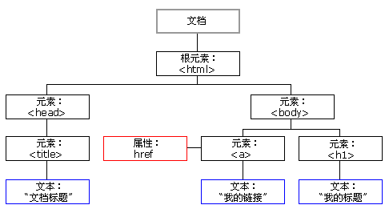

# DOM

DOM（document object model）：将标记语言**文档**的各个组成部分，封装为**对象**。可以使用这些对象，对标记语言文档进行 CRUD 的动态操作

W3C DOM 标准被分为 3 个不同的部分：

- **核心 DOM** - 针对任何结构化文档的标准模型
  - **Node**：原生节点对象，以下节点对象都继承于此
  - **Document**：文档对象，整个文档树的顶层节点
  - DocumentType：`doctype`标签（比如`<!DOCTYPE html>`
  - **Element**：元素对象，网页的各种 HTML 标签（比如`<body>`、`<a>`等）
  - **Attribute**：属性对象，网页元素的属性（比如`class="right"`）
  - **Text**：文本对象，标签之间或标签包含的文本
  - Comment：注释对象
  - DocumentFragment：文档的片段
- XML DOM - 针对 XML 文档的标准模型
- **HTML DOM** - 针对 HTML 文档的标准模型

解析过程：根据 html 的层级结构，在内存中分配一个树形结构，需要把 html 中的每部分封装成对象



## Node 🔥

节点对象，其他对象的父对象。所有 dom 对象都可以被认为是一个节点

JS 中有宿主对象 document（文档对象本身），是 window 对象的属性。DOM 中的对象又称为节点对象，4 种常用节点：

| nodeName               | nodeType  | nodeValue |          |
| :--------------------- | :-------- | :-------- | -------- |
| Document 文档节点      | #document | 9         | null     |
| Element 元素节点       | 标签名    | 1         | null     |
| **Attribute** 属性节点 | 属性名    | 2         | 属性值   |
| Text 文本节点          | #text     | 3         | 文本内容 |

### Node 接口 🔥

属性：

- `nodeType`：一个整数值表示==**节点的类型**==。如 Element 为 1、Attribute 为 2、Text 为 3、Document 为 9
- `nodeName`：**节点的名称**。如 Element 为大写标签名、Attribute 为属性名、Text 为`#text`、Document 为`#document`
- `nodeValue`：一个字符串，表示**当前节点**本身的**文本值**。只有 Attribute、Text、Comment 有值，其余返回`null`
- `textContent`：**当前**节点和它的**所有后代**节点的==**所有文本内容**==，自动**忽略**当前节点内部的 **HTML 标签**
- `baseURI`：一个字符串，表示当前网页的绝对路径
- `ownerDocument`：当前节点所在的顶层文档对象，document 本身的这个属性为`null`。与`getRootNode()`一样作用
- `previousSiblin`：当前节点==**前**==面的、距离最近的一个**同级节点**，没有同级节点则返回`null`
- `nextSibling`：紧跟在当前节点==**后**==面的第一个**同级节点**，没有同级节点则返回`null`
- **`parentNode`**：==当前节点的**父节点**==，可能有三种类型，如 Document、Element、DocumentFragment
- `parentElement`：当前节点的**父元素节点**，排除了上述类型中首尾两个

方法(CRUD DOM 树)：

- **`appendChild(newNode)`**：==将其作为**最后一个子节点**，**插入**当前节点==。若`newNode`为 DOM 中已存在的，相当于**剪贴**
- `insertBefore(newNode,oldNode)`：节点之前插入一个新的节点，没有 insertAfter()方法可以结合`nextSibling`实现
- `removeChild(Node)`：通过父节点删除指定子节点，并返回被删除的节点。不存在 DOM 中，但在内存中仍可使用
- `replaceChild(newNode,oldNode)`：通过父节点用新节点替换一个子节点
- **`cloneNode(boolean b)`**：**复制节点返回新节点**，boolean 表示**是否复制子节点**，会丧失该节点上的事件回调函数

- > `childNodes`：当前节点的所有子节点的`NodeList`集合，但是包括 Text、Commnet！空格之类的都包括！别用！
  >
  > `hasChildNodes()`：当前节点是否有子节点，也是包括所有类型节点！空格也算！别用！

### NodeList 接口（了解）

- `NodeList`实例是一个类似数组不是数组的对象，它的成员是节点对象。通过以下方法可以得到`NodeList`实例
  - `Node.childNodes`：说了别用！省的没注意空格！
  - `document.querySelectorAll()`等节点搜索方法
- 属性：
  - `length`，NodeList 实例包含的节点数量
- 方法：
  - `forEach`，也可以使用 for 循环。没 pop、pust 等方法哦！
  - `item(index)`：接受一个整数值作为参数，表示成员的位置，返回该位置上的成员。
- 。。。懒得看了

### HTMLCollection 接口（了解）

- `HTMLCollection`是一个节点对象的集合，只能包含元素节点（element），不能包含其他类型的节点。它的返回值是一个类似数组的对象，但是与`NodeList`接口不同，`HTMLCollection`没有`forEach`方法，只能使用`for`循环遍历
- 返回`HTMLCollection`实例的，主要是一些`Document`对象的集合属性，比如`document.links`、`docuement.forms`、`document.images`、`document.styleSheets`、`document.scripts`等
- `HTMLCollection`实例都是动态集合，节点的变化会实时反映在集合中
- 属性
  - `length`：返回`HTMLCollection`实例包含的成员数量
- 方法
  - `item()`：接受一个整数值作为参数，表示成员的位置，返回该位置上的成员
  - `namedItem()`：参数是一个字符串，表示`id`属性或`name`属性的值，返回对应的元素节点。如果没有则返回`null`

### ParentNode 接口（注意 IE 基本不支持）

- 只有元素节点（element）、文档节点（document）和文档片段节点（documentFragment）拥有子节点，因此只有这三类节点会继承`ParentNode`接口
- 属性
  - `children`：返回一个`HTMLCollection`实例，成员是当前节点的所有**元素子节点**。该属性只读。
  - `firstElementChild`：当前节点的第一个元素子节点。如果没有任何元素子节点，则返回`null`
  - `lastElementChild`：当前节点的最后一个元素子节点，如果不存在任何元素子节点，则返回`null`
  - `childElementCount`：返回一个整数表示当前节点的所有元素子节点的数目。如果不包含任何元素子节点则返回`0`
- ==方法（如下方法都没有返回值）==
  - **`append()`**：为当前节点的最后一个元素子节点后追加**一个或多个子节点**。可以添加元素子节点、文本子节点。**IE 全不支持**！！！
  - **`prepend()`**：为当前节点的的第一个元素子节点前追加**一个或多个子节点**。同 append()方法
    - 若是若`newNode`为 DOM 中已存在的，相当于**剪贴**

### ChildNode 接口

- 如果一个节点有父节点，那么该节点就继承了`ChildNode`接口
- ==方法（都是本节点调用方法）==
  - `remove()`：==用于从父节点**移除当前节点**，**自己调用删除自己**！因为已知本节点有父节点==
  - `before()`：当前节点的**前**面，插入**一个或多个**同级节点，两者拥有相同的父节点。可以插入元素节点、文本节点
  - `after()`：在当前节点的**后**面，插入**一个或多个**同级节点，两者拥有相同的父节点。同 before()方法
  - `replaceWith()`：使用参数节点，**替换**当前节点。参数可以是元素节点，也可以是文本节点

## Document 🔥

### 简介

在 HTML DOM 模型中有宿主对象`document`，它是`window`对象的属性（也可以省略）。

**继承了 Node、ParentNode 等接口**

### 常用属性（好像不太常用）

- `body`

  该属性封装的是 body 元素对象的引用

- `documentElement`

  属性值为 HTML 元素对象

- `all`

  属性值为当前页面中的所有元素节点的数组。这个属性值本身为`undefined`，它的`typeof`值也为`undefined`

- `URL`

  获取当前页面的 url

- `domain`

  获取当前页面的域名部分

- `referrer`

  获取是哪个页面链接跳转到当前页面，没有则返回空字符串

### 常用 CRUD 方法 🔥

#### 获取 Element 对象

::: tip 注意

可以使用`Document`对象和`Element`对象调用如下函数。但是`~ById()`函数只能用在`Document`对象上

:::

::: danger 注意

如下方法都支持 IE8 及以上

:::

- `querySelector()`：CSS 选择器为参数，如果有多个节点满足匹配条件，则返回**第一个匹配的节点**，没有则返回 null

- `querySelectorAll()`：返回一个`NodeList`对象，包含**所有匹配给定选择器的节点**。用法同上

  【注意】不支持 CSS 伪元素选择器和伪类选择器

- `getElementById("id")`：根据 ID 属性获取一个**元素对象**，效率比`querySelector()`高

- `getElementsByClassName("className")`：标签的 class 的属性值得到元素**集合**（`HTMLCollection`实例）

- `getElementsByTagName("tagName")`：标签名称得到元素**集合**（`HTMLCollection`实例）

- `getElementsByName("name")`：标签的 name 属性值得到元素**集合**（`NodeList`实例），radio、checkBox 等

  只有一个标签时通过`document.getElementsByTag/ClassName("input")[0]`获取元素对象

  **获取标签下面的子孙标签**的唯一有效办法，使用父节点**`getElementsByTagName()`**方法，不使用 childNodes 属性

#### 添加 DOM 对象

- `createElement("元素名称")`：创建**元素节点**，参数为 tagName 属性，对 HTML 不区分大小写，但不能加尖括号
- `createTextNode("文本内容")`：创建**文本节点**，可以在内容中添加标签。不能对属性赋值，不会转义单双引
- `createAttribute(name)`：创建拥有指定名称的属性节点，并返回新的 Attr 对象。通过 Node 来设置属性
- `createComment()`：创建注释节点

#### 其他

- **write**()：向页面输出变量（值）、html 代码

## Element 🔥

通过`document`来获取和创建

### 常用属性

- `innerHTML`：返回一个字符串，等同于**该元素包含的所有 HTML 代码**，该属性**可读写**。用来设置某个节点的内容

- `innerText`：同上，但是只显示文本代码，不带标签的！！，设置内容也不会解析为 HTML

- `textContent`：显示文本或插入的是文本时使用来替代上面方法。原样显示，不像上面方法会转为`&**;`来显示

- `value`：代表的是元素的 value 属性，一般用于**`input`标签值的获取**，**`select`**标签值也可以使用

- `style`：用来读写该元素的行内样式信息，配合 CSS。如 display 可取值 none、block、inner

  也可以**提前定义好**类选择器的样式，通过元素的`className`属性来设置其`class`属性值。

### 常用 Attribute 方法

- `getAttribute("name")`：获取属性里面的值
- `setAttribute("name","value")`：设置属性的值
- `removeAttribute("name")`：删除属性，**不能删除 value 属性**

## Event

### 加载事件

- `onload`

  **文档被浏览器**加载**时触发，**只能写一次**；一般在 body 标签中注册函数；或用 window 来调用。此时**可以操作 DOM 元素\*\*。

  ```javascript
  window.onload = function() {
    document.getElementById('btn').onclick = function() {
      alert('haha')
    }
  }
  ```

### 点击事件

- **`onclick`**：点击事件(按钮)
- **`ondblclick`**：双击事件

### 焦点事件(表单校验)

- **`onfocus`**：组件获得焦点事件(输入框/单选/多选/下拉) ，光标闪动
- **`onblur`**：组件失去焦点事件(输入框/单选/多选/下拉)

### 改变事件

- **`onchange`：域的内容改变**/选择的值发生变化事件(输入框/下拉)
- **`onselect`**：文本被选中

### 表单事件

- **`onsubmit`**：表单提交按钮按下时触发的事件(**表单校验**)**在 form 后注册函数，有返回值 true/false**，控制提交与否

  必须写`return 函数名`否则不能获取到返回的 boolean 值

- **`onreset`**：重置按钮按下时

### 鼠标事件

- **`onmouseover()`**：鼠标移动到组件上时触发

- **`onmouseout`**：鼠标移出组件时触发

- **`onmousemove`**：鼠标移动就触发

- **`onmousedown`**：鼠标按键按下时触发

  定义方法时，定义一个形参来接收`event`对象，它的`button`属性可以获取鼠标哪个按钮被点击(0，1，2)

- **`onmouseup`**：鼠标按键松开时触发

### 键盘事件

- `onkeydown`：某个键盘按键被按下
- `onkeyup`：某个键盘按键被松开
- `onkeypress`：某个键盘按键被按下并松开

## 案例

### 动态显示时间

```javascript
let ele = document.getElementById('h1')
function setTime() {
  let s = new Date().toLocaleString()
  ele.innerText = s
}
setInterval(setTime, 1000)
```

### 轮播图(正常不这么做)

```javascript
var i = 1
function changeImg() {
  i++
  if (i > 3) i = 1
  document.getElementById('img1').src = 'img/' + i + '.jpg'
}
setInterval(changeImg, 5000)
```

### 定时弹出广告(style.display)

```javascript
showTime = setTimeout(showAd, 3000) //定义为全局变量

function showAd() {
  document.getElementById('adImg').style.display = 'block'
  clearTimeout(showTime)
  hiddenTime = setTimeout(hiddenAd, 3000)
}

function hiddenAd() {
  document.getElementById('adImg').style.display = 'none'
  clearTimeout(hiddenTime)
}
```

### 动态增删表格

```javascript
document.getElementById('btn').onclick = function() {
  let id = document.getElementById('id').value
  let name = document.getElementById('name').value
  let sex = document.getElementById('sex').value
  //thead
  let tbd = document.getElementsByTagName('thead')[0]

  document.getElementById('btn').onclick = function() {
    let id = document.getElementById('id').value
    let name = document.getElementById('name').value
    let sex = document.getElementById('sex').value

    let thd = document.getElementsByTagName('thead')[0]

    thd.innerHTML +=
      '<tr>\n' +
      '        <td>' +
      id +
      '</td>\n' +
      '        <td>' +
      name +
      '</td>\n' +
      '        <td>' +
      sex +
      '</td>\n' +
      '        <td><a href="javascript:void(0);" onclick="delTr(this);" >删除</a></td>\n' +
      '    </tr>'
    //使用方法一个个添加也行，但是麻烦
  }
  function delTr(obj) {
    var parentNode = obj.parentNode.parentNode.parentNode
    var deleteNode = obj.parentNode.parentNode
    parentNode.removeChild(deleteNode)
  }
}
```

### 全选/全不选/反选/高亮

```javascript
let inputs = document.getElementsByClassName('check-box')
//全选
document.getElementById('selectAll').onclick = function() {
  for (let i in inputs) {
    inputs[i].checked = true
  }
}
//全不选
document.getElementById('notSelect').onclick = function() {
  for (let i in inputs) {
    inputs[i].checked = false
  }
}
//反选
document.getElementById('reverseSelect').onclick = function() {
  for (let i in inputs) {
    inputs[i].checked = !inputs[i].checked
  }
}
//左上角选择
document.getElementById('ck1').onclick = function() {
  for (let i in inputs) {
    inputs[i].checked = this.checked
  }
}
//表格行高亮
let trs = document.getElementsByTagName('tr')
for (let t in trs) {
  trs[t].onmouseover = function() {
    this.style.backgroundColor = 'gray'
  }
  trs[t].onmouseout = function() {
    this.style.backgroundColor = 'white'
  }
}
```

### 表单校验

```javascript
window.onload = function () {
    //表单校验
    document.getElementById("form").onsubmit = function () {
        return checkUsername();//可添加密码校验
    }
    document.getElementById("username").onblur = checkUsername;//可添加密码校验

}
//用户名校验
function checkUsername() {
    var username = document.getElementById("username").value;
    var reg = /^\w{6,12}$/;
    let flag = reg.test(username);
    if (flag) {
        document.getElementById("usernameSpan").innerHTML = "✔";
    } else {
        document.getElementById("usernameSpan").innerHTML = "用户名格式有误";
    }
    return flag;
}
//可添加密码校验等等
。。。。。
```

### 左右列表

- select、option、multiple、selected=true/false、appendChild()剪贴的 length 变化

```javascript
var left = document.getElementById('left')
var leftlist = left.getElementsByTagName('option')
var right = document.getElementById('right')
var rightlist = right.getElementsByTagName('option')

var toRight = function() {
  for (let i = 0; i < leftlist.length; i++) {
    if (leftlist[i].selected) {
      right.appendChild(leftlist[i])
      i--
    }
  }
}
var allToRight = function() {
  for (let i = 0; i < leftlist.length; i++) {
    right.appendChild(leftlist[i])
    i--
  }
}
```

### 表格隔行换色(tBodies、rows)

```javascript
//这样也可以获得行数
//var tbody = document.getElementsByTagName("tbody")[0];
//var rows = tbody.getElementsByTagName("tr").length;

var tb = document.getElementById('table1')
var rows = tb.tBodies[0].rows.length
for (let i = 0; i < rows; i++) {
  if (i % 2 === 0) {
    tb.tBodies[0].rows[i].style.backgroundColor = 'gray'
  } else {
    tb.tBodies[0].rows[i].style.backgroundColor = 'yellow'
  }
}
```

### 省市联动(this.value)

```javascript
let arr = [
  ['陕西', '西安', '商洛', '延安', '安康'],
  ['河北', '石家庄', '廊坊', '秦皇岛', '雄安'],
  ['广东', '深圳', '珠海', '广州', '不知道'],
]

document.getElementById('sheng').onchange = function() {
  let option = document.getElementById('shi') //不能直接使用innerHTML来赋值
  option.innerHTML = '' //每次改变时要清空
  for (let i in arr) {
    if (arr[i][0] === this.value) {
      for (let j = 1; j < arr[i].length; j++) {
        option.innerHTML += '<option>' + arr[i][j] + '</option>'
      }
    }
  }
}
```

## DOM 操作 🔥

### 表单值获取 🔥

::: demo [vanilla]

```html
<html>
  <div id="radio">
    <h2>radio值获取</h2>
    <div>
      <input type="radio" value="0" name="radioStatus" checked="checked" />好评
      <input type="radio" value="1" name="radioStatus" />差评

      <button id="getRadioStatus">getRadioStatus</button>
    </div>
  </div>

  <div id="checkbox">
    <h2>checkbox值获取</h2>
    <div>
      <input type="checkbox" value="0" name="checkboxStatus" checked />唱
      <input type="checkbox" value="1" name="checkboxStatus" />跳
      <input type="checkbox" value="2" name="checkboxStatus" />rap
      <input type="checkbox" value="3" name="checkboxStatus" />篮球

      <button id="getCheckboxStatus">getCheckboxStatus</button>
    </div>
  </div>

  <div id="select">
    <h2>select值获取</h2>
    <div>
      <select name="selectStatus" id="selectStatus">
        <option value="1">1</option>
        <option value="2">2</option>
        <option value="3">3</option>
      </select>

      <button id="getSelectStatus">getSelectStatus</button>
    </div>
  </div>
</html>
<script>
  const getRadioStatus = document.getElementById('getRadioStatus')
  getRadioStatus.addEventListener('click', function() {
    // $('input:radio[name="status"]:checked').val()// jQuery方式，除了:radio外其实是CSS选择器
    const test = document.querySelector('input[name="radioStatus"]:checked') //CSS选择器，type=radio一般命名规范时可以省略
    console.log(test.value)
  })

  const getCheckboxStatus = document.getElementById('getCheckboxStatus')
  getCheckboxStatus.addEventListener('click', function() {
    // $('input:checkbox').each(function() {
    //     if ($(this).attr('checked') ==true) {
    //         alert($(this).val());
    //     }
    // });
    let nodeList = document.querySelectorAll(
      'input[name="checkboxStatus"]:checked'
    )
    console.log(nodeList) // NodeList 是对象，不是数组，无法使用 .map 流
    nodeList.forEach((item) => console.log(item.value))
  })

  const getSelectStatus = document.getElementById('getSelectStatus')
  getSelectStatus.addEventListener('click', function() {
    // $('select[name="selectStatus"]).val()// jQuery，就是CSS选择器，直接使用 #id 也可以！！！
    const select = document.querySelector('select[name="selectStatus"]') //CSS选择器，直接使用 #id 也可以！！！
    console.log(select.value)

    const index = select.selectedIndex // 索引，从0开始
    const value = select.options[index].value //要的值
  })
</script>
```

:::

### 动态增删表单

::: demo [vanilla]

```html
<html>
  <button id="add">add dom</button>
  <div id="container"></div>
</html>
<script>
  const add = document.getElementById('add')
  add.addEventListener('click', function() {
    const container = document.getElementById('container')

    const id = Date.now()
    const div = document.createElement('div')
    div.setAttribute('id', id)

    const input = document.createElement('input')
    input.setAttribute('type', 'text')
    div.appendChild(input)

    const button = document.createElement('button')
    button.innerText = 'del dom'
    div.appendChild(button)

    button.addEventListener('click', function() {
      const delEl = document.getElementById(id)
      delEl.remove() // IE全不支持
      // delEl.parentNode.removeChild(delEl)// 都支持
    })

    // innerHTML += 会导致重新渲染！！！
    // container.innerHTML += html

    container.append(div) // IE全不支持
    // container.appendChild(div)// 都支持
  })
</script>
```

:::


### 动态增删表单 & 拖动 & 单击移动

<iframe height="300" style="width: 100%;" scrolling="no" title="DOM crud&amp;drag" src="https://codepen.io/conanan/embed/MWowMeN?default-tab=html%2Cresult" frameborder="no" loading="lazy" allowtransparency="true" allowfullscreen="true">
  See the Pen <a href="https://codepen.io/conanan/pen/MWowMeN">
  DOM crud&amp;drag</a> by apple54whn (<a href="https://codepen.io/conanan">@conanan</a>)
  on <a href="https://codepen.io">CodePen</a>.
</iframe>

