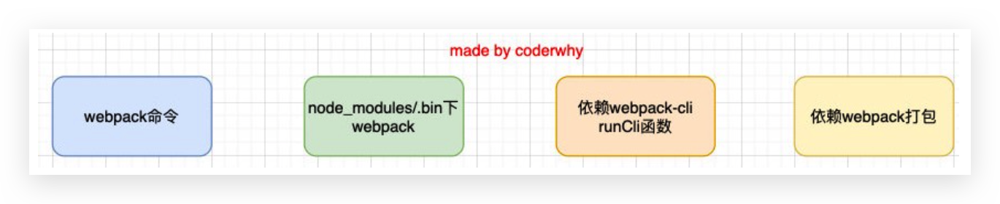
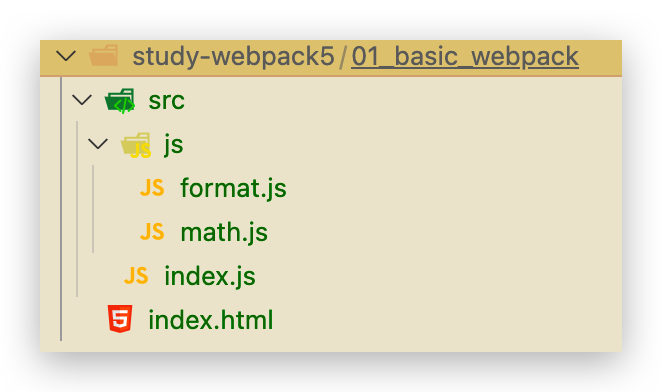
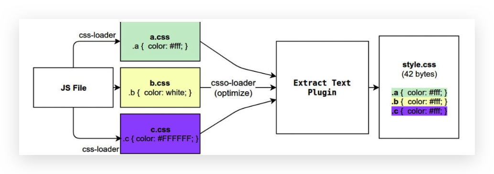
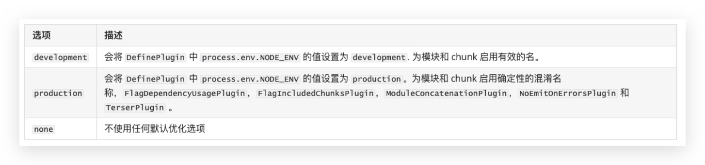
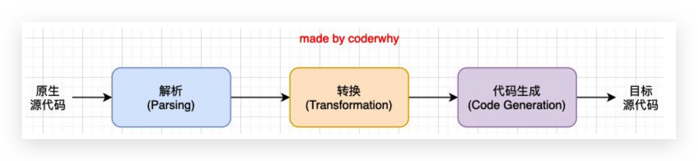
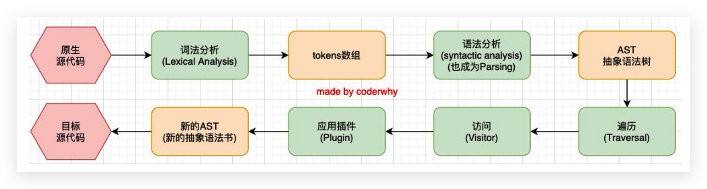
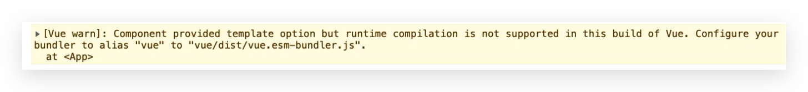
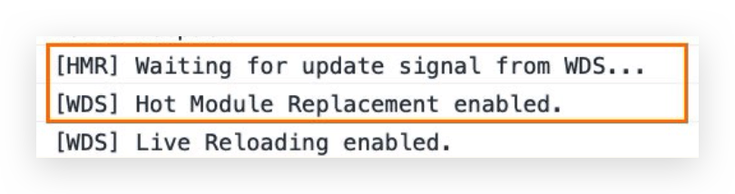
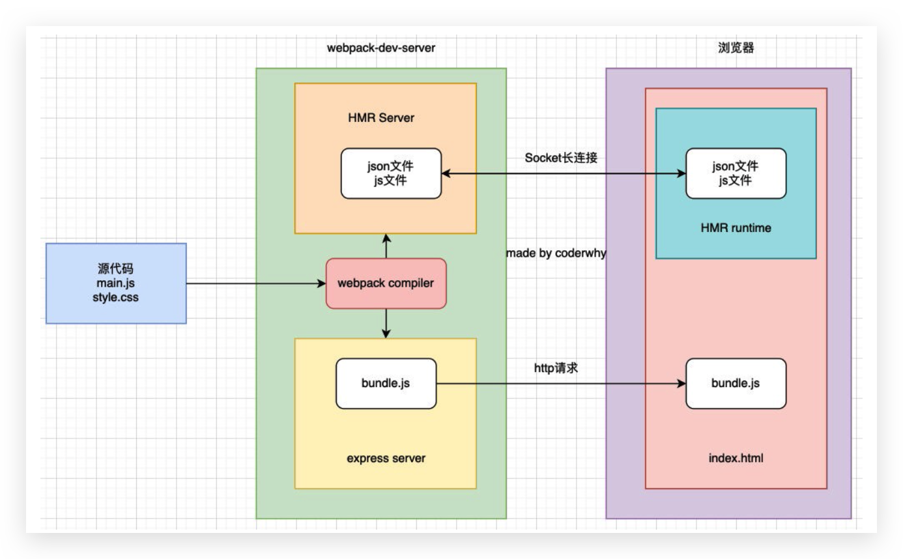

# 入门

## 介绍

本质上，**webpack** 是一个用于现代 JavaScript 应用程序的 ***静态模块打包工具***。当 webpack 处理应用程序时，它会在内部从一个或多个入口点构建一个 [依赖图(dependency graph)](https://webpack.docschina.org/concepts/dependency-graph/)，然后将你项目中所需的每一个模块组合成一个或多个 *bundles*，它们均为静态资源，用于展示你的内容。

*   现代的modern：我们前端说过，正是因为现代前端开发面临各种各样的问题，才催生了webpack的出现和发展
*   静态的static：这样表述的原因是我们最终可以将代码打包成最终的静态资源(部署到静态服务器)
*   模块化module：webpack默认支持各种模块化开发，ES Module、CommonJS、AMD等
*   打包bundler：webpack可以将帮助我们进行打包，所以它是一个打包工具


## 打包的东西

**JavaScript的打包**:

*   ES6转换成ES5的语法;
*   TypeScript的处理，将其转换成JavaScript;

**Css的处理**:

*   CSS文件模块的加载、提取;
*   Less、Sass等预处理器的处理;

**资源文件img、font**:

*   图片img文件的加载; 
*   字体font文件的加载;

**HTML资源的处理**

*   打包HTML资源文件;

**处理vue项目的SFC文件.vue文件;**


## Node 和 NPM 版本

目前使用的版本

```bash
v14.18.3
6.14.15
```


## webpack & webpack-cli

webpack的安装目前分为两个：webpack、webpack-cli

·那么它们是什么关系呢?

*   执行webpack命令，会执行node_modules下的.bin目录下的webpack;
*   webpack在执行时是依赖webpack-cli的，如果没有安装就会报错;
*   而webpack-cli中代码执行时，才是真正利用webpack进行编译和打包的过程;
*   所以在安装webpack时，我们需要同时安装webpack-cli(第三方的脚手架事实上是没有使用webpack-cli的，而是类似于自己的vue-service-cli的东西)




## 全局 webpack 打包

安装

```bash
npm install webpack webpack-cli –g # 全局安装 
```


创建如下文件



/index.html

```html
<!DOCTYPE html>
<html lang="en">
  <head>
    <meta charset="UTF-8" />
    <meta http-equiv="X-UA-Compatible" content="IE=edge" />
    <meta name="viewport" content="width=device-width, initial-scale=1.0" />
    <title>Document</title>
  </head>
  <body>
    <!-- 源js文件无法运行 -->
    <script src="./src/index.js" type="module"></script>
  </body>
</html>
```

/src/index.js

```js
import { sum } from "./js/math";
const { priceFormat } = require("./js/format");

console.log(sum(20, 30));
console.log(priceFormat());
```

/src/js/format.js

```js
const priceFormat = function() {
  return "¥99.88";
}

// CommonJS的导出
module.exports = {
  priceFormat
}
```

/src/js/math.js

```js
// ES Module
export function sum(num1, num2) {
  return num1 + num2;
}
```

在项目`/`目录下执行`webpack`，会生成`/dist/main.js`，将html替换为

```html
<!DOCTYPE html>
<html lang="en">
  <head>
    <meta charset="UTF-8" />
    <meta http-equiv="X-UA-Compatible" content="IE=edge" />
    <meta name="viewport" content="width=device-width, initial-scale=1.0" />
    <title>Document</title>
  </head>
  <body>
    <!-- 源js文件无法运行 -->
    <!-- <script src="./src/index.js" type="module"></script> -->
    <!-- 打包后的js文件可以访问 -->
    <script src="./dist/main.js"></script>
  </body>
</html>
```

就会运行成功！


## 局部 webpack 打包 🔥

```bash
npm init
npm install webpack webpack-cli -D
npx webpack
```

`npx`意思是在`npm`安装的`node_modules`中的`.bin`目录下查找命令

在package.json中创建scripts脚本，执行脚本打包即可

```json
  "scripts": {
    "build": "webpack"
  },
```

此时只写webpack，它会自动先在`node_modules`中的`.bin`目录下查找命令。执行如下命令即可打包

```
npm run build
```


## 入口、出口文件配置 🔥

当我们运行`webpack`时，webpack会查找当前目录下的 `src/index.js`作为入口，不存在则报错

**可以通过配置来指定入口和出口**：

```bash
 npx webpack --entry ./src/main.js --output-path ./build
```

但是不推荐该方式，可以在项目根目录创建`wepack.config.js`文件

```js
const path = require('path')

// Webpack在Node环境运行，Node使用的CommonJS，要改为ES6需要配置，比较麻烦
module.exports = {
  // 入口文件名
  entry: './src/main.js',
  output: {
    // path必须是绝对路径！！！，__dirname代表当前文件（webpack.config.js）所在绝对路径
    path: path.resolve(__dirname, './build'),
    filename: 'bundle.js',
  },
}
```

在package.json中修改scripts脚本即可使用

```json
"build": "webpack"
```

若是创建的文件名不是默认的，而是如`  conana.config.js`，则需要修改scripts脚本。不推荐！！！

```json
"build": "webpack --config conana.config.js"
```


## Webpack的依赖图


*   事实上webpack在处理应用程序时，它会根据命令或者配置文件找到入口文件
*   从入口开始，会生成一个依赖关系图，这个依赖关系图会包含应用程序中所需的所有模块(比如.js文件、css文件、图片、字 体等)
*   然后遍历图结构，打包一个个模块(根据文件的不同使用不同的loader来解析)
*   注意，**没有依赖到的不会打包**！！！


## 打包 css

`css-loader` 是将 css 解析、装载；`style-loader` 是将解析、装载的 css 添加到 style 标签中。

```bash
npm install css-loader style-loader -D
```

配置webpack.config.js

```js
module.exports = {\
  module: {
    rules: [
      {
        test: /\.css$/,
        // loader: 'css-loader',
        // use: ['css-loader'],
        // 完整写法(倒序执行！！！)
        use: [
          { loader: 'style-loader', options: {} },
          { loader: 'css-loader', options: {} },
        ],
      },
    ],
  },
}
```


## 打包 less、scss、stylus

这里以 less 为例。`less`会将less文件转换为css文件，安装后会有个`lessc`可执行文件；`less-loader`会批量将less文件转为css文件

```
npm install less less-loader -D
```

配置webpack.config.js

```js
gmodule.exports = {
  module: {
    rules: [
      {
        test: /\.less$/,
        use: [
          { loader: 'style-loader', options: {} },
          { loader: 'css-loader', options: {} },
          { loader: 'less-loader', options: {} },
        ],
      },
    ],
  },
}
```


## PostCSS

CSS的转换和适配，比如自动添加浏览器前缀、css样式的重置。实现这些功能，我们需要借助于PostCSS对应的插件

如何使用PostCSS呢?主要就是两个步骤:

*   第一步:查找PostCSS在构建工具中的扩展，比如webpack中的postcss-loader; 
*   第二步:选择可以添加你需要的PostCSS相关的插件;


### 安装 postcss、postcss-cli

```bash
npm install postcss postcss-cli -D
```

postcss-cli可以直接在终端使用PostCSS

我们编写一个需要添加前缀的csshttps://autoprefixer.github.io/，在该网站中查询一些添加css属性的样式;


### 插件autoprefixer（可不用该插件）

添加前缀，所以要安装autoprefixer

```
 npm install autoprefixer -D
```

直接使用使用postcss工具，并且制定使用autoprefixer

```
 npx postcss --use autoprefixer -o end.css ./src/css/style.css
```


### postcss-loader

真实开发中我们必然不会直接使用命令行工具来对css进行处理，而是可以借助于构建工具。在webpack中使用postcss就是使用postcss-loader来处理的

```
 npm install postcss-loader -D
```

修改加载css的loader。注意:因为postcss需要有对应的插件才会起效果，所以我们需要配置它的plugin

```js
{
    loader: 'postcss-loader',
        options: {
            postcssOptions: {
                plugins: [
                    require('autoprefixer')
                ]
            },
        },
},
```

当然，我们也可以将这些配置信息放到一个单独的文件中进行管理，在根目录下创建postcss.config.js

```js
module.exports = {
  plugins: [
      require('autoprefixer')
  ],
}
```


### postcss-preset-env

事实上，在配置postcss-loader时，我们配置插件并不需要使用autoprefixer，我们可以使用另外一个插件:postcss-preset-env

*   postcss-preset-env也是一个postcss的插件;
*   它可以帮助我们将一些现代的CSS特性，转成大多数浏览器认识的CSS，并且会根据目标浏览器或者运行时环境 添加所需的polyfill
*   也包括会自动帮助我们添加autoprefixer(所以相当于已经内置了autoprefixer)

```
 npm install postcss-preset-env -D
```

之后，我们直接修改掉之前的autoprefixer即可

```js
module.exports = {
  plugins: [
      require('postcss-preset-env')
  ],
}
```

注意:我们在使用某些postcss插件时，也可以直接传入字符串

```js
module.exports = {
  plugins: [
      'postcss-preset-env'
  ],
}
```


### postcss 完整配置

webpack.config.js

```js
module.exports = {
  module: {
    rules: [
      {
        test: /\.css$/,
        use: [
          { loader: 'style-loader', options: {} },
          { loader: 'css-loader', options: {} },
          {
            loader: 'postcss-loader',
            options: {},
          },
        ],
      },
      {
        test: /\.less$/,
        use: [
          { loader: 'style-loader', options: {} },
          { loader: 'css-loader', options: {} },
          {
            loader: 'postcss-loader',
            options: {},
          },
          { loader: 'less-loader', options: {} },
        ],
      },
    ],
  },
}

```

postcss.config.js

```js
module.exports = {
  plugins: [require('postcss-preset-env')],
}
```


## 打包资源

为了演示我们项目中可以加载图片，我们需要在项目中使用图片，比较常见的使用图片的方式是两种

*   img元素，设置src属性;
*   其他元素(比如div)，设置background-image的css属性;


### file-loader

要处理jpg、png等格式的图片，我们也需要有对应的loader:**file-loader**

file-loader的作用就是帮助我们处理`import/require()`方式引入的一个文件资源，并且会将它放到我们输出的文件夹中;

当然我们待会儿可以学习如何修改它的名字和所在文件夹

```
npm install file-loader -D
```

有时候我们处理后的文件名称按照一定的规则进行显示，比如保留原来的文件名、扩展名，同时为了防止重复，包含一个hash值等;

这个时候我们可以使用PlaceHolders来完成，webpack给我们提供了大量的PlaceHolders来显示不同的内容: https://webpack.js.org/loaders/file-loader/#placeholders。我们可以在文档中查阅自己需要的placeholder;

我们这里介绍几个最常用的placeholder:

*   `[ext]`: 处理文件的扩展名;
*   `[name]`:处理文件的名称;
*   `[hash]`:文件的内容，使用MD4的散列函数处理，生成的一个128位的hash值(32个十六进制);
*   `[contentHash]`:在file-loader中和[hash]结果是一致的(在webpack的一些其他地方不一样，后面会讲到); 
*   `[hash:<length>]`:截图hash的长度，默认32个字符太长了;
*   `[path]`:文件相对于webpack配置文件的路径;


#### 完整配置

```js
{
        test: /\.(jpe?g|png|gif|svg)$/,
        use: {
          // file-loader 和 url-loader 根据需要选择一个
          loader: 'file-loader',
          // loader: 'url-loader',
          options: {
            // outputPath: "img",
            name: 'img/[name]_[hash:6].[ext]',
          },
        },
      },
```


### url-loader

**url-loader和file-loader**的工作方式是相似的，但是可以将较小的文件，转成base64的URI

```bash
 npm install url-loader -D
```

dist文件夹中，我们会看不到图片文件:

*   这是因为我的两张图片的大小分别是38kb和295kb;
*   默认情况下url-loader会将所有的图片文件转成base64编码

但是开发中我们往往是小的图片需要转换，但是大的图片直接使用图片即可

*   这是因为小的图片转换base64之后可以和页面一起被请求，减少不必要的请求过程
*   而大的图片也进行转换，反而会影响页面的请求速度;

url-loader有一个options属性limit，可以用于设置转换的限制;

```js
{
        test: /\.(jpe?g|png|gif|svg)$/,
        use: {
          // file-loader 和 url-loader 根据需要选择一个
          // loader: 'file-loader',
          loader: 'url-loader',
          options: {
            // outputPath: "img",
            name: 'img/[name]_[hash:6].[ext]',
            limit: 100 * 1024,
          },
        },
      },
```


### 字体文件

```js
{
        test: /\.(eot|ttf|woff2?)$/,
        use: {
          loader: "file-loader",
          options: {
            // outputPath: "font",
            name: "font/[name]_[hash:6].[ext]"
          }
        }
      },
```


### asset module type 🔥

**我们当前使用的webpack版本是webpack5:** 

*   在webpack5之前，加载这些资源我们需要使用一些loader，比如raw-loader 、url-loader、file-loader; 
*   在webpack5开始，我们可以直接使用资源模块类型(asset module type)，来替代上面的这些loader;

**资源模块类型(asset module type)**，通过添加 4 种新的模块类型，来替换所有这些 loader: 

*   **asset/resource** 发送一个单独的文件并导出 URL。之前通过使用 file-loader 实现; 
*   **asset/inline** 导出一个资源的 data URI。之前通过使用 url-loader 实现; 
*   **asset/source** 导出资源的源代码。之前通过使用 raw-loader 实现;
*   **asset** 在导出一个 data URI 和发送一个单独的文件之间自动选择。之前通过使用 url-loader，并且配置资源体 积限制实现;


#### 完整配置

```js
// webpack5的asset module type替换file-loader 和 url-loader等
      {
        test: /\.(jpe?g|png|gif|svg)$/,
        type: 'asset',
        generator: {
          filename: 'img/[name]_[hash:6][ext]',
        },
        parser: {
          dataUrlCondition: {
            maxSize: 100 * 1024,
          },
        },
      },
          {
        test: /\.(eot|ttf|woff2?)$/,
        type: 'asset/resource',
        generator: {
          filename: 'font/[name]_[hash:6][ext]',
        },
      },
```

效果和上述url-loader、file-loader一样！！！


## Plugin

**Webpack的另一个核心是Plugin，官方有这样一段对Plugin的描述:**

While loaders are used to transform certain types of modules, plugins can be leveraged to perform a wider range of tasks like bundle optimization, asset management and injection of environment variables.

上面表达的含义翻译过来就是:

*   Loader是用于特定的**模块类型进行转换**;
*   Plugin可以用于执行更加广泛的任务，比如**打包优化、资源管理、环境变量注入**等;




### CleanWebpackPlugin

前面我们演示的过程中，每次修改了一些配置，重新打包时，都需要手动删除dist文件夹。我们可以借助于一个插件来帮助我们完成，这个插件就是CleanWebpackPlugin

```bash
 npm install clean-webpack-plugin -D
```

配置

```js
const { CleanWebpackPlugin } = require("clean-webpack-plugin");

module.exports = {
  plugins: [
    new CleanWebpackPlugin(),
  ],
};
```


### HtmlWebpackPlugin

另外还有一个**不太规范**的地方:

*   我们的HTML文件是编写在根目录下的，而最终打包的dist文件夹中是没有index.html文件的。 
*   在进行项目部署的时，必然也是需要有对应的入口文件index.html;
*   所以我们也需要对index.html进行打包处理;

```bash
 npm install html-webpack-plugin -D
```

配置（可以在public中使用自定义模板）

```js
const HtmlWebpackPlugin = require("html-webpack-plugin");


module.exports = {
  plugins: [
      new HtmlWebpackPlugin({
      	template: "./public/index.html",
      	title: "哈哈哈哈"
      }),
  ],
};
```


### DefinePlugin

这是因为在编译template模块时，有一个BASE_URL`<link rel="icon" href="<%= BASE_URL %>favicon.ico">`但是我们并没有设置过这个常量值，所以会出现没有定义的错误，可以使用DefinePlugin插件;

DefinePlugin允许在编译时创建配置的全局常量，是一个webpack内置的插件(不需要单独安装)

```js
const { DefinePlugin } = require("webpack");

module.exports = {
  plugins: [
      new DefinePlugin({
      	BASE_URL: "'./'"
      }),
  ],
};
```


### CopyWebpackPlugin

在vue的打包过程中，如果我们将一些文件放到public的目录下，那么这个目录会被复制到dist文件夹中。 这个复制的功能，我们可以使用CopyWebpackPlugin来完成;

```bash
 npm install copy-webpack-plugin -D
```

配置CopyWebpackPlugin：

*   复制的规则在patterns中设置;
*   **from:**设置从哪一个源中开始复制;
*   **to:**复制到的位置，可以省略，会默认复制到打包的目录下;
*   **globOptions:**设置一些额外的选项，其中可以编写需要忽略的文件:
    *   .DS_Store:mac目录下回自动生成的一个文件;
    *   index.html:也不需要复制，因为我们已经通过HtmlWebpackPlugin完成了index.html的生成;

```js
const CopyWebpackPlugin = require('copy-webpack-plugin');

module.exports = {
  plugins: [
      new CopyWebpackPlugin({
      patterns: [
        {
          from: "public",
          to: "./",
          globOptions: {
            ignore: [
              "**/index.html"
            ]
          }
        }
      ]
    })
  ],
};
```


## Mode配置

Mode配置选项，可以告知webpack使用响应模式的内置优化: 

*   默认值是production(什么都不设置的情况下); 
*   可选值有:'none' | 'development' | 'production'




```js
  // 设置模式
  // development 开发阶段, 会设置development
  // production 准备打包上线的时候, 设置production
  mode: "development",
  // 设置source-map, 建立js映射文件, 方便调试代码和错误
  devtool: "source-map",
```


## Babel

### 介绍

开发中，我们想要使用ES6+的语法，想要使用TypeScript，开发React项目，它们都是离不开Babel的。所以，学习Babel对于我们理解代码从编写到线上的转变过程至关重要

Babel是一个**工具链**，主要用于旧浏览器或者环境中将ECMAScript 2015+代码转换为向后兼容版本的 JavaScript。如**语法转换**、**源代码转换**等


### Babel命令行使用

babel本身可以作为**一个独立的工具**(和postcss一样)，不和webpack等构建工具配置来单独使用

如果我们希望在命令行尝试使用babel，需要安装如下库

*   @babel/core:babel的核心代码，必须安装;
*   @babel/cli:可以让我们在命令行使用babel;

```bash
 npm install @babel/cli @babel/core -D
```

使用babel来处理我们的源代码:

*   src:是源文件的目录;
*    --out-dir:指定要输出的文件夹dist;

```bash
 npx babel src --out-dir dist
```


### 插件的使用

比如我们需要转换箭头函数，那么我们就可以使用**箭头函数转换相关的插件**

```bash
 npm install @babel/plugin-transform-arrow-functions -D
 npx babel src --out-dir dist --plugins=@babel/plugin-transform-arrow-functions
```

查看转换后的结果:我们会发现 const 并没有转成 var

*   这是因为 plugin-transform-arrow-functions，并没有提供这样的功能;
*   我们需要使用 plugin-transform-block-scoping 来完成这样的功能;

```bash
npm install @babel/plugin-transform-block-scoping -D
npx babel src --out-dir dist --plugins=@babel/plugin-transform-block-scoping ,@babel/plugin-transform-arrow-functions
```


### Babel的预设preset

但是如果要转换的内容过多，一个个设置是比较麻烦的，我们可以使用预设(preset)

安装@babel/preset-env预设

```bash
 npm install @babel/preset-env -D
```

执行如下命令

```bash
 npx babel src --out-dir dist --presets=@babel/preset-env
```


### Babel的底层原理

babel是如何做到将我们的**一段代码(ES6、TypeScript、React)**转成**另外一段代码(ES5)**的呢? 

*   从一种源代码(原生语言)转换成另一种源代码(目标语言)，这是什么的工作呢?
*   就是**编译器**，事实上我们可以将babel看成就是一个编译器。
*   Babel编译器的作用就是将我们的源代码，转换成浏览器可以直接识别的另外一段源代码;

**Babel也拥有编译器的工作流程:** 

*   解析阶段(Parsing)
*   转换阶段(Transformation) 
*   生成阶段(Code Generation)

https://github.com/jamiebuilds/the-super-tiny-compiler


### Babel编译器执行原理

Babel的执行阶段



当然，这只是一个简化版的编译器工具流程，在每个阶段又会有自己具体的工作




### babel-loader 🔥

在实际开发中，我们通常会在构建工具中通过配置babel来对其进行使用的，比如在webpack中。那么我们就需要去安装相关的依赖，如果之前已经安装了@babel/core，那么这里不需要再次安装

```bash
 npm install babel-loader @babel/core -D
```

我们可以设置一个规则，在加载js文件时，使用我们的babel

```js
{
    test: /\.js$/,
    loader: "babel-loader"
}
```

我们必须指定使用的插件才会生效

```js
{
    test: /\.js$/,
        use: {
            loader: "babel-loader",
                options: {
                    plugins: [
                       "@babel/plugin-transform-arrow-functions",
                       "@babel/plugin-transform-block-scoping",
                    ]
                    
                }
        }
}
```


### babel-preset 🔥

如果我们一个个去安装使用插件，那么需要手动来管理大量的babel插件，我们可以直接给webpack提供一个 preset，webpack会根据我们的预设来加载对应的插件列表，并且将其传递给babel。

比如常见的预设有三个: 

*   env

*   react 
*   TypeScript

安装preset-env

```bash
 npm install @babel/preset-env
```

配置

```js
{
    test: /\.js$/,
        use: {
            loader: "babel-loader",
                options: {
                    // plugins: [
                    //   "@babel/plugin-transform-arrow-functions",
                    //   "@babel/plugin-transform-block-scoping",
                    // ]
                    presets: [
                        "@babel/preset-env"
                    ]
                }
        }
}
```


### Babel的配置文件

像之前一样，我们可以将babel的配置信息放到一个独立的文件中，babel给我们提供了两种配置文件的编写:

*   babel.config.json(或者.js，.cjs，.mjs)文件;
*   .babelrc.json(或者.babelrc，.js，.cjs，.mjs)文件;

它们两个有什么区别呢?目前很多的项目都采用了多包管理的方式(babel本身、element-plus、umi等); 

*   .babelrc.json:早期使用较多的配置方式，但是对于配置Monorepos项目是比较麻烦的;
*   **babel.config.json**(babel7):可以直接作用于Monorepos项目的子包，更加**推荐**;

babel.config.js

```js
module.exports = {
  presets: [
    "@babel/preset-env"
  ]
}
```

webpack.config.js可以精简为

```js
{
    test: /\.js$/,
    loader: "babel-loader"
}
```


## Vue 打包 🔥

### 问题

安装vue

```bash
npm install vue
```

修改element.js

```js
import { createApp } from 'vue';

createApp({
    template: '#my-app',
    data(){
        return {
            title: '标题',
            content: '内容',
        }
    }
}).mount('#app');
```

由于vue是js文件，所以打包是正常的。但是界面没有效果，且报如下警告：



修改为如下的即可

```js
import { createApp } from 'vue/dist/vue.esm-bundler';
```

但是使用SFC时无需改为`vue.esm-bundler`


### Vue打包后不同版本解析

*   **vue(.runtime).global(.prod).js**:
    *   p通过浏览器中的 `<script src="...">` 直接使用;
    *   我们之前通过CDN引入和下载的Vue版本就是这个版本; 
    *   会暴露一个全局的Vue来使用;

*   **vue(.runtime).esm-browser(.prod).js**:
    *   用于通过原生 ES 模块导入使用 (在浏览器中通过 `<script type="module">` 来使用)。

*    **vue(.runtime).esm-bundler.js**:
    *   用于 webpack，rollup 和 parcel 等构建工具;
    *   **构建工具中默认**是**vue.runtime.esm-bundler.js**;
    *   如果我们需要解析模板template，那么需要**手动指定vue.esm-bundler.js**;
*   **vue.cjs(.prod).js:
    *   服务器端渲染使用;
    *   通过require()在Node.js中使用;


### 运行时+编译器 vs 仅运行时

在Vue的开发过程中我们有**三种方式**来编写DOM元素:

*   方式一:template模板的方式(之前经常使用的方式);
*   方式二:render函数的方式，使用h函数来编写渲染的内容; 
*   方式三:通过.vue文件中的template来编写模板;

**它们的模板分别是如何处理的呢?**

*   方式二中的h函数可以直接返回一个**虚拟节点**，也就是**Vnode节点**; 
*   方式一和方式三的template都需要有特定的代码来对其进行解析:
    *   方式三.vue文件中的template可以通过在vue-loader对其进行编译和处理; 
    *   方式一中的template我们必须要通过源码中一部分代码来进行编译;

所以，Vue在让我们选择版本的时候分为 **运行时+编译器** vs **仅运行时

*   运行时+编译器包含了对template模板的编译代码，更加完整，但是也更大一些; 
*   仅运行时没有包含对template版本的编译代码，相对更小一些;


### VSCode对SFC文件的支持

真实开发中多数情况下我们都是使用SFC(**single-file components**)，即单文件组件方式

VSCode对SFC的支持:

*   插件一:**Vetur**，从Vue2开发就一直在使用的VSCode支持Vue的插件;
*   插件二:**Volar**，官方推荐的插件(后续会基于Volar开发官方的VSCode插件); 


### App.vue 打包 🔥

```bash
npm install vue-loader -D
npm install @vue/compiler-sfc -D
```

webpack.config.js

```js
{
    test: /\.vue$/,
    loader: "vue-loader"
}
```

还配置对应的Vue插件

```js
const { VueLoaderPlugin } = require('vue-loader/dist/index');

module.exports = {
  plugins: [
    new VueLoaderPlugin(),
  ],
};
```


## devServer 🔥

### 需求

目前我们开发的代码，为了运行需要有两个操作

*   `npm run build`编译相关代码
*   通过live server或者直接通过浏览器，打开index.html代码，查看效果

这个过程经常操作会影响我们的开发效率，我们希望可以做到，当**文件发生变化**时，可以**自动的完成编译和展示**。为了完成自动编译，webpack提供了几种可选的方式：

*   webpack watch mode
*   webpack-dev-server（常用）
*   webpack-dev-middleware


### webpack watch

webpack给我们提供了**watch模式**。在该模式下，webpack依赖图中的所有文件，只要有一个**发生了更新**，那么**代码将被重新编译**，我们不需要手动去运行 npm run build指令了

**开启watch两种方式**

*   在导出的配置中，添加 `watch: true`。修改webpack.config.js

    ```js
    // mode: 'xxx',
    watch: true,
    ```

*   在启动webpack的命令中，添加 `--watch`的标识。修改package.json

    ```js
    "script": {
       "watch": "webpack --watch" 
    }
    ```

    


### webpack-dev-server 🔥

上面的方式**可以监听到文件的变化**，但是事实上它本身是**没有自动刷新浏览器的功能**的。当然通过在VSCode中使用live-server来完成这样的功能。在不使用live-server的情况下，可以具备live reloading(实时重新加载)的功能

#### 安装

*   **安装webpack-dev-server**

    ```bash
     npm install webpack-dev-server -D
    ```

*   修改package.json

    ```json
    "script": {
       "serve": "webpack serve" 
    }
    ```

    执行`npm run serve`即可完成


#### contentBase 配置 🔥

**修改webpack.config.js配置文件**，告知 devServer，从什么位置查找文件

```js
devServer: {
    contentBase: "./public",
}
```

这里的文件指的是额外的，如favicon.ico 或者其他 x.mp4 之类的资源，一般放在 `/public`中

*   **打包**阶段：**使用的是`copyWepackPlugin`插件**，每次打包将`/public`中文件复制到`/build`中
*   **开发**阶段，复制文件比较耗费性能，并且 webpack-dev-server 使用的是内存方式，不适合复制这些静态资源。所以在找不到资源时，就会去**配置的`contentBase`中查找**


#### host配置 🔥

```js
devServer: {
    host: "0.0.0.0",
}
```

**host设置主机地址**:

*   默认值是`localhost`; 
*   如果希望**其他地方也可以访问**，可以设置为`0.0.0.0`;

**localhost 和 0.0.0.0 的区别**

*   localhost:本质上是一个域名，通常情况下会被解析成127.0.0.1;
*   127.0.0.1:回环地址(Loop Back Address)，表达的意思其实是我们主机自己发出去的包，直接被自己接收;
    *   正常的数据库包经常 应用层 - 传输层 - 网络层 - 数据链路层 - 物理层 ;
    *   而回环地址，是在网络层直接就被获取到了，是不会经常数据链路层和物理层的; ü 比如我们监听 127.0.0.1时，在同一个网段下的主机中，通过ip地址是不能访问的


#### port、open、compress 配置 🔥

*   **port设置监听的端口，默认情况下是8080**

*   **open是否打开浏览器**

    默认值是false，设置为true会打开浏览器; 也可以设置为类似于 Google Chrome等值

*   **compress是否为静态文件开启gzip compression**

    默认值是false，可以设置为true。一般对js进行压缩！


#### proxy 配置 🔥

首先要明确，跨域是浏览器的安全策略！服务器之间访问没有跨域问题。proxy就是根据这个原理来解决开发阶段跨域问题！

如，8000访问8888的api

```js
devServer: {
	proxy: {
      "/api": {
        target: "http://localhost:8888",
        pathRewrite: {
          "^/api": ""
        },
        secure: false,
        changeOrigin: true
      }
    } 
}
```

**proxy是我们开发（生产中不 用这个！）中非常常用的一个配置选项，它的目的设置代理来解决跨域访问的问题:**

*   比如我们的一个api请求是 http://localhost:8888，但是本地启动服务器的域名是 http://localhost:8000，这 个时候发送网络请求就会出现跨域的问题;

*   那么我们可以将请求先发送到一个代理服务器，代理服务器和API服务器没有跨域的问题，就可以解决我们的跨域问题了;

**进行如下的设置**

*   **target:**表示的是代理到的目标地址，比如 `/api-hy/moment`会被代理到 http://localhost:8888/api-hy/moment;
*   **pathRewrite:**默认情况下，我们的 /api-hy 也会被写入到URL中，如果希望删除，可以使用pathRewrite; 
*   **secure:**默认情况下不接收转发到https的服务器上，如果希望支持，可以设置为false; 开发阶段可以置为false
*   **changeOrigin:**它表示是否更新代理后请求的headers中host地址（将target配置写入header）。


#### historyApiFallback 配置

和路由有关！

**historyApiFallback**是开发中一个非常常见的属性，它主要的作用是解决SPA页面在路由跳转之后，进行页面刷新时，返回404的错误。

boolean值：

*   默认是false
*   如果设置为true，那么在刷新时，返回404错误时，会自动返回 index.html 的内容

object类型的值，可以配置rewrites属性(了解)：

*   可以配置from来匹配路径，决定要跳转到哪一个页面

事实上devServer中实现historyApiFallback功能是通过[connect-history-api-fallback库](https://github.com/bripkens/connect-history-api-fallback)的


### HMR 模块热替换 🔥

#### 介绍

HMR的全称是Hot Module Replacement，翻译为模块热替换。指在 **应用程序运行过程中**，**替换、添加、删除**模块，而**无需重新刷新**整个页面。

HMR通过如下几种方式，来提高开发的速度：

*   **不重新加载整个页面**，这样可以**保留**某些应用程序的**状态**不丢失。如**计数器**
*   **只更新需要变化的内容**，节省开发的时间
*   修改了css、js源代码，会立即在浏览器更新，相当于直接在浏览器的devtools中直接修改样式

默认情况下，**webpack-dev-server已经支持HMR**，我们只**需要开启**即可。在不开启HMR的情况下，当我们修改了源代码之后，整个页面会自动刷新，使用的是live reloading


#### hot 配置 🔥

**修改webpack.config.js配置文件**

```js
target: 'web', // 这个不配置有时会出问题！
devServer: {
    hot: true,
}
```

浏览器可以看到如下效果



但是你会发现，**当我们修改了某一个模块的代码时，依然是刷新的整个页面**。这是因为我们需要去**指定哪些模块发生更新**时，进行HMR。**导入文件的方式还需要添加HMR方式**！！！如main.js中：

```js
import './js/element'; // 旧方式，不能删

// HMR 方式
if(module.hot) {
 	module.hot.accept('./js/element.js', () => {
        console.log('element HMR');
    }
}
```

上面方式太麻烦了！！！


#### 框架的HMR 🔥

在开发其他项目时，**我们是否需要经常手动去写入 module.hot.accpet相关的API呢**?比如开发Vue、React项目，我们修改了组件，希望进行热更新，这个时候应该如何去操作呢? 事实上社区已经针对这些有很成熟的解决方案了;

*   比如vue开发中，我们使用vue-loader，此loader**支持vue组件的HMR**，提供开箱即用的体验;

*   比如react开发中，有React Hot Loader，实时调整react组件(目前React官方已经弃用了，改成使用react-refresh);

注意：有时TS文件的HMR也需要手动配置！使用vben项目时遇到该问题！


#### HMR 原理 🔥

webpack-dev-server会创建两个服务:提供静态资源的服务(**express**)和Socket服务(**net.Socket**); 

*   express server负责直接提供静态资源的服务(打包后的资源直接被浏览器请求和解析);
*   **HMR Socket Server，是一个socket的长连接**
    *   长连接有一个最好的好处是**建立连接后双方可以通信**(服务器可以直接发送文件到客户端); 
    *   当服务器**监听到对应的模块发生变化时**，会生成**两个文件.json(manifest文件)和.js文件(update chunk)**; 
    *   通过长连接，可以**直接将这两个文件主动发送给客户端(浏览器)**;
    *   **浏览器拿到两个新的文件后**，通过HMR runtime机制，**加载**这两个文件，并且针对修改的模块进行更新;




## resolve 模块解析配置

### 介绍

resolve用于设置模块如何被解析:

*   在开发中我们会有各种各样的模块依赖，这些模块可能来自于自己编写的代码，也可能来自第三方库; 
*   resolve可以帮助webpack从每个 require/import 语句中，找到需要引入到合适的模块代码;
*   webpack 使用 [enhanced-resolve](https://github.com/webpack/enhanced-resolve) 来解析文件路径;


### 路径

**webpack能解析三种文件路径**

*   绝对路径：由于已经获得文件的绝对路径，因此不需要再做进一步解析
*   相对路径：
    *   在这种情况下，使用 import 或 require 的资源文件所处的目录，被认为是上下文目录
    *   在 import/require 中给定的相对路径，会拼接此上下文路径，来生成模块的绝对路径
*   **模块路径**（如 `import { createApp } from 'vue';`：
    *   在 resolve.modules中指定的所有目录检索模块。默认值是 ['node_modules']，所以默认会从node_modules中查找文件
    *   我们可以通过**设置别名**的方式来替换初识模块路径，具体后面讲解**alias**的配置


### 文件？文件夹？

*   如果是一个文件

    *   如果文件具有扩展名，则直接打包文件
    *   否则，将使用 resolve.extensions选项作为文件扩展名解析（依次匹配扩展查询文件）

*   如果是一个文件夹

    会**在文件夹中**根据 resolve.mainFiles配置选项中指定的**文件顺序**查找

    *   resolve.mainFiles的默认值是 `['index']`
    *   再根据 resolve.extensions来解析扩展名

    所以一般查找到index文件


### extensions和alias配置

extensions是解析到文件时自动添加扩展名:

*   默认值是 ['.wasm', '.mjs', '.js', '.json'];
*   所以如果我们代码中想要添加加载 .vue 或者 jsx 或者 ts 等文件时，我们必须自己写上扩展名;

另一个非常好用的功能是配置别名alias: 

*   特别是当我们项目的目录结构比较深的时候，或者一个文件的路径可能需要 ../../../这种路径片段; 
*   我们可以给某些常见的路径起一个别名;


### 配置 🔥

修改webpack.config.js配置文件

```js
resolve: {
    extensions: [".js", ".json", ".mjs", ".vue", ".ts", ".jsx", ".tsx"],
    alias: {
      "@": path.resolve(__dirname, "./src"),
      "js": path.resolve(__dirname, "./src/js")
    }
  },
```


## 分离开发生产环境 🔥

目前我们所有的webpack配置信息都是放到一个配置文件中的:webpack.config.js

*   当配置越来越多时，这个文件会变得越来越不容易维护;

*   并且某些配置是在开发环境需要使用的，某些配置是在生成环境需要使用的，当然某些配置是在开发和生成环 境都会使用的;

*   所以，我们最好对配置进行划分，方便我们维护和管理;

那么，在启动时如何可以区分不同的配置呢?

*   方案一：编写两个不同的配置文件，开发和生成时，分别加载不同的配置文件即可; 

*   方式二：使用相同的一个入口配置文件，通过设置参数来区分它们;

    修改package.json

    ```json
    {
        "scripts": {
            "build": "webpack --config ./config/webpack.prod.config.js",
            "serve": "webpack serve --config ./config/webpack.dev.config.js"
        },   
    }
    ```

    安装`merge`

    ```bash
    npm install webpack-merge -D
    ```

配置文件

/config/webpack.comm.config.js

```js
const path = require("path");
const HtmlWebpackPlugin = require("html-webpack-plugin");
const { DefinePlugin } = require("webpack");
const { VueLoaderPlugin } = require('vue-loader/dist/index');

module.exports = {
  target: "web",
  entry: "./src/main.js",
  output: {
    path: path.resolve(__dirname, "../build"),
    filename: "js/bundle.js",
  },
  resolve: {
    extensions: [".js", ".json", ".mjs", ".vue", ".ts", ".jsx", ".tsx"],
    alias: {
      "@": path.resolve(__dirname, "../src"),
      "js": path.resolve(__dirname, "../src/js")
    }
  },
  module: {
    rules: [
      {
        test: /\.css$/,
        use: ["style-loader", "css-loader", "postcss-loader"],
      },
      {
        test: /\.less$/,
        use: ["style-loader", "css-loader", "less-loader"],
      },
      // },
      {
        test: /\.(jpe?g|png|gif|svg)$/,
        type: "asset",
        generator: {
          filename: "img/[name]_[hash:6][ext]",
        },
        parser: {
          dataUrlCondition: {
            maxSize: 10 * 1024,
          },
        },
      },
      {
        test: /\.(eot|ttf|woff2?)$/,
        type: "asset/resource",
        generator: {
          filename: "font/[name]_[hash:6][ext]",
        },
      },
      {
        test: /\.js$/,
        loader: "babel-loader"
      },
      {
        test: /\.vue$/,
        loader: "vue-loader"
      }
    ],
  },
  plugins: [
    new HtmlWebpackPlugin({
      template: "./public/index.html",
      title: "哈哈哈哈"
    }),
    new DefinePlugin({
      BASE_URL: "'./'",
      __VUE_OPTIONS_API__: true,
      __VUE_PROD_DEVTOOLS__: false
    }),
    new VueLoaderPlugin()
  ],
};
```


/config/webpack.dev.config.js

```js
const { merge } = require('webpack-merge');

const commonConfig = require('./webpack.comm.config');

module.exports = merge(commonConfig, {
  mode: "development",
  devtool: "source-map",
  devServer: {
    contentBase: "./public",
    hot: true,
    // host: "0.0.0.0",
    port: 7777,
    open: true,
    // compress: true,
    proxy: {
      "/api": {
        target: "http://localhost:8888",
        pathRewrite: {
          "^/api": ""
        },
        secure: false,
        changeOrigin: true
      }
    }
  },
})
```


/config/webpack.prod.config.js

```js
const { CleanWebpackPlugin } = require("clean-webpack-plugin");
const CopyWebpackPlugin = require('copy-webpack-plugin');
const {merge} = require('webpack-merge');

const commonConfig = require('./webpack.comm.config');

module.exports = merge(commonConfig, {
  mode: "production",
  plugins: [
    new CleanWebpackPlugin(),
    new CopyWebpackPlugin({
      patterns: [
        {
          from: "./public",
          globOptions: {
            ignore: [
              "**/index.html"
            ]
          }
        }
      ]
    }),
  ]
})
```

