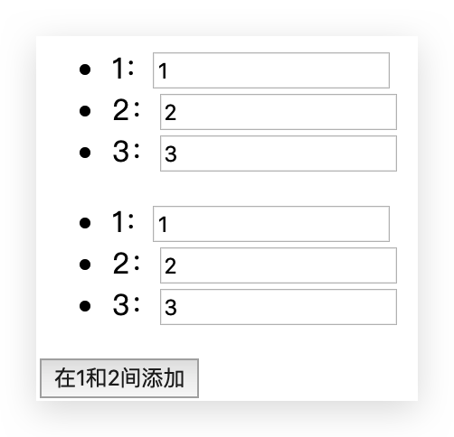
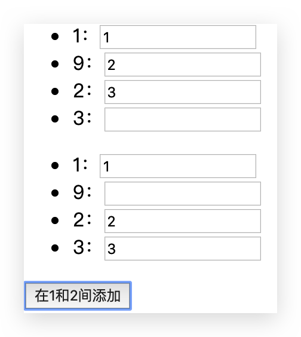

# 条件和循环

## v-if & v-else-if & v-else

```html
<!DOCTYPE html>
<html lang="en">
  <head>
    <meta charset="UTF-8" />
    <meta name="viewport" content="width=device-width, initial-scale=1.0" />
    <title>Title</title>
  </head>

  <body>
    <div id="app">
      <h2 v-if="score>=90">优秀</h2>
      <h2 v-else-if="score>=80">良好</h2>
      <h2 v-else-if="score>=60">及格</h2>
      <h2 v-else>不及格</h2>

      <!-- 但是不推荐这样写，推荐使用计算属性 -->
      {{result}}
    </div>

    <script src="/lib/vue.js"></script>
    <script>
      const vm = new Vue({
        el: '#app',
        data: {
          score: 88,
        },
        computed: {
          result() {
            let showMessage = ''
            if (this.score >= 90) {
              showMessage = '优秀'
            } else if (this.score >= 80) {
              showMessage = '良好'
            } else if (this.score >= 60) {
              showMessage = '及格'
            } else {
              showMessage = '不及格'
            }
            return showMessage
          },
        },
        methods: {},
      })
    </script>
  </body>
</html>
```

## 账号切换案例 & Virtual DOM 复用

```html
<!DOCTYPE html>
<html lang="en">
  <head>
    <meta charset="UTF-8" />
    <meta name="viewport" content="width=device-width, initial-scale=1.0" />
    <title>Title</title>
  </head>

  <body>
    <div id="app">
      <span v-if="isUser">
        <label for="username">用户账号</label>
        <input
          type="text"
          id="username"
          placeholder="用户账号"
          key="username"
        />
      </span>
      <span v-else>
        <label for="username">用户邮箱</label>
        <input type="email" id="email" placeholder="用户邮箱" key="email" />
      </span>
      <button @click="isUser = !isUser">切换</button>
    </div>

    <script src="/lib/vue.js"></script>
    <script>
      const vm = new Vue({
        el: '#app',
        data: {
          isUser: true,
        },
      })
    </script>
  </body>
</html>
```

小问题：

- 在有输入内容情况下，切换类型，会发现内容依然存在，没有被清空
- 按理说已经切换到另一个 input 元素中了，且另一个元素没有输入内容

解答：

- 因为 Vue 的 Virtual DOM 在进行渲染时，出于性能考虑，会尽可能复用已存在的元素，而不是重新创建新的元素
- 在上面的案例中，Vue 发现原来的 input 元素不再使用，直接作为 else 中的 input 来使用了

解决：

- 若不希望出现 Vue 重复利用问题，可以给对应的 input 元素添加**不同的 key**
- 但是有的时候又需要不清空，根据需要选择
- 类似的 v-for 时要指定 key 也是该原因（但是是**为了更好的复用**）

## v-if & v-show

区别：

- `v-if` 是“真正”的条件渲染，因为它会确保在切换过程中条件块内的事件监听器和子组件适当地被销毁和重建。它也是**惰性的**：如果在初始渲染时条件为假，则什么也不做（**DOM 中不存在**）——直到条件第一次变为真时，才会开始渲染条件块。

- `v-show` 不管初始条件是什么，元素总是会被渲染，并且只是简单地基于 CSS 进行切换，`display: none`。

总结：一般来说，`v-if` 有更高的切换开销，而 `v-show` 有更高的初始渲染开销。因此，如果需要**非常频繁地切换**，则使用 `v-show` 较好；如果在**运行时条件很少改变**，则使用 `v-if` 较好。

## v-for & key

### v-for

不推荐遍历对象，直接调用即可

```html
<!DOCTYPE html>
<html lang="en">
  <head>
    <meta charset="UTF-8" />
    <meta name="viewport" content="width=device-width, initial-scale=1.0" />
    <title>Title</title>
  </head>

  <body>
    <div id="app">
      <!-- 便利对象，获取 value -->
      <ul>
        <li v-for="value in info">{{value}}</li>
      </ul>

      <!-- 便利对象，获取 (value,key) -->
      <ul>
        <li v-for="(value,key) in info">{{value}}-{{key}}</li>
      </ul>

      <!-- 便利对象，获取 (value,key,index) -->
      <ul>
        <li v-for="(value,key,index) in info">{{value}}-{{key}}-{{index}}</li>
      </ul>

      <!-- 便利数组，获取 value -->
      <ul>
        <li v-for="item in infoList">
          {{item.name}}-{{item.age}}-{{item.sex}}
        </li>
      </ul>

      <!-- 便利数组，获取  (value,index)  -->
      <ul>
        <li v-for="(item,index) in infoList">
          {{item.name}}-{{item.age}}-{{item.sex}}-{{index}}
        </li>
      </ul>
    </div>

    <script src="/lib/vue.js"></script>
    <script>
      const vm = new Vue({
        el: '#app',
        data: {
          message: 'Hello',
          info: {
            name: 'conanan',
            age: 18,
            sex: 'male',
          },
          infoList: [
            {
              name: 'conanan',
              age: 18,
              sex: 'male',
            },
            {
              name: 'zhangsan',
              age: 33,
              sex: 'male',
            },
            {
              name: 'lisi',
              age: 44,
              sex: 'female',
            },
          ],
        },
        methods: {},
      })
    </script>
  </body>
</html>
```

### key

**建议尽可能在使用 `v-for` 时提供 `key` attribute（无论是元素还是组件）**，除非遍历输出的 DOM 内容非常简单，或者是刻意依赖默认行为以获取性能上的提升。它是 Vue 识别节点的一个通用机制，并不仅与 `v-for` 特别关联。

这和 Vue 的 Virtual DOM 的 Diff 算法有关

当 Vue 正在更新使用 `v-for` 渲染的元素列表时，它默认使用“**就地更新**”的策略。如果**数据项的顺序被改变**，Vue 将**不会移动 DOM 元素来匹配数据项的顺序，而是就地更新每个元素**，并且确保它们在每个索引位置正确渲染。这个默认的模式是高效的，但是**只适用于不依赖子组件状态或临时 DOM 状态 (例如：表单输入值) 的列表渲染输出**。为了给 Vue 一个提示，以便它能跟踪每个节点的身份，从而**重用和重新排序现有元素**，你需要为每项提供一个唯一 `key` attribute。

看如下例子：

```html
<!DOCTYPE html>
<html lang="en">
  <head>
    <meta charset="UTF-8" />
    <meta name="viewport" content="width=device-width, initial-scale=1.0" />
    <title>Title</title>
  </head>

  <body>
    <div id="app">
      <ul>
        <li v-for="(item,index) in array">{{item}}：<input type="text" /></li>
      </ul>
      <ul>
        <li v-for="(item,index) in array" :key="item">
          {{item}}：<input type="text" />
        </li>
      </ul>
      <button @click="add">在1和2间添加</button>
    </div>

    <script src="/lib/vue.js"></script>
    <script>
      const vm = new Vue({
        el: '#app',
        data: {
          message: 'Hello',
          array: [1, 2, 3],
        },
        methods: {
          add() {
            this.array.splice(1, 0, 9)
          },
        },
      })
    </script>
  </body>
</html>
```

input 中填入值



点击按钮后结果如图：



显而易见，上面的没有使用 key，它**就地更新**，重用了组件。下面的使用了 key，不会重用组件，添加正确。具体再总结吧！

## 数组中哪些方法是响应式的？

Vue 将被侦听的数组的变更方法进行了包裹，所以它们也将会触发视图更新。这些被包裹过的方法包括：

- `push()`
- `pop()`
- `shift()`
- `unshift()`
- `splice()`
- `sort()`
- `reverse()`

注意：直接修改数组中某个值，不是响应式的！

```html
<!DOCTYPE html>
<html lang="en">
  <head>
    <meta charset="UTF-8" />
    <meta name="viewport" content="width=device-width, initial-scale=1.0" />
    <title>Title</title>
  </head>

  <body>
    <div id="app">
      <ul>
        <li v-for="item in letters">{{item}}</li>
      </ul>
      <button @click="arrayMethod">btn</button>
    </div>

    <script src="/lib/vue.js"></script>
    <script>
      const vm = new Vue({
        el: '#app',
        data: {
          letters: ['a', 'b', 'c', 'd'],
        },
        methods: {
          arrayMethod() {
            // push 向末尾添加
            // this.letters.push("e");
            // this.letters.push("e"，"f","g");
            // pop 从末尾删除
            // this.letters.pop();
            // shift 从首部删除
            // this.letters.shift();
            // unshift 向首部添加
            // this.letters.unshift("-a");
            // this.letters.unshift("-c", "-b", "-a"); // ['-c','-b','-a','a','b','c']
            // splice 删除并添加一个值，修改一个值时使用。增删改都可以完成
            this.letters.splice(1, 1, 'bbb')
            // reverse 反转
            // this.letters.reverse();
            // sort 排序
            // this.letters.sort();
          },
        },
      })
    </script>
  </body>
</html>
```

## 购物车案例

```html
<!DOCTYPE html>
<html lang="en">
  <head>
    <meta charset="UTF-8" />
    <meta name="viewport" content="width=device-width, initial-scale=1.0" />
    <title>Vue</title>
    <style>
      table {
        /* 合并细线边框 */
        border-collapse: collapse;
        /* 单元格之间水平、垂直距离，与 border-collapse 冲突，不常用 */
        /*border-spacing: 10px 20px;*/
        /* 表格居中 */
        margin: 100px auto;
      }
      th,
      td {
        /* 边框 */
        border: 1px solid skyblue;
        /* 内边距 */
        padding: 20px;
        /* 让td居中，th本来就是居中的 */
        text-align: center;
        /* 默认情况下元素在th,td中是垂直居中的，也可以通过 vertical-align 来修改*/
        /* 由此可得，对一个父元素设置 display: table-cell，可以直接使用 vertical-align 来垂直居中*/
      }
    </style>
  </head>

  <body>
    <div id="app">
      <div v-if="books.length >= 1">
        <table>
          <thead>
            <tr>
              <th></th>
              <th>书籍名称</th>
              <th>出版日期</th>
              <th>价格</th>
              <th>购买数量</th>
              <th>操作</th>
            </tr>
          </thead>
          <tbody>
            <tr v-for="(book,index) in books" :key="book.id">
              <td>{{book.id}}</td>
              <td>{{book.name}}</td>
              <td>{{book.time}}</td>
              <!-- <td>{{'¥'+book.price.toFixed(2)}}</td> -->
              <!-- 这么多地方使用，可以复用 -->
              <!-- 方式1:方法。计算属性也可以 -->
              <!-- <td>{{formartPrice(book.price)}}</td> -->
              <!-- 方式2:过滤器 -->
              <td>{{book.price | formartPrice}}</td>

              <td>
                <button @click="decrement(book)" :disabled="book.count === 1">
                  -
                </button>
                {{book.count}}
                <button @click="increment(book)">+</button>
              </td>
              <td><button @click="remove(index)">移除</button></td>
            </tr>
          </tbody>
        </table>
        <!-- 总价：{{'¥'+totalPrice.toFixed(2)}} -->
        <!-- 总价：{{formartPrice(totalPrice)}} -->
        总价：{{totalPrice | formartPrice}}
      </div>
      <div v-else>
        购物车为空
      </div>
    </div>

    <script src="/lib/vue.js"></script>
    <script>
      // vue.js文件中定义了 Vue 对象，使用时可以 new 构造出，并且它还有参数（对象类型）
      const vm = new Vue({
        el: '#app',
        // 声明式编程（声明式渲染），不再使用命令式
        data: {
          books: [
            { id: 1, name: 'Java', time: '2006-02', price: 110.0, count: 1 },
            { id: 2, name: 'Kotlin', time: '2016-03', price: 120.0, count: 1 },
            { id: 3, name: 'Clojure', time: '2008-12', price: 112.0, count: 1 },
            { id: 4, name: 'JVM', time: '2002-8', price: 200.0, count: 1 },
          ],
        },
        methods: {
          increment(book) {
            book.count++
          },
          decrement(book) {
            // if (book.count === 1) {
            //   return;
            // }
            book.count--
          },
          remove(index) {
            this.books.splice(index, 1)
          },
          formartPrice(price) {
            return '¥' + price.toFixed(2)
          },
        },
        computed: {
          totalPrice() {
            // let totalPrice = 0;
            // this.books.forEach((item) => {
            //   totalPrice += item.price * item.count;
            // });
            // return totalPrice;

            return this.books.reduce((previous, current, index, arr) => {
              return previous + current.price * current.count
            }, 0)
          },
        },
        filters: {
          formartPrice(price) {
            return '¥' + price.toFixed(2)
          },
        },
      })
    </script>
  </body>
</html>
```
