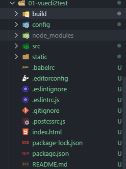
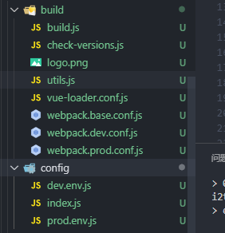
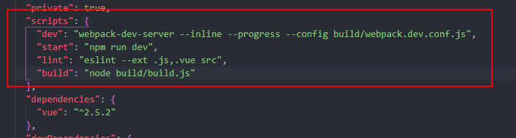
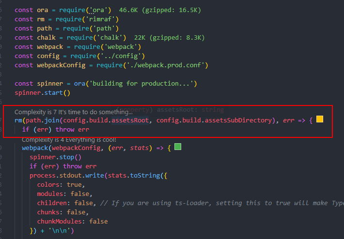
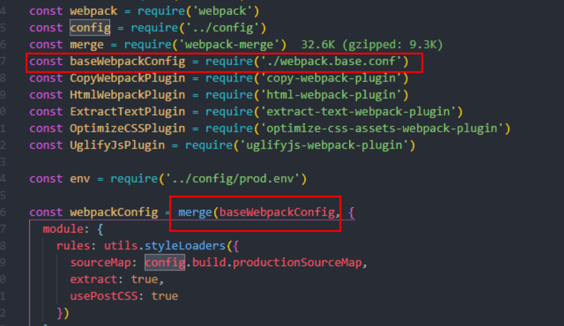

# 入门

[官方文档](https://cli.vuejs.org/zh/)

## 安装

```bash
npm install -g @vue/cli
# OR
yarn global add @vue/cli
```

用这个命令来检查其版本是否正确：

```bash
vue --version
```

## 创建项目

### vue create

运行以下命令来创建一个新项目：

```bash
vue create hello-world
```

### vue ui

也可以通过 `vue ui` 命令以图形化界面创建和管理项目：

```bash
vue ui
```

上述命令会打开一个浏览器窗口，并以图形化界面将你引导至项目创建的流程。

### 拉取 2.x 模板 (旧版本)

Vue CLI >= 3 和旧版使用了相同的 `vue` 命令，所以 Vue CLI 2 (`vue-cli`) 被覆盖了。如果你仍然需要使用旧版本的 `vue init` 功能，你可以全局安装一个桥接工具：

```bash
npm install -g @vue/cli-init
# `vue init` 的运行效果将会跟 `vue-cli@2.x` 相同
vue init webpack my-project
```

我 tm 模版下载了半天没成功！算逑了

不过 2.x 生成的代码有许多配置（大致能看懂），3.x 开始后就隐藏了，所以可以用于学习了解

## runtime + compiler & runtime

**推荐 runtime**

### 区别

区别看下面俩 main.js

runtime + compiler：

```js
import Vue form 'vue'
import App form './App'

Vue.config.productionTip = false

new Vue({
    el: '#app',
    components: { App },
    template: '<App/>'
})
```

从 template --parse--> ast --render--> vdom --> UI

compiler：

```js
import Vue form 'vue'
import App form './App'

Vue.config.productionTip = false

new Vue({
    el: '#app',
    render: h => h(App)
})
```

直接 --render--> vdom --> UI。即使是 .vue 文件中的 template 也会被 vue-template-compiler parse，查看对象中不再有 template，而是有个 render() 函数替代直接渲染

### render

普通用法

```js
import Vue form 'vue'
import App form './App'

Vue.config.productionTip = false

new Vue({
    el: '#app',
    // createElement('标签名', {标签的属性}, [])
    render: createElement => createElement('h2',
                                          {class: 'box'},
                                           ['Hello World', createElement('button',
                                                                        {class: 'btn'},
                                                                        ['按钮'])]
                                          )
})
```

传入组件对象。直接 --render--> vdom --> UI

```js
import Vue form 'vue'
import App form './App'

Vue.config.productionTip = false

const cpn = {
    template: '<div>{{message}}</div>',
    data(){
        return {
            message: '我是组件message'
        }
    }
}

new Vue({
    el: '#app',
    // render: createElement => createElement(cpn)

    // 同样的 App 组件也可以直接传递
    // render: createElement => createElement(App)
    // 精简
    render: h => h(App)
})
```

## Vue-CLI 2 目录

### 目录

生成的目录如下图，其中 build 和 config 都是配置相关的文件。



### build

如图所示，build 中将 webpack 的配置文件做了分离：

- `webpack.base.conf.js`（公共配置）
- `webpack.dev.conf.js`（开发环境）
- `webpack.prod.conf.js`（生产环境）



我们使用的脚本命令配置在`package.json`中。



打包构建：

```bash
npm run build
```

如果搭建了本地服务器`webpack-dev-server`，本地开发环境：

```bash
npm run dev
```

此时`npm run build`打包命令相当于使用 node 执行 build 文件夹下面的 build.js 文件。



1.  检查 dist 文件夹是否已经存在，存在先删除
2.  如果没有 err，就使用 webpack 的配置打包 dist 文件夹

在生产环境，即使用 build 打包时候，使用的是`webpack.prod.conf.js`配置文件。



源码中，显然使用了`webpack-merge`插件来合并 prod 配置文件和公共的配置文件，合并成一个配置文件并打包，而`webpack.dev.conf.js`也是如此操作，在开发环境使用的是 dev 的配置文件。

config 文件夹中是 build 的配置文件中所需的一些变量、对象，在`webpack.base.conf.js`中引入了`index.js`。

```js
const config = require('../config')
```

### src & static

src 源码目录，就是我们需要写业务代码的地方。

static 是放静态资源的地方，static 文件夹下的资源会原封不动的打包复制到 dist 文件夹下。

### .babelrc

.babelrc 是 ES 代码相关转化配置。

```
{
  "presets": [
    ["env", {
      "modules": false,
      "targets": {
        "browsers": ["> 1%", "last 2 versions", "not ie <= 8"]
      }
    }],
    "stage-2"
  ],
  "plugins": ["transform-vue-jsx", "transform-runtime"]
}
```

1.  browsers 表示需要适配的浏览器，份额大于 1%，最后两个版本，不需要适配 ie8 及以下版本
2.  babel 需要的插件

### .editorconfig

.editorconfig 是编码配置文件。

```
root = true

[*]
charset = utf-8
indent_style = space
indent_size = 2
end_of_line = lf
insert_final_newline = true
trim_trailing_whitespace = true
```

一般是配置编码，代码缩进 2 空格，是否清除空格等。

### .eslintignore

.eslintignore 文件忽略一些不规范的代码。

```
/build/
/config/
/dist/
/*.js
```

忽略 build、config、dist 文件夹和 js 文件。

### .postcssrc.js

css 转化是配置的一些。

### index.html

index.html 文件是使用`html-webpack-plugin`插件打包的 index.html 模板。

### package.json & package-lock.json

- package.json（包管理，记录大概安装的版本）

- package-lock.json（记录真实安装版本）

所以一般下载开源项目时，要根据 lock 使用的是 npm 还是 yarn 来安装依赖，才能防止版本不一致

## Vue-CLI 3 介绍

与 2 的区别

- Vue-CLI 3 基于 webpack4 打造，Vue-CLI 2 是基于 webpack3

- Vue-CLI 3 的设计原则是"**0 配置**"，**移除了配置文件，build 和 config 等**。最终跑到 node_modules/@vue/cli-service/webpack.config.js，实在要改变则在根目录下创建 vue.config.js，类似 webpack.config.js

  ```js
  //在module.exports中修改配置
  module.exports = {}
  ```

- Vue-CLI 3 提供`vue ui`的命令，提供了可视化配置

- **移除了 static 文件夹**，**新增了 public 文件夹**，并将 index.html 移入了 public 文件夹。**打包时原封不动**！
