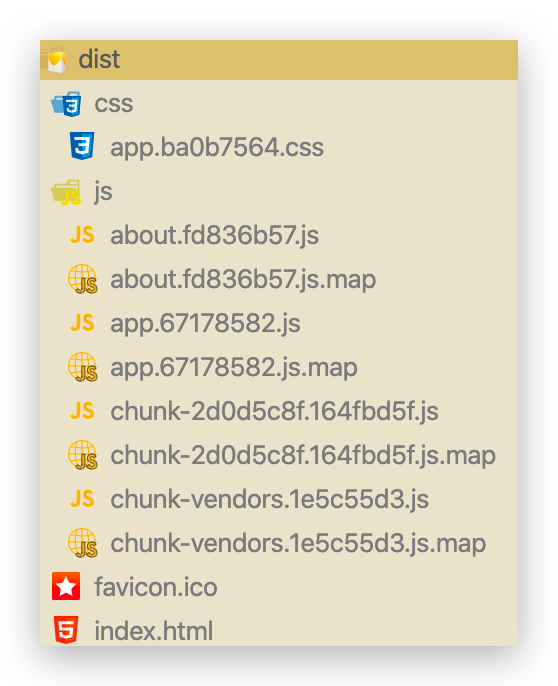

# 入门

## 简介

### 路由简介

- 路由就是通过互联的网络把信息**从源地址传送到目的地的活动**，网络工程术语
- 路由提供了两种机制：**路由**和**传送**
  - 路由是决定数据包从来源到目的地的**路径**
  - 转送就是**将数据转移**
- **路由表**
  - 路由表本质就是一个**映射表**，决定了数据包的指向

### 后端 & 前端路由 🔥

1.  **后端渲染，服务端渲染（后端路由）阶段**：前端请求一个 URL 后，由例如 Java 如 SpringMVC 中 @RequestMapping 来映射到 Java 代码中，并通过 Servlet 和 JSP 技术编写 HTML 页面（JS+CSS）并填充数据，最后返回给前端完整的 HTML，前端直接渲染展示即可。这种**由后端处理 URL 和页面映射关系的称为后端路由**。

2.  **前后端分离阶段（Gmail 的 Ajax 大量使用）** ：前端请求一个 URL 后，可能先从静态资源服务器获取一套 HTML+CSS+JS（服务器中有多套），之后再由 JS 发送 Ajax 请求到后端，由后端返回如 JSON 数据交给前端，前端使用 JS 进行数据填充，渲染 DOM。**每次 URL 改变都会请求后端服务器拿静态资源和数据**。

3.  **单页面富应用（SPA 页面），前后端分离加上前端路由阶段**： 前端第一次请求 URL 后，会从如静态资源服务器获取一套完整的 HTML+CSS+JS（只有一个 HTML，其他 JS 或 CSS 可能会懒加载），**之后的 URL 改变不会向后端服务器发送请求，页面不进行整体刷新**，而是由其不同的 URL 页面自己**发送 Ajax 请求获取数据并由 JS 进行数据填充**，渲染 DOM。**这种由前端处理 URL 和页面的映射关系称为前端路由**。

    那么如何在 URL 改变后页面还不进行整体刷新呢？且看下面介绍。

### URL 的 hash & HTML5 的 history 🔥

::: tip

Vue CLI 初始化项目时推荐选择 history 模式。URL 看起来更友好，没有`#`这玩意

:::

URL 的 hash 是改变锚点`#`，其本质上改变的是 window.location.hash 属性，不是 href 属性

```
location.hash = '/user/10000'
http://localhost:8082/#/user/10000

location.hash = '/role/1'
http://localhost:8082/#/role/1
```

HTML5 的 history。是一个**栈结构**

```bash
history.pushState('','','/user/100001')
http://localhost:8082/user/100001

history.pushState('','','/role/1')
http://localhost:8082/role/1

history.back()
http://localhost:8082/user/100001

history.forward()
http://localhost:8082/role/1

history.replaceState('','','/permission/100')
http://localhost:8082/permission/100
# 此时将上面的 http://localhost:8082/role/1 替换掉了，之后无法 back 回去，只能 back 到 http://localhost:8082/user/100001

# go 可以更灵活控制，相比 back，forward
history.go(-1)
history.go(1)
history.go(-2)
history.go(2)
```

**Vue Router 就是将组件和 URL 映射**

## 安装和配置 🔥

安装。有的推荐加上`--save`，代表安装到**正式依赖中**

```bash
npm install vue-router
```

模块化工程中使用必须要通过 `Vue.use()` 明确地**安装路由插件**功能，**创建路由实例，传入路由映射配置**

```js
import Vue from 'vue'
import VueRouter from 'vue-router'
// 可以省略后缀(resolve.extensions配置的作用)；不推荐在这里导入，推荐如下懒加载方式
import Home from '../components/Home'

// 安装路由插件功能
Vue.use(VueRouter)

// 路由映射配置
const routes = [
  {
    path: '/', // 或 "" 都可以
    name: 'Index',
    // 重定向
    redirect: '/home',
  },
  {
    path: '/home',
    name: 'Home',
    component: Home,
  },
  {
    path: '/about',
    name: 'About',
    // route level code-splitting
    // this generates a separate chunk (about.[hash].js) for this route
    // which is lazy-loaded when the route is visited.
    component: () =>
      import(/* webpackChunkName: "about" */ '@/components/About'),
  },
  {
    path: '/user/:id',
    name: 'User',
    component: () => import('@/components/User'),
  },
]

// 创建路由实例，传入路由映射配置
const router = new VueRouter({
  // history模式
  mode: 'history',
  base: process.env.BASE_URL,
  routes,
})

// 导出
export default router
```

**在 Vue 实例中挂载创建的路由实例**

```js
// /src/main.js

import Vue from 'vue'
import App from './App.vue'
// 导入，./router 是一个目录，会自动导入 index 文件
import router from './router'

Vue.config.productionTip = false

// 挂载
new Vue({
  router,
  render: (h) => h(App),
}).$mount('#app')
```

## 标签路由 🔥

### 使用

```vue
<!-- /src/App.vue-->

<template>
  <div id="app">
    <div id="nav">
      <router-link to="/home">Home</router-link>
      <router-link to="/about">About</router-link>
    </div>
    <router-view />
  </div>
</template>

<script>
export default {
  name: 'App',
}
</script>

<style>
#app {
  font-family: Avenir, Helvetica, Arial, sans-serif;
  -webkit-font-smoothing: antialiased;
  -moz-osx-font-smoothing: grayscale;
  text-align: center;
  color: #2c3e50;
}

#nav {
  padding: 30px;
}

#nav a {
  font-weight: bold;
  color: #2c3e50;
}

#nav a.router-link-active {
  color: #42b983;
}
</style>
```

那两个组件就不写了。

### `<router-link>`

全局组件，最终被渲染成 a 标签，但是它**只是标记路由指向类似一个 a 标签或者按钮一样**，若是我们点击 a 标签要跳转页面或者要显示页面，所以就要用上它。

- `to`属性：用于跳转到指定路径

- `tag`属性：可以指定`<router-link>`之后渲染成什么组件使用`<router-link to='/home' tag='button'>`会被渲染成一个按钮，而不是 a 标签

- `relapce`属性：在 history 模式下指定`<router-link to='/home' tag='button' replace>`使用 replaceState 而不是 pushState，此时浏览器的返回按钮将不能返回替换前的路由

- `active-class`属性：当`<router-link>`对应的路由匹配成功的时候，会自动给当前元素设置一个`router-link-active`的 class，设置`active-class`属性值可以修改默认的名称。

  - 在进行高亮显示的导航菜单或者底部 tabbar 时，会用到该属性。但是通常不会修改类的属性，会直接使用默认的`router-link-active`

  - `<router-link to='/home' tag='button' active-class='active'>`此时被选中的`<router-link>`就会有 active 的 class。

  - 如果每个`<router-link>`都要加上`active-class='active'`，那就在路由里面统一更改。

    ```js
    const router = new Router({
      //配置路由和组件之间的应用关系
      routes,
      mode: 'history', //修改模式为history
      linkActiveClass: 'active',
    })
    ```

### `<router-view>`

用来**占位的，就是路由对应的组件展示的地方**，该标签会根据当前的路径，动态渲染出不同的组件。

路由切换的时候切换的是它挂载的组件，其他不会发生改变。它默认使用 hash 模式，可以在 src/router/index.js 中配置修改为 history 模式。

## 代码路由 🔥

```vue
<template>
  <div id="app">
    <div id="nav">
      <!-- 当然也可以使用 router-link 和 tag 来实现。但是必须有 to 属性，所以自己斟酌使用场景。
			这里 button 也不会添加 class -->
      <button @click="goHome">Home</button>
      <button @click="goAbout">About</button>
    </div>
    <router-view />
  </div>
</template>

<script>
export default {
  name: 'App',
  methods: {
    goHome() {
      // vue-router 给所有组件都添加了 $router 属性。还有replace方法！
      console.log(this.$route)
      // 不判断，则第二次点击同一路由报错
      if (this.$route.path !== '/home') {
        this.$router.push('/home')
      }
    },
    goAbout() {
      if (this.$route.path !== '/about') {
        this.$router.push('/about')
      }
    },
  },
}
</script>

<style>
#app {
  font-family: Avenir, Helvetica, Arial, sans-serif;
  -webkit-font-smoothing: antialiased;
  -moz-osx-font-smoothing: grayscale;
  text-align: center;
  color: #2c3e50;
}

#nav {
  padding: 30px;
}

#nav a {
  font-weight: bold;
  color: #2c3e50;
}
</style>
```

## 动态路由 🔥

由于路由中的 `path`是全匹配，例如`/user`查询所有用户，若此时 URL 为`/user/1`则匹配不到，但是这个 1 又不能写死！

```js
{
    path: '/user/:id',
    name: 'User',
    component: () => import('@/components/User')
}
```

```vue
<router-link :to="'/user/' + user.id">User</router-link>
<!-- user.id 为动态获取的 -->
```

```vue
<template>
  <div>
    <h1>User</h1>
    <h2>{{ userId }}</h2>
  </div>
</template>

<script>
export default {
  computed: {
    userId() {
      // 拿到路由上的动态参数
      return this.$route.params.id
    },
  },
}
</script>

<style></style>
```

注意，手动输入 URL 即使匹配到路由，也不会添加 active class！

## 路由懒加载 🔥

vue-router 打包文件解析问题：打包时候 JS 太大，页面响应缓慢

**如果组件模块化了，当路由被访问的时候才开始加载被选中的组件**，这样就是路由懒加载。**一个路由对应一个 JS 文件**。

```js
component: () => import('@/components/User')
```

使用`npm run build`命令将之前创建的项目打包，打开 dist 文件夹，器目录结构如下：



以下是 Vue CLI 2 的代码

- app.xxx.js 是我们自己编写的业务代码
- vendor.xxx.js 是第三方框架，例如 vue/vue-router/axios 等
- mainfest.xxx.js 是为了打包的代码做底层支持的，一般是 webpack 帮我们做一些事情
- 除了这三个还多了 2 个 js，这 2 个 js 文件（0.5bxxx.js 和 1.e5xxx.js）分别是 About 和 User 组件，因为这 2 个组件是懒加载的所以被分开打包了。

此时因为是懒加载，需要用到这个组件的时候才会加载，所以不会一次性请求所有 JS。

## 嵌套路由 🔥

平常在一个 home 页面中，我们可能需要`/home/news`和`/home/message`访问一些内容，一个路由映射一个组件就像后端一个 api 对应一个 controller 的一个 requestMapping 一样，访问两个路由也会分别渲染这两个组件。

要实现嵌套路由：

- 创建对应的子组件，并且在路由映射`router/index.js`中配置对应的子路由。

- 在组件内部使用`<router-view>`标签来占位。

```js
// /router/index.js

import Vue from 'vue'
import VueRouter from 'vue-router'

// 安装路由插件功能
Vue.use(VueRouter)

// 路由映射配置
const routes = [
  {
    path: '', // 或 "/" 都可以
    name: 'Index',
    // 重定向
    redirect: '/home',
  },
  {
    path: '/home',
    name: 'Home',
    component: () => import('@/components/Home'),
    children: [
      {
        path: '', // 或 "/" 都可以
        // 后续也不这样使用，使用 keep-alive 来选择上次选择的路由
        redirect: 'news',
      },
      {
        // 不可以加 /，也不可以加 /home
        path: 'news',
        component: () => import('@/components/HomeNews'),
      },
      {
        // 不可以加 /，也不可以加 /home
        path: 'message',
        component: () => import('@/components/HomeMessage'),
      },
    ],
  },
  {
    path: '/about',
    name: 'About',
    // route level code-splitting
    // this generates a separate chunk (about.[hash].js) for this route
    // which is lazy-loaded when the route is visited.
    component: () =>
      import(/* webpackChunkName: "about" */ '@/components/About'),
  },
  {
    path: '/user/:id',
    name: 'User',
    component: () => import('@/components/User'),
  },
]

// 创建路由实例，传入路由映射配置
const router = new VueRouter({
  // history模式
  mode: 'history',
  base: process.env.BASE_URL,
  routes,
})

// 导出
export default router
```

```vue
<!-- /components/Home.vue -->

<template>
  <div>
    <h1>Home</h1>
    <router-link to="/home/news">News</router-link>｜
    <router-link to="/home/message">Message</router-link>
    <router-view></router-view>
  </div>
</template>

<script>
export default {
  name: 'Home',
}
</script>
```

## 传递参数 🔥

路由跳转间传递参数

### 方式一：动态路由 & params

- 配置路由的格式：`/user/:id`
- 传递时需要拼接，最终形成的路径：`/user/123`，`/user/xxx`
- 通过`$route.params.id`获取指定 id

代码查看动态路由

### 方式二：query

- 配置路由的格式：`/profile`，也就是普通的配置

- 传递的方式：对象中使用 query 的 key 作为传递的方式

- 传递形成的路径：`/profile?name=conanan&age=18`这个 query 传递的是两个键值对

  `/profile?user=%5Bobject%20Object%5D`这个 query 传递的是一个对象的键值对，key 为 user，value 是一个对象

```vue
<template>
  <div id="app">
    <div id="nav">
      <router-link to="/home">Home</router-link>|
      <router-link to="/about">About</router-link>|
      <router-link :to="'/user/' + user.id">User</router-link>|
      <router-link
        :to="{ path: '/profile', query: { name: 'conanan', age: 18 } }"
        >Profile</router-link
      >

      <!-- 当然也可以使用 router-link 和 tag 来实现。但是必须有 to 属性，所以自己斟酌使用场景。这里 button 也不会添加 class -->
      <!-- <button @click="goHome">Home</button>
      <button @click="goAbout">About</button>
      <button @click="goProfile">Profile</button>-->
    </div>
    <router-view />
  </div>
</template>

<script>
export default {
  name: 'App',
  data() {
    return {
      user: {
        id: 10001,
      },
    }
  },
  methods: {
    goHome() {
      // vue-router 给所有组件都添加了 $router 属性。还有replace方法！
      console.log(this.$route)
      // 不判断，则第二次点击同一路由报错
      if (this.$route.path !== '/home') {
        this.$router.push('/home')
      }
    },
    goAbout() {
      if (this.$route.path !== '/about') {
        this.$router.push('/about')
      }
    },
    goProfile() {
      if (this.$route.path !== '/profile') {
        this.$router.push({
          path: '/profile',
          // query: { name: 'conanan', age: 18 }
          query: {
            user: {
              name: 'conanan',
              age: 25,
            },
          },
        })
      }
    },
  },
}
</script>

<style>
#app {
  font-family: Avenir, Helvetica, Arial, sans-serif;
  -webkit-font-smoothing: antialiased;
  -moz-osx-font-smoothing: grayscale;
  text-align: center;
  color: #2c3e50;
}

#nav {
  padding: 30px;
}

#nav a {
  font-weight: bold;
  color: #2c3e50;
}

#nav a.router-link-active {
  color: #42b983;
}
</style>
```

## $router & $route 区别 🔥

vue 全局对象`this.$router`与 main.js 导入的 router 对象是一个对象，也就是我们`/router/index.js`导出的对象 router，都是同一个 VueRouter 对象。因为**所有的组件都继承自 Vue 类的原型（prototype）**

`this.$route`对象是当前处于活跃的路由，就是 router 中配置的映射关系，有 params 和 query 属性可以用来传递参数。
