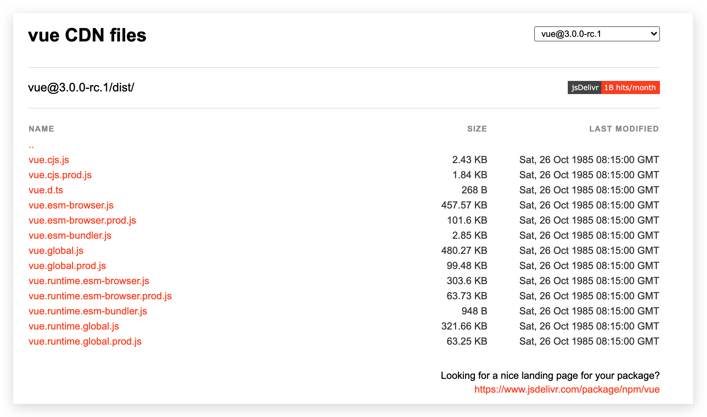

# 入门

::: tip 代码

配套的代码在 [Github](https://github.com/apple54whn/study-vuejs) 中

:::

## Vue.js 是什么

Vue 是一套用于构建用户**界面**的**渐进式框架（可以只用 Vue，根据后续需要使用其他如 Router、Vuex 等）**。

与其它大型框架不同的是，Vue 被设计为可以**自底向上逐层应用**。Vue 的核心库只**关注视图层**，不仅易于上手，还便于与第三方库或既有项目整合。另一方面，当与现代化的工具链以及各种支持类库结合使用时，Vue 也完全能够为复杂的单页应用提供驱动。

特点如下：

- 解耦视图和数据
- 可复用的组件
- 前端路由
- 状态管理
- 虚拟 DOM

## 安装

官方的[安装文档](https://www.vue3js.cn/docs/zh/guide/installation.html)

### CDN

对于**制作原型或学习**，你可以这样使用最新版本

```html
<script src="https://unpkg.com/vue@next"></script>
```

对于生产环境，我们推荐链接到一个**明确的版本号和构建文件**，以避免新版本造成的不可预期的破坏


### npm


### CLI


### Vite


### 对不同构建版本的解释

在 [npm 包的 dist/ 目录](https://cdn.jsdelivr.net/npm/vue@3.0.0-rc.1/dist/)你将会找到很多不同的 Vue.js 构建版本。这里列出了它们之间的差别：



具体见[文档](https://www.vue3js.cn/docs/zh/guide/installation.html#%E5%AF%B9%E4%B8%8D%E5%90%8C%E6%9E%84%E5%BB%BA%E7%89%88%E6%9C%AC%E7%9A%84%E8%A7%A3%E9%87%8A)


## 计数器

可以将 template 中内容写到 html 中，Vue2 的 el 已被 mount() 替代：

```html
<!DOCTYPE html>
<html lang="en">
  <head>
    <meta charset="UTF-8" />
    <meta name="viewport" content="width=device-width, initial-scale=1.0" />
    <title>Hello World</title>
    <script src="https://unpkg.com/vue@next"></script>
  </head>
  <body>
    <div id="app">
      <button @click="decrement">-</button>
      <span>{{counter}}</span>
      <button @click="increment">+</button>
    </div>

    <script>
      const options = {
        // template中写么有提示，不方便
        // template: `<div></div>`,
        data() {
          return {
            counter: 0,
          }
        },
        methods: {
          decrement() {
            this.counter--
          },
          increment() {
            this.counter++
          },
        },
      }

      // // Vue.createApp 创建 Vue 应用
      // const app = Vue.createApp(options);
      // // mount 装载到哪里，即在 id = root 的 html 中使用 vue
      // const vm = app.mount('#root');

      // 可以链式编程：
      const vm = Vue.createApp(options).mount('#app')
    </script>
  </body>
</html>

```


## Options（后续使用 Composition 替换）

### template

表示的是Vue需要帮助我们**渲染的模板信息**。

*   它里面有很多的HTML标签，这些标签会**替换**掉我们挂载到的元素（比如id为app的div）的innerHTML;
*   模板中有一些奇怪的语法，比如 {{}}，比如 @click，这些都是**模板**特有的**语法**

这个模板的写法有点过于别扭了，并且IDE很有可能没有任何提示，阻碍我们编程的效率。**Vue提供了两种方式：**

*   使用script标签，并且标记它的类型为 x-template（和layui那种一样）

    ```html
    <script type="x-template" id="temp"></script>
    
    template: '#temp', //
    ```

    注意和`mount('#app')`不一样！`template: '#temp'` 会把其内容渲染到 mount 中！

*   使用**任意标签**（通常使用template标签，因为不会被浏览器渲染），设置id。🔥

    ```html
    <template id="temp"></template>
    
    template: '#temp', //
    ```

    注意和`mount('#app')`不一样！`template: '#temp'`  会把其内容渲染到 mount 中！


### data

传入一个**函数**，并且该函数需要**返回一个对象**

*   在Vue2.x的时候，也可以传入一个对象（虽然官方推荐是一个函数）
*   在Vue3.x的时候，必须传入一个函数，否则就会直接在浏览器中报错

data 中返回的对象会被Vue的响应式系统劫持，之后对该对象的修改或者访问都会在劫持中被处理

*   所以我们在template中通过 {{counter}} 访问counter，可以从对象中获取到数据
*   我们修改counter的值时，template中的 {{counter}}也会发生改变;


### methods

**methods属性**是一个对象，通常我们会在这个对象中定义很多的方法：

*   这些方法可以被绑定到 template 模板中;
*   在该方法中，我们可以使用this关键字来直接访问到data中返回的对象的属性

注意：


#### this 绑定问题 🔥

*   methods 的方法定义为什么不能使用箭头函数（官方文档有给出解释）

*   不使用箭头函数的情况下，this到底指向的是什么? **是 window**

    箭头函数使用this的查找规则，它会在自己的**上层作用于中来查找this**，最终刚好找到的是script作用于中的this，所以就是window 🔥。vue源码中使用 bind 绑定 publicThis 到每个 method 上，存入 ctx[methos]


## debug 源码

可以在 package.json 中的 dev 选项后面加上 `--sourcemap`，就可以在debug时看到独立的文件而不是打包后的文件


## VSCode 代码片段 🔥

*   第一步，复制自己需要生成代码片段的代码;
*   第二步，https://snippet-generator.app/在该网站中生成代码片段;
*   第三步，在VSCode中配置代码片段;


## v-bind 🔥

*   一般使用：`v-bind:src='src'`或简写`:src='src'`。只能传递单独的值
*   在封装高级组件时（底层是如Element的组件），可以使用`v-bind='info'`来传递info对象！


## Todo-List 及组件初识

```html
<!DOCTYPE html>
<html lang="en">
  <head>
    <meta charset="UTF-8" />
    <meta name="viewport" content="width=device-width, initial-scale=1.0" />
    <title>Hello World</title>
  </head>
  <body>
    <div id="root">
      <div>
        <input v-model="item" />
        <button @click="handleAddItem" :title="item">添加</button>
        <ul>
          <li v-for="(item,index) in list">
            <todo-item
              :item="item"
              :index="index"
              @handle-delete-item="handleDeleteItem"
            />
          </li>
        </ul>
      </div>
    </div>

    <!-- 组件模版分离 -->
    <template id="todo-item">
      <span>{{index+1}}</span>
      <span>--</span>
      <span>{{item}}</span>
      <button @click="handleDeleteItem(index)">删除</button>
    </template>

    <script src="https://unpkg.com/vue@next"></script>
    <script>
      let options = {
        data() {
          return {
            item: '',
            list: [],
          }
        },
        methods: {
          handleAddItem() {
            this.list.push(this.item)
            this.item = ''
          },
          handleDeleteItem(index) {
            this.list.splice(index, 1)
          },
        },
      }

      // Vue.createApp 创建 Vue 应用，存储到 app 中
      //传入的参数表示，这个应用最外层的组件，该如何展示
      const app = Vue.createApp(options)

      // 组件
      app.component('todo-item', {
        template: `#todo-item`,
        props: {
          item: {
            type: String,
            default: '',
          },
          index: {
            type: Number,
            default: 0,
          },
        },
        emits: ['handle-delete-item'],
        methods: {
          handleDeleteItem(index) {
            this.$emit('handle-delete-item', index)
          },
        },
      })

      // mount 装载到哪里，即在 id = root 的 html 中使用 vue
      // vm 就是 vue 应用的根组件
      // mvvm 模式，m model 数据， v view 视图，vm viewModal视图数据连接层
      const vm = app.mount('#root')

      // 改变数据
      // vm.$data.item = '测试课程'
      // vm.item = '测试课程'
    </script>
  </body>
</html>
```


## 生命周期函数

注意 Vue2 的 destroy 等已被 unmount 等取代

```html
<!DOCTYPE html>
<html lang="en">
  <head>
    <meta charset="UTF-8" />
    <meta name="viewport" content="width=device-width, initial-scale=1.0" />
    <title>Hello World</title>
  </head>
  <body>
    <div id="root">
      <div>{{counter}}</div>
    </div>

    <script src="https://unpkg.com/vue@next"></script>
    <script>
      // 生命周期函数：在某一刻会自动执行的函数
      // 执行完 Vue.createApp 并且 mount 后开始进行生命周期函数

      let options = {
        data() {
          return {
            counter: 1,
          }
        },
        beforeCreate() {
          console.log(
            '=====[beforeCreate]: after init events & lifecycle。事件绑定、生命周期函数等。即 Vue 应用生成之前，Vue.createApp',
            '。root innerHTML: ',
            document.getElementById('root').innerHTML // 空
          )
        },
        created() {
          console.log(
            '=====[created]: after init injections & reactivity。依赖注入、响应式（数据双向绑定）等。即 Vue 应用生成之后，Vue.createApp',
            '。root innerHTML: ',
            document.getElementById('root').innerHTML // 空
          )
        },
        // 组件中有 template 则编译为 render 函数，没有则使用 mount 挂载的 el DOM 元素作为 template 进行编译
        beforeMount() {
          console.log(
            '=====[beforeMount]: template（或 el） 的 innerHtml 被编译成render函数后。或称为组件被渲染到页面前。app.mount()',
            '。root innerHTML: ',
            document.getElementById('root').innerHTML // 空，此时没有任何内容！
          )
        },
        mounted() {
          console.log(
            '=====[mounted]: after Create app.$el and replace "el" with it。 组件被渲染到页面后。此时页面的所有数据都可以正常展示！！！app.mount()',
            '。root innerHTML: ',
            document.getElementById('root').innerHTML // <div>1</div>
          )
        },
        beforeUpdate() {
          // 执行 vm.counter ++ 改变了 data 中数据即可
          console.log(
            '=====[beforeUpdate]: when data change, before Virtual DOM re-rendered and patch。即 data 变化，且页面重新渲染前执行',
            '。root innerHTML: ',
            document.getElementById('root').innerHTML // <div>1</div>
          )
        },
        updated() {
          // 执行 vm.counter ++ 改变了 data 中数据即可
          console.log(
            '=====[updated]: when data change, after Virtual DOM re-rendered and patch。即 data 变化，且页面重新渲染后执行',
            '。root innerHTML: ',

            document.getElementById('root').innerHTML // <div>2</div>
          )
        },
        beforeUnmount() {
          console.log(
            '=====[beforeUnmount]: when app.unmount() is called。即 Vue 应用失效时，类比 beforeMount',
            '。root innerHTML: ',
            document.getElementById('root').innerHTML // <div>2</div>
          )
        },
        unmounted() {
          console.log(
            '=====[unmounted]: when app.unmount() is called。即 Vue 应用失效，且 DOM 完全销毁之后，类比 mounted',
            '。root innerHTML: ',
            document.getElementById('root').innerHTML // 空
          )
        },
      }

      // Vue.createApp 创建 Vue 应用
      // mount 装载到哪里，即在 id = root 的 html 中使用 vue
      const app = Vue.createApp(options)
      const vm = app.mount('#root')

      // vm.$data.counter = 2
      vm.counter = 2
      // app.unmount()
    </script>
  </body>
</html>

```

