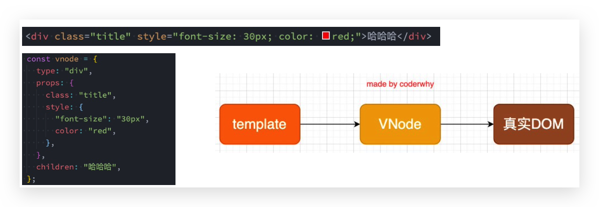
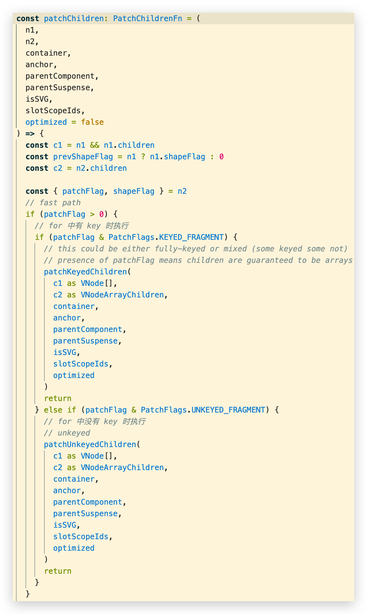
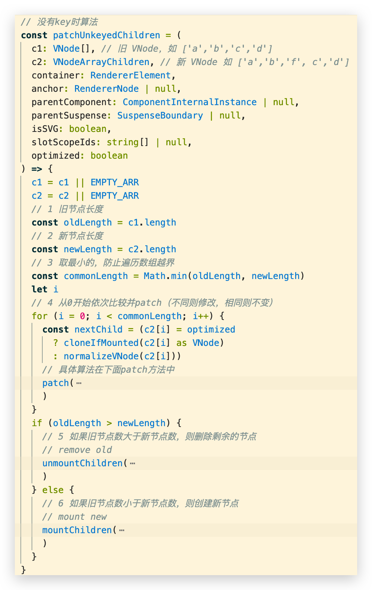
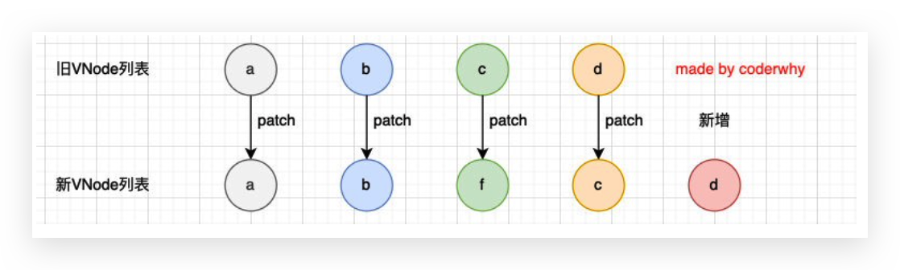
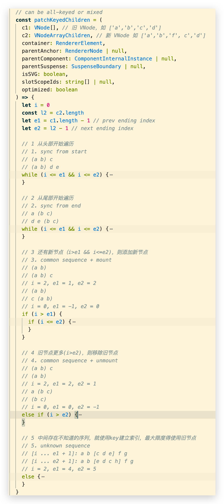
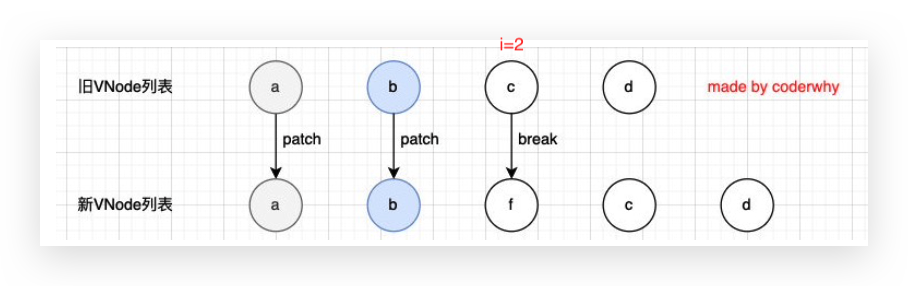
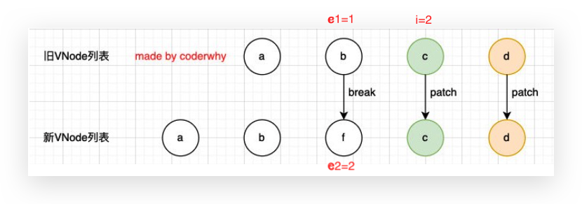
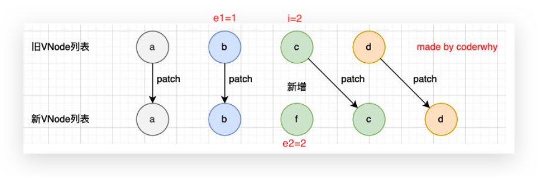
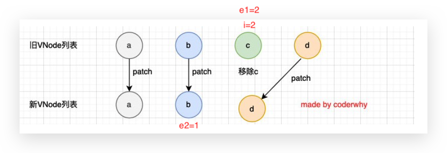
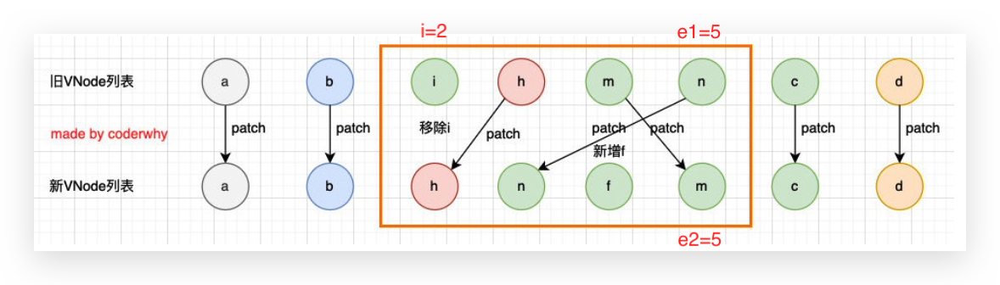

# 条件渲染&列表渲染

## v-if & v-show

*   v-show就是 display: none
*   v-show不支持 template
*   v-show不能和v-else一起使用

## v-for

也可以用 `of` 替代 `in` 作为分隔符，因为它更接近 JavaScript 迭代器的语法

### 数组更新检测 🔥

*   push()：添加到最后

*   pop()：弹出最前面的
*   shift()：弹出最后面的
*   unshift()：添加到最前面
*   splice()：增删改都可以
*   sort()：排序
*   reverse()：反转

### key 的作用 🔥

*   key属性主要用在Vue的**虚拟DOM算法**，在**新旧nodes对比**时**辨识VNodes**
*   如果**不使用key**，Vue会使用一种最大限度减少动态元素并且尽可能的尝试**就地修改/复用**相同类型元素的算法
*   而**使用key**时，它会**基于key的变化重新排列元素顺序**，并且会**移除/销毁key不存在的元素**

### VNode 🔥

全称是**Virtual Node**，即**虚拟节点**

无论组件还是元素，在Vue中表示出来都是一个个VNode。是一个Javascript对象

### 虚拟DOM 🔥

如果页面不是一个简单的元素（如div），而是**许多元素**，那么他们会形成**一个个VNode**，**整体**称作虚拟DOM

### Vue 源码对于 key 的判断

基于v3.2.9版本

在`/vue-next/packages/runtime-core/src/renderer.ts`的1600行中

### 没有 key 时的 diff 算法 🔥

上面的diff算法效率并不高：

*    **c和d**来说它们事实上**并不需要有任何的改动**
*   但是因为我们的c被f所使用了，所有后续所有的内容都要一次进行改动，并且最后进行新增

### 有 key 时的 diff 算法 🔥

1.   第一步的操作是从头开始进行遍历、比较

     1.   a和b是一致的会继续进行比较;
     2.   c和f因为key不一致，所以就会break跳出循环;

     

2.   第二步的操作是从尾部开始进行遍历、比较:

     

3.   第三步是如果旧节点遍历完毕，但是依然有新的节点，那么就新增节点（`i>e1 && i<=e2`)

     

4.   第四步是如果新的节点遍历完毕，但是依然有旧的节点，那么就移除旧节点

     

5.   第五步是最特色的情况，中间还有很多未知的或者乱序的节点

     

     可以发现，Vue在进行diff算法的时候，会尽量利用我们的key来进行优化操作：

     *   在没有key的时候我们的效率是非常低效的;
     *   在进行插入或者重置顺序的时候，保持相同的key可以让diff算法更加的高效;
