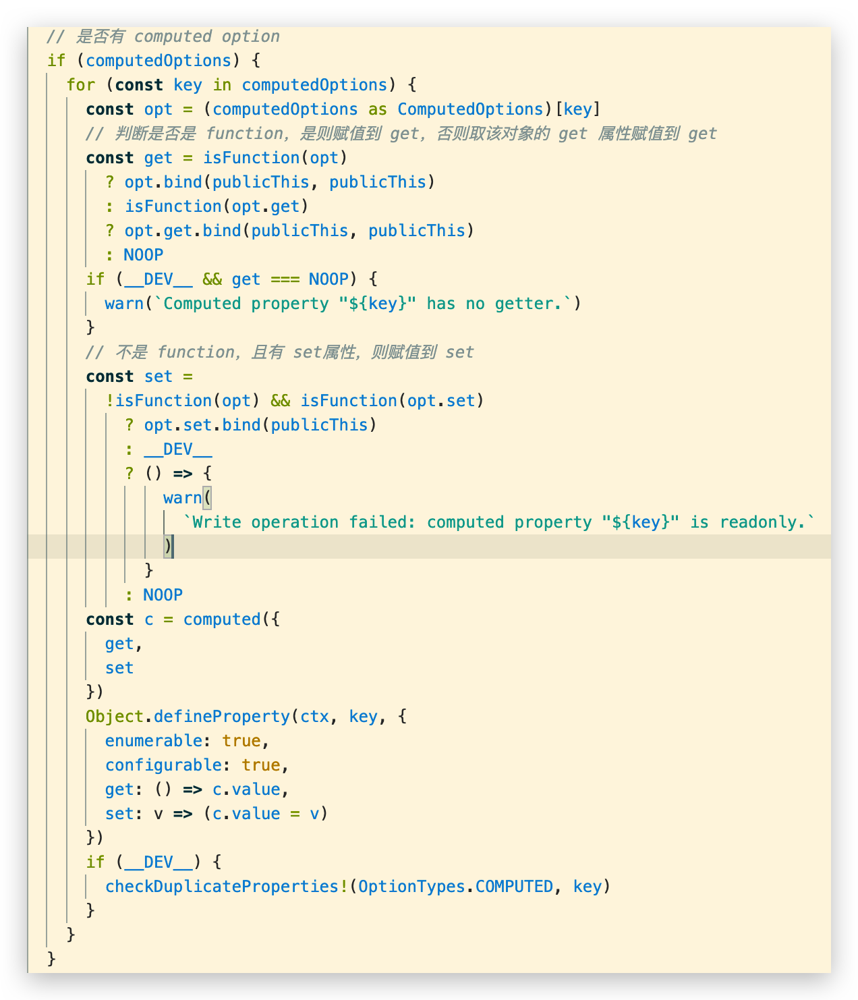

# 计算属性 & 侦听器

## 计算属性 computed 🔥

### 介绍

*   对于任何包含响应式数据的复杂逻辑，你都应该使用**计算属性**
*   计算属性将被混入到组件实例中。所有 getter 和 setter 的 this 上下文自动地绑定为组件实例
*   用法:
    *   **选项:**computed
    *   **类型:**{ [key: string]: Function | { get: Function, set: Function } }


### 计算属性的setter和getter

*   计算属性在大多数情况下，只需要一个**getter方法**即可，所以我们会将计算属性直接**写成一个函数**
*   但是，如果我们确实想**设置计算属性的值**呢?这个时候我们也可以给计算属性设置一个setter的方法

```js
computed: {
    // fullName 的 getter方法
    fullName() {
        return this.firstName + ' ' + this.lastName
    },
    // fullName的getter和setter方法
    fullName: {
        get: function () {
            return this.firstName + ' ' + this.lastName
        },
        set: function (newValue) {
            console.log(newValue)
            const names = newValue.split(' ')
            this.firstName = names[0]
            this.lastName = names[1]
        },
    },
},
```


### 源码 🔥

Vue内部是如何对我们传入的是一个getter，还是说是一个包含setter和getter的对象进行处理的呢？

`vue-next/packages/runtime-core/src/componentOptions.ts`中的




## 侦听器 Watch 🔥

### 介绍

在data返回的对象中定义了数据，这个数据通过插值语法等方式绑定到template中

*   当数据变化时，**template会自动进行更新**来显示最新的数据
*   希望**在代码逻辑中监听某个数据的变化**，这个时候就**需要用侦听器watch**来完成了


### Watch Option 用法 🔥

*   **选项:**`watch`
*   **类型:**`{ [key: string]: string | Function | Object | Array}`

由类型可知：

*   key 是 string 类型，那个数组代表可以监听多个
*   value可以是对应的**字符串方法名**、**回调函数**、或者**包含额外选项的对象**

```js
const app = createApp({
  data() {
    return {
      a: 1,
      b: 2,
      c: {
        d: 4
      },
      e: 5,
      f: 6
    }
  },
  watch: {
    // 侦听顶级 property
    a(val, oldVal) {
      console.log(`new: ${val}, old: ${oldVal}`)
    },
    // 字符串方法名
    b: 'someMethod',
    // 该回调会在任何被侦听的对象的 property 改变时被调用，不论其被嵌套多深
    c: {
      handler(val, oldVal) {
        console.log('c changed')
      },
      deep: true
    },
    // 侦听单个嵌套 property
    'c.d': function (val, oldVal) {
      // do something
    },
    // 该回调将会在侦听开始之后被立即调用
    e: {
      handler(val, oldVal) {
        console.log('e changed')
      },
      immediate: true
    },
    // 你可以传入回调数组，它们会被逐一调用
    f: [
      'handle1',
      function handle2(val, oldVal) {
        console.log('handle2 triggered')
      },
      {
        handler: function handle3(val, oldVal) {
          console.log('handle3 triggered')
        }
        /* ... */
      }
    ]
  },
  methods: {
    someMethod() {
      console.log('b changed')
    },
    handle1() {
      console.log('handle 1 triggered')
    }
  }
})

const vm = app.mount('#app')

vm.a = 3 // => new: 3, old: 1
```

注意，***不应该使用箭头函数来定义 watcher 函数*** (例如 `searchQuery: newValue => this.updateAutocomplete(newValue)`)。理由是箭头函数绑定了父级作用域的上下文，所以 `this` 将不会按照期望指向组件实例，`this.updateAutocomplete` 将是 undefined


### $watch 实例方法（掌握） 🔥

#### 参数

-   `{string | Function} source`
-   `{Function | Object} callback`
-   `{Object} [options]`
    -   `{boolean} deep`
    -   `{boolean} immediate`
    -   `{string} flush`

#### 返回

`{Function} unwatch`

#### 用法

侦听组件实例上的响应式 property 或函数计算结果的变化。回调函数得到的参数为新值和旧值。我们只能将顶层的 `data`、`props` 或 `computed` property 名作为字符串传递。对于更复杂的表达式，用一个函数取代。

#### 示例

```js
const app = createApp({
  data() {
    return {
      a: 1,
      b: 2,
      c: {
        d: 3,
        e: 4
      }
    }
  },
  created() {
    // 顶层property 名
    this.$watch('a', (newVal, oldVal) => {
      // 做点什么
    })

    // 用于监视单个嵌套property 的函数
    this.$watch(
      () => this.c.d,
      (newVal, oldVal) => {
        // 做点什么
      }
    )

    // 用于监视复杂表达式的函数
    this.$watch(
      // 表达式 `this.a + this.b` 每次得出一个不同的结果时
      // 处理函数都会被调用。
      // 这就像监听一个未被定义的计算属性
      () => this.a + this.b,
      (newVal, oldVal) => {
        // 做点什么
      }
    )
  }
})
```

当侦听的值是一个**对象**或者**数组**时，对**其属性或元素的任何更改都不会触发侦听器**，因为它们**引用（不变）**相同的对象/数组：	

```js
const app = createApp({
  data() {
    return {
      article: {
        text: 'Vue is awesome!'
      },
      comments: ['Indeed!', 'I agree']
    }
  },
  created() {
    this.$watch('article', () => {
      console.log('Article changed!')
    })

    this.$watch('comments', () => {
      console.log('Comments changed!')
    })
  },
  methods: {
    // 这些方法不会触发侦听器，因为我们只更改了Object/Array的一个property，
    // 不是对象/数组本身
    changeArticleText() {
      this.article.text = 'Vue 3 is awesome'
    },
    addComment() {
      this.comments.push('New comment')
    },

    // 这些方法将触发侦听器，因为我们完全替换了对象/数组
    changeWholeArticle() {
      this.article = { text: 'Vue 3 is awesome' }
    },
    clearComments() {
      this.comments = []
    }
  }
})
```

`$watch` 返回一个取消侦听函数，用来停止触发回调：

```js
const app = createApp({
  data() {
    return {
      a: 1
    }
  }
})

const vm = app.mount('#app')

const unwatch = vm.$watch('a', cb)
// later, teardown the watcher
unwatch()
```


#### 选项：deep 🔥

为了发现**对象内部值的变化**，可以在选项参数中指定 `deep: true`。这个选项同样适用于**监听数组变更**。

>   注意：当变更（不是替换）对象或数组并使用 deep 选项时，**旧值将与新值相同**，因为它们的**引用**指向同一个对象/数组。Vue 不会保留变更之前值的副本。可以参考[Vue3中watch的最佳实践](https://juejin.cn/post/6980987158710452231)来完成！！！

```js
vm.$watch('someObject', callback, {
  deep: true
})
vm.someObject.nestedValue = 123
// callback is fired
```


#### 选项：immediate

在选项参数中指定 `immediate: true` 将立即以表达式的当前值触发回调：

```js
vm.$watch('a', callback, {
  immediate: true
})
// 立即以 `a` 的当前值触发 `callback`
```

注意，在带有 `immediate` 选项时，你不能在第一次回调时取消侦听给定的 property。

```js
// 这会导致报错
const unwatch = vm.$watch(
  'value',
  function() {
    doSomething()
    unwatch()
  },
  { immediate: true }
)
```

如果你仍然希望在回调内部调用一个取消侦听的函数，你应该先检查其函数的可用性：

```js
let unwatch = null

unwatch = vm.$watch(
  'value',
  function() {
    doSomething()
    if (unwatch) {
      unwatch()
    }
  },
  { immediate: true }
)
```


#### 选项：flush

`flush` 选项可以更好地控制回调的时间。它可以设置为 `'pre'`、`'post'` 或 `'sync'`。

默认值是 `'pre'`，指定的回调应该在渲染前被调用。它允许回调在模板运行前更新了其他值。

`'post'` 值是可以用来将回调推迟到渲染之后的。如果回调需要通过 `$refs` 访问更新的 DOM 或子组件，那么则使用该值。

如果 `flush` 被设置为 `'sync'`，一旦值发生了变化，回调将被同步调用。

对于 `'pre'` 和 `'post'`，回调使用队列进行缓冲。回调只被添加到队列中一次，即使观察值变化了多次。值的中间变化将被跳过，不会传递给回调。

缓冲回调不仅可以提高性能，还有助于保证数据的一致性。在执行数据更新的代码完成之前，侦听器不会被触发。

`'sync'` 侦听器应少用，因为它们没有这些好处。

更多关于 `flush` 的信息，请参阅[副作用刷新时机](https://v3.cn.vuejs.org/guide/reactivity-computed-watchers.html#副作用刷新时机)。
