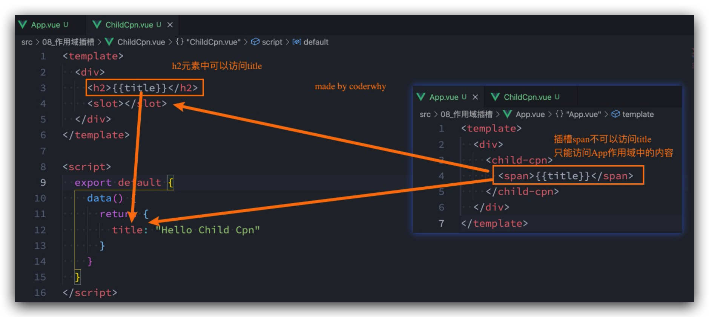
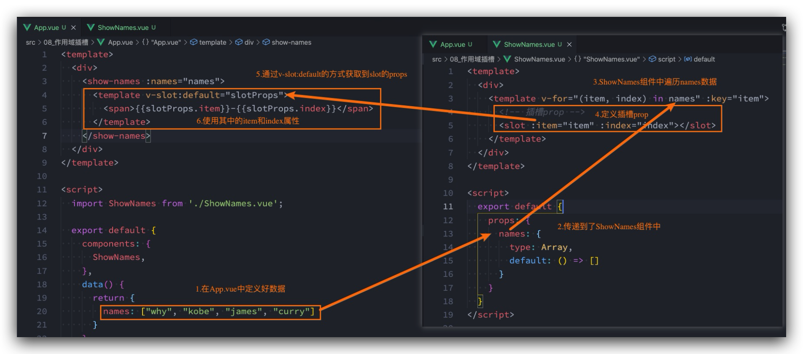

# 插槽 Slot


## 基本使用 & 默认内容

App.vue

```vue
<template>
  <div>
    <my-slot-cpn>
      <!-- 注意，这里面会对 my-slot-cpn 中定义的 3 个插槽都写入 button-->
      <button>我是按钮</button>
    </my-slot-cpn>
    <hr />

    <!-- 注意，这里面会对 my-slot-cpn 中定义的 3 个插槽都写入 我是普通的文本-->
    <my-slot-cpn> 我是普通的文本 </my-slot-cpn>
    <hr />

    <my-slot-cpn>
      <!-- 注意，这里面会对 my-slot-cpn 中定义的 3 个插槽都写入 my-button 组件-->
      <my-button />
    </my-slot-cpn>
    <hr />

    <!-- 注意，这里面会对 my-slot-cpn 中定义的 3 个插槽启用默认值-->
    <my-slot-cpn />
    <hr />

    <!-- 插入了很多的内容 -->
    <my-slot-cpn>
      <!-- 注意，这里面会对 my-slot-cpn 中定义的 3 个插槽分别！！！插入如下3个元素！！！总共出现9个！！！-->
      <h2>哈哈哈</h2>
      <button>我是按钮</button>
      <strong>我是strong</strong>
    </my-slot-cpn>
  </div>
</template>

<script>
import MySlotCpn from './MySlotCpn.vue'
import MyButton from './MyButton.vue'

export default {
  components: {
    MySlotCpn,
    MyButton,
  },
}
</script>
```

MySlotCpn.vue

```vue
<template>
  <div>
    <h2>组件开始</h2>
    <slot>
      <i>我是默认的i元素</i>
    </slot>
    <slot>
      <i>我是默认的i元素</i>
    </slot>
    <slot>
      <i>我是默认的i元素</i>
    </slot>
    <h2>组件结束</h2>
  </div>
</template>

<script>
  export default {
    
  }
</script>
```

MyButton.vue

```vue
<template>
  <div>
    <button>coderwhy button</button>
  </div>
</template>

<script>
  export default {
    
  }
</script>
```


## 具名插槽 🔥

*   `v-slot:left` 可以简写为 `#left`
*   一个不带 `name` 的slot，会带有隐含的名字 **default**
*   **动态插槽名**：通过 `v-slot:[dynamicSlotName]`方式动态绑定一个名称


App.vue

```vue
<template>
  <div>
    <nav-bar :name="name">
      <template #left>
        <button>左边的按钮</button>
      </template>
      <template #center>
        <h2>我是标题</h2>
      </template>
      <template #right>
        <i>右边的i元素</i>
      </template>
      <template #[name]>
        <i>why内容</i>
      </template>
    </nav-bar>
  </div>
</template>

<script>
import NavBar from './NavBar.vue'

export default {
  components: {
    NavBar,
  },
  data() {
    return {
      name: 'why',
    }
  },
}
</script>
```

NavBar.vue

```vue
<template>
  <div class="nav-bar">
    <!-- <slot name="default"></slot> -->
    <div class="left">
      <slot name="left"></slot>
    </div>
    <div class="center">
      <slot name="center"></slot>
    </div>
    <div class="right">
      <slot name="right"></slot>
    </div>
    <div class="addition">
      <slot :name="name"></slot>
    </div>
  </div>
</template>

<script>
  export default {
    props: {
      name: String
    }
    // data() {
    //   return {
    //     name: "why"
    //   }
    // }
  }
</script>

<style scoped>
  .nav-bar {
    display: flex;
  }

  .left, .right, .center {
    height: 44px;
  }

  .left, .right, .addition {
    width: 80px;
    background-color: red;
  }

  .center {
    flex: 1;
    background-color: blue;
  }
</style>
```


## 作用域插槽 🔥

### 渲染作用域 🔥

*   父级模板里的所有内容都是在父级作用域中编译的; 
*   子模板里的所有内容都是在子作用域中编译的;

如何理解这句话呢?我们来看一个案例:

*   在我们的案例中ChildCpn自然是可以让问自己作用域中的title内容的;
*   但是在App中，是访问不了ChildCpn中的内容的，因为它们是跨作用域的访问;




### 作用域插槽 🔥

有时候我们希望插槽**可以访问到子组件中的内容**是非常重要的

*   当一个组件被用来渲染一个**数组**时，我们使用插槽，并且希望插槽中**不要显示直接每项的内容，样式需通过父组件定义**; 
*   这个Vue给我们提供了作用域插槽;




### 独占默认插槽的缩写

见示例


### 示例

App.vue

```vue
<template>
  <div>
    <show-names :names="names">
      <template v-slot="coderwhy">
        <button>{{ coderwhy.item }}-{{ coderwhy.index }}</button>
      </template>
    </show-names>

    <!-- 独占默认default插槽，无需写template -->
    <show-names :names="names" v-slot="coderwhy">
      <button>{{ coderwhy.item }}-{{ coderwhy.index }}</button>
    </show-names>

    <!-- 注意: 如果还有其他的具名插槽, 那么默认插槽也必须使用template来编写 -->
    <show-names :names="names">
      <template v-slot="coderwhy">
        <button>{{ coderwhy.item }}-{{ coderwhy.index }}</button>
      </template>

      <template v-slot:why>
        <h2>我是why的插入内容</h2>
      </template>
    </show-names>

    <show-names :names="names">
      <template v-slot="slotProps">
        <strong>{{ slotProps.item }}-{{ slotProps.index }}</strong>
      </template>
    </show-names>
  </div>
</template>

<script>
import ChildCpn from './ChildCpn.vue'
import ShowNames from './ShowNames.vue'

export default {
  components: {
    ChildCpn,
    ShowNames,
  },
  data() {
    return {
      names: ['why', 'kobe', 'james', 'curry'],
    }
  },
}
</script>
```

ShowNames.vue

```vue
<template>
  <div>
    <template v-for="(item, index) in names" :key="item">
      <slot :item="item" :index="index"></slot>

      <slot name="why"></slot>
    </template>
  </div>
</template>

<script>
  export default {
    props: {
      names: {
        type: Array,
        default: () => []
      }
    }
  }
</script>
```


