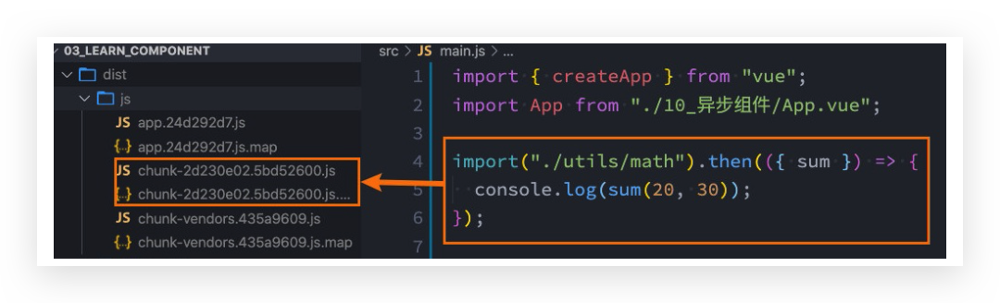

# 异步组件

## Webpack的代码分包

**默认的打包过程:**

*   默认情况下，在构建整个组件树的过程中，因为组件和组件之间是通过模块化直接依赖的，那么webpack在打包时就会将组 件模块打包到一起(比如一个app.js文件中);

*   这个时候随着项目的不断庞大，app.js文件的内容过大，会造成**首屏的渲染速度变慢**;

**打包时，代码的分包**:

*   所以，对于一些不需要立即使用的组件，我们可以单独对它们进行拆分，拆分成一些小的代码块chunk.js; 
*   这些chunk.js会在需要时从服务器加载下来，并且运行代码，显示对应的内容;

**webpack中如何可以对代码进行分包呢?**




## Vue中实现异步组件

如果我们的项目过大了，对于**某些组件**我们希望**通过异步的方式来进行加载**(目的是可以对其进行分包处理)，那么Vue中给我们提供了一个函数:**defineAsyncComponent**。

**defineAsyncComponent接受两种类型的参数**:

*   类型一：工厂函数，该工厂函数需要返回一个Promise对象; 
*   类型二:接受一个对象类型，对异步函数进行配置;

### 工厂函数写法

```vue
<script>
    import { defineAsyncComponent } from 'vue';

    const AsyncCategory = defineAsyncComponent(() => import("./AsyncCategory.vue"))

    export default {
        components: {
            AsyncCategory,
        }
    }
</script>
```


### 对象写法

```vue
<script>
    import { defineAsyncComponent } from 'vue';
    import Loading from './Loading';    
    import Error from './Error';

    const AsyncCategory = defineAsyncComponent({
        // 工厂函数
        loader: () => import("./AsyncCategory.vue"),
        
        // 加载过程中显示的组件
        loadingComponent: Loading,
        
        // 加载失败时显示的组件
        errorComponent: Error,
        
        // 在显示loadingComponent组件之前, 等待多长时间，默认值：200，单位ms
        delay: 2000,
        
        // 如果提供了timeout，并且加载组件的时间超过了该值，将显示错误组件。默认值 Infinity (即永不超时，单位ms)
        // timeout: 0,
        /**
     	 * err: 错误信息,
     	 * retry: 函数, 调用retry尝试重新加载
     	 * attempts: 记录尝试的次数
     	 */
        onError: function(err, retry, fail, attempts) {

    	}
    	// 定义组件是否可挂起，默认值 true
    	suspensible: true,
    })

    export default {
        components: {
            AsyncCategory,
            Loading,
            Error,
        }
    }
</script>
```


## 异步组件和Suspense

**目前(2021-06-08)Suspense显示的是一个实验性的特性，API随时可能会修改**

**Suspense是一个内置的全局组件，该组件有两个插槽**:

*   **default**:如果default可以显示，那么显示default的内容;
*   **fallback**:如果default无法显示，那么会显示fallback插槽的内容;

```vue
<suspense>
    <template #default>
		<async-category></async-category>
    </template>
    <template #fallback>
		<loading></loading>
    </template>
</suspense>
```

