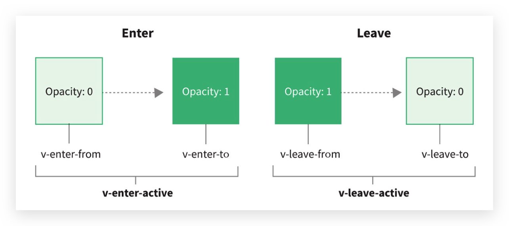

# Vue 动画

## 认识动画

在开发中，我们想要给一个组件的**显示和消失添加某种过渡动画**，可以很好的**增加用户体验**:

* React框架本身并没有提供任何动画相关的API，所以在React中使用过渡动画我们需要使用一个第三方库 react-transition-group;

* Vue中为我们提供一些内置组件和对应的API来完成动画，利用它们我们可以方便的实现过渡动画效果;

隐藏 / 显示案例

* 没有动画的情况下，**整个内容的显示和隐藏会非常的生硬**
* 如果我们希望给**单元素或者组件**实现过渡动画，可以**使用 transition 内置组件**来完成动画


## Vue 的 transition 组件

### 介绍

Vue **提供了 transition 的封装组件**，在下列情形中，可以给任何元素和组件添加进入/离开过渡：

* 条件渲染 (使用 v-if)条件展示 (使用 v-show)
* 动态组件
* 组件根节点


### 原理

**当插入或删除包含在 transition 组件中的元素时，Vue 将会做以下处理：**

* 自动嗅探**目标元素是否应用了CSS过渡或者动画**，如果有，那么**在恰当的时机添加/删除 CSS类名**
* 如果 transition 组件提供了**JavaScript钩子函数**，这些钩子函数将在恰当的时机被调用
* 如果**没有找到JavaScript钩子并且也没有检测到CSS过渡/动画**，**DOM插入、删除操作将会立即执行**


## 过渡—transition

### 过渡 class

* `v-enter-from`：定义进入过渡的开始状态。在元素被插入之前生效，在元素被插入之后的下一帧移除。
* `v-enter-active`：定义进入过渡生效时的状态。在整个进入过渡的阶段中应用，在元素被插入之前生效，在过渡/动 画完成之后移除。这个类可以被用来定义进入过渡的过程时间，延迟和曲线函数。
* `v-enter-to`：定义进入过渡的结束状态。在元素被插入之后下一帧生效 (与此同时 v-enter-from 被移除)，在过渡/ 动画完成之后移除。
* `v-leave-from`：定义离开过渡的开始状态。在离开过渡被触发时立刻生效，下一帧被移除。
* `v-leave-active`：定义离开过渡生效时的状态。在整个离开过渡的阶段中应用，在离开过渡被触发时立刻生效，在过渡/动画完成之后移除。这个类可以被用来定义离开过渡的过程时间，延迟和曲线函数。
* `v-leave-to`：离开过渡的结束状态。在离开过渡被触发之后下一帧生效 (与此同时 v-leave-from 被删除)，在过渡/ 动画完成之后移除。


### class 添加的时机和命名规则



**class的name命名规则如下**

* 如果我们使用的是一个没有 name 的 transition，那么所有的class是以`v-`作为默认前缀
* 如果我们添加了一个 name 属性，比如 `<transtion name="why">`，那么所有的 class 会以`why-`开头


### 示例

```vue
<template>
  <div>
    <button @click="isShow = !isShow">显示/隐藏</button>

    <transition name="why">
      <h2 v-if="isShow">Hello World</h2>
    </transition>
  </div>
</template>

<script>
  export default {
    data() {
      return {
        isShow: true
      }
    }
  }
</script>

<style scoped>
  .why-enter-from,
  .why-leave-to {
    opacity: 0;
  }

  .why-enter-to, 
  .why-leave-from {
    opacity: 1;
  }

  .why-enter-active,
  .why-leave-active {
    transition: opacity 2s ease;
  }
</style>
```


## 动画—animation

### 示例

```vue
<template>
  <div class="app">
    <div><button @click="isShow = !isShow">显示/隐藏</button></div>

    <transition name="why">
      <h2 class="title" v-if="isShow">Hello World</h2>
    </transition>
  </div>
</template>

<script>
  export default {
    data() {
      return {
        isShow: true
      }
    }
  }
</script>

<style scoped>
  .app {
    width: 200px;
    margin: 0 auto;
  }

  .title {
    display: inline-block;
  }

  .why-enter-active {
    animation: bounce 1s ease;
  }

  .why-leave-active {
    animation: bounce 1s ease reverse;
  }

  @keyframes bounce {
    0% {
      transform: scale(0)
    }

    50% {
      transform: scale(1.2);
    }

    100% {
      transform: scale(1);
    }
  }
</style>
```


## 未完待续 ... 
