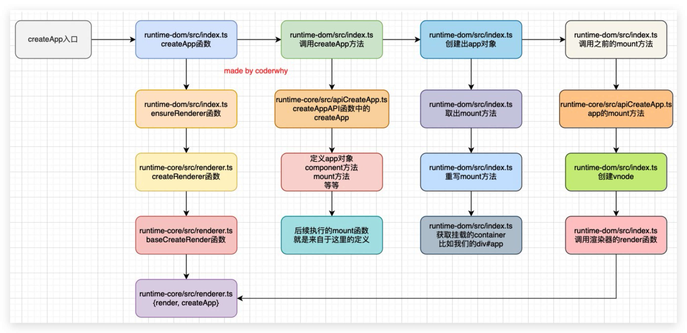
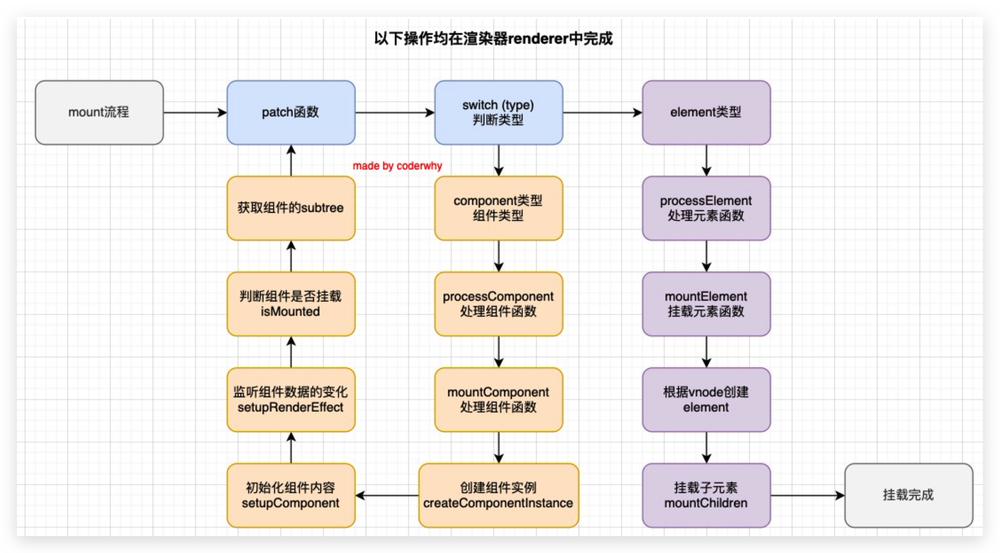
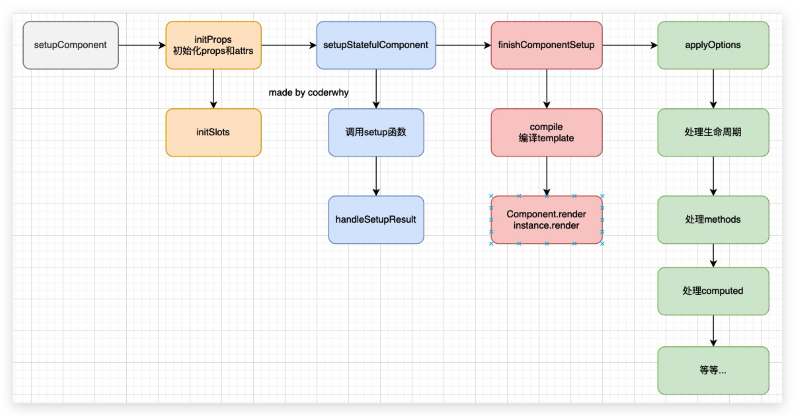

# 源码

## 源码 clone 🔥

步骤：

1.   `git clone git@github.com:vuejs/vue-next.git`

2.   `git checkout -b conangan-v3.2.9 v3.2.9`切换并创建分支。可以使用`git tag`查看 tag

3.   `yarn`安装依赖

4.   在 package.json 中的 dev 选项后面加上 `--sourcemap`，就可以在debug时看到独立的文件而不是打包后的文件

5.   执行`yarn dev`命令，会自动打包文件，并会生成`packages/vue/dist/vue.global.js`和`*.map`文件

6.   创建`packages/vue/examples/conanan`这个目录，用于自己写demo

     ```html
     <!DOCTYPE html>
     <html lang="en">
       <head>
         <meta charset="UTF-8" />
         <meta http-equiv="X-UA-Compatible" content="IE=edge" />
         <meta name="viewport" content="width=device-width, initial-scale=1.0" />
         <title>Document</title>
       </head>
       <body>
         <div id="app"></div>
     
         <template id="temp">
           <button @click="decrement">-</button>
           <span>{{counter}}</span>
           <button @click="increment">+</button>
         </template>
     
         <script src="../../dist/vue.global.js"></script>
     
         <script>
           const options = {
             template: '#temp', //
             data() {
               return {
                 counter: 0
               }
             },
             methods: {
               decrement() {
                 this.counter--
               },
               increment() {
                 this.counter++
               }
             }
           }
           // debugger
           const vm = Vue.createApp(options).mount('#app')
         </script>
       </body>
     </html>
     ```

     debug会发现`createApp`进入的是`index.ts`文件，而不是上面生成的`vue.global.js`


## 源码之 createApp




## 源码阅读之挂载根组件




## 组件化的初始化




## template中数据的使用顺序

```js
// data / props / ctx
// This getter gets called for every property access on the render context
// during render and is a major hotspot. The most expensive part of this
// is the multiple hasOwn() calls. It's much faster to do a simple property
// access on a plain object, so we use an accessCache object (with null
// prototype) to memoize what access type a key corresponds to.
let normalizedProps
if (key[0] !== '$') {
    const n = accessCache![key]
    if (n !== undefined) {
        switch (n) {
            case AccessTypes.SETUP:
                return setupState[key]
            case AccessTypes.DATA:
                return data[key]
            case AccessTypes.CONTEXT:
                return ctx[key]
            case AccessTypes.PROPS:
                return props![key]
                // default: just fallthrough
        }
    } else if (setupState !== EMPTY_OBJ && hasOwn(setupState, key)) {
        accessCache![key] = AccessTypes.SETUP
        return setupState[key]
    } else if (data !== EMPTY_OBJ && hasOwn(data, key)) {
        accessCache![key] = AccessTypes.DATA
        return data[key]
    } else if (
        // only cache other properties when instance has declared (thus stable)
        // props
        (normalizedProps = instance.propsOptions[0]) &&
        hasOwn(normalizedProps, key)
    ) {
        accessCache![key] = AccessTypes.PROPS
        return props![key]
    } else if (ctx !== EMPTY_OBJ && hasOwn(ctx, key)) {
        accessCache![key] = AccessTypes.CONTEXT
        return ctx[key]
    } else if (!__FEATURE_OPTIONS_API__ || shouldCacheAccess) {
        accessCache![key] = AccessTypes.OTHER
    }
}
```

由源码可知：setup——data——props——ctx（methods、computed）
