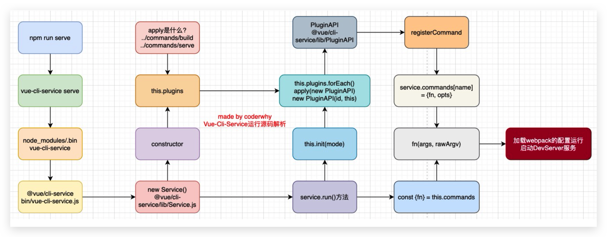

# VueCLI


## 安装

全局安装

```bash
 npm install @vue/cli -g
```

升级

```bash
 npm update @vue/cli -g
```

通过Vue的命令来创建项目

```bash
vue create [项目名]
```


## CLI 原理

查看package.json

```json
"scripts": {
    "serve": "vue-cli-service serve",
    "build": "vue-cli-service build",
},
```

在`/node_modules/.bin/vue-cli-service`可以看到该命令，但是里面有段代码

```js
const Service = require('../lib/Service')
```

.bin下没有该目录，仔细查看可以发现 vue-cli-service 是一个**软连接**。连接到`/node_modules/@vue/cli-service`。

其他的自己看！！！




