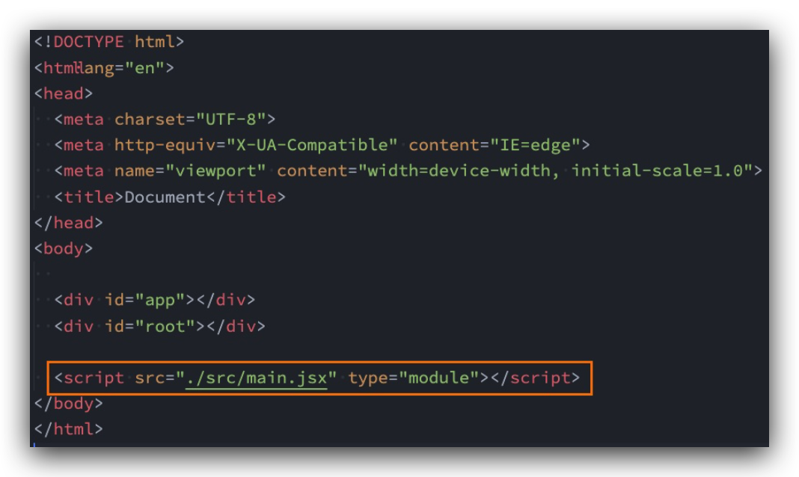
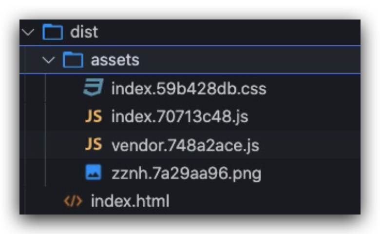
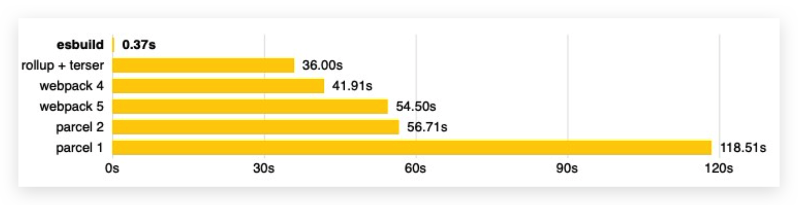

# Vite

## 介绍

Webpack是目前整个前端使用最多的构建工具，但是除了webpack之后也有其他的一些构建工具：如rollup、parcel、gulp、vite等

vite官方的定位:**下一代前端开发与构建工具**

如何定义下一代开发和构建工具呢？

*   我们知道在实际开发中，我们编写的代码往往是不能被浏览器直接识别的，比如ES6、TypeScript、Vue文件等 等;
*   所以我们必须通过构建工具来对代码进行转换、编译，类似的工具有webpack、rollup、parcel; 
*   但是随着项目越来越大，需要处理的JavaScript呈指数级增长，模块越来越多;
*   构建工具需要很长的时间才能开启服务器，HMR也需要几秒钟才能在浏览器反应出来;
*   所以也有这样的说法：天下苦webpack久矣;

Vite (法语意为 "快速的"，发音 /vit/) 是一种新型前端构建工具，能够显著提升前端开发体验


## 构造

它主要由两部分组成:

*   一个开发服务器，它基于原生ES模块提供了丰富的内建功能，HMR的速度非常快速;
*   一套构建指令，它使用**rollup**打开我们的代码，并且它是预配置的，可以输出生成环境的优化过的静态资源


目前是否要大力学习vite?vite的未来是怎么样的?

*   我个人非常看好vite的未来，也希望它可以有更好的发展;
*   但是，目前vite虽然已经更新到2.0，依然并不算非常的稳定，并且比较少大型项目(或框架)使用vite来进行 构建;
*   vite的整个社区插件等支持也还不够完善;
*   包括vue脚手架本身，目前也还没有打算迁移到vite，而依然使用webpack(虽然后期一定是有这个打算的); 
*   所以vite看起来非常的火热，在面试也可能会问到，但是实际项目中应用的还比较少;


## 浏览器原生支持模块化



但是如果我们不借助于其他工具，直接使用ES Module来开发有什么问题呢?

*   首先，我们会发现在使用loadash时，加载了上百个模块的js代码，对于浏览器发送请求是巨大的消耗; 
*   其次，我们的代码中如果有TypeScript、less、vue等代码时，浏览器并不能直接识别;

事实上，vite就帮助我们解决了上面的所有问题


## 安装和使用

```bash
 npm install vite –g # 全局安装 
 npm install vite –D # 局部安装
```

通过vite来启动项目

```bash
 npx vite
```


##  Vite对css的支持

*   vite可以直接支持css的处理，直接js中导入css即可

*   vite可以直接支持css预处理器，比如less，js中直接导入less

    安装less编译器

    ```bash
     npm install less -D
    ```

*   vite直接支持postcss的转换

    只需要安装postcss，并且配置 postcss.config.js 的配置文件即可

    ```bash
     npm install postcss postcss-preset-env -D
    ```

    ```js
    module.exports = {
      plugins: [
        require("postcss-preset-env")
      ]
    }
    ```

    

## Vite对TypeScript的支持

vite对TypeScript是原生支持的，它会直接使用ESBuild来完成编译。只需要直接导入即可

如果我们查看浏览器中的请求，会发现请求的依然是ts的代码

*   这是因为vite中的服务器Connect会对我们的请求进行转发
*   获取ts编译后的代码，给浏览器返回，浏览器可以直接进行解析

注意:在vite2中，已经不再使用Koa了，而是使用Connect来搭建的服务器


## Vite对vue的支持

vite对vue提供第一优先级支持:

*   Vue 3 单文件组件支持:@vitejs/plugin-vue 
*   Vue 3 JSX 支持:@vitejs/plugin-vue-jsx 
*   Vue 2 支持:underfin/vite-plugin-vue2

安装支持vue的插件

```bash
  npm install @vitejs/plugin-vue -D
```

在vite.config.js中配置插件

```js
const vue = require('@vitejs/plugin-vue')

module.exports = {
  plugins: [
    vue()
  ]
}
```


## Vite打包项目

我们可以直接通过vite build来完成对当前项目的打包工具

```bash
 npx vite build
```



我们可以通过preview的方式，开启一个本地服务来预览打包后的效果：

```bash
 npx vite preview
```

在package.json 中配置

```json
"scripts": {
    "serve": "vite",
    "build": "vite build",
    "preview": "vite preview"
  },
```


## ESBuild 解析

### ESBuild 特点

*   超快的构建速度，并且不需要缓存; 
*   支持ES6和CommonJS的模块化; 
*   支持ES6的Tree Shaking（删除未使用的代码）;
*   支持Go、JavaScript的API; 
*   支持TypeScript、JSX等语法编译; 
*   支持SourceMap;
*   支持代码压缩;
*   支持扩展其他插件;


### ESBuild的构建速度

ESBuild的构建速度和其他构建工具速度对比:



ESBuild为什么这么快呢?

*   使用Go语言编写的，可以**直接转换成机器代码**，而无需经过字节码;
*   ESBuild可以充分利用CPU的多内核，尽可能让它们饱和运行;
*   ESBuild的所有内容都是从零开始编写的，而不是使用第三方，所以从一开始就可以考虑各种性能问题; 
*   等等....


## Vite 脚手架工具

在开发中，我们不可能所有的项目都使用vite从零去搭建，比如一个react项目、Vue项目; 这个时候vite还给我们提供了对应的脚手架工具

所以Vite实际上是有两个工具的:

*   vite:相当于是一个构件工具，类似于webpack、rollup; 
*   @vitejs/create-app:类似vue-cli、create-react-app;

如果使用脚手架工具呢?

```bash
 #  如下2种方式都可以，官方文档是第1个
 npm create vite@latest
 
 # npm init @vitejs/app
```

第一种做法相当于省略了安装脚手架的过程:

```bash
npm install @create-vite@latest
create-app
```

第二种做法相当于省略了安装脚手架的过程:

```bash
npm install @vitejs/create-app -g
create-app
```

