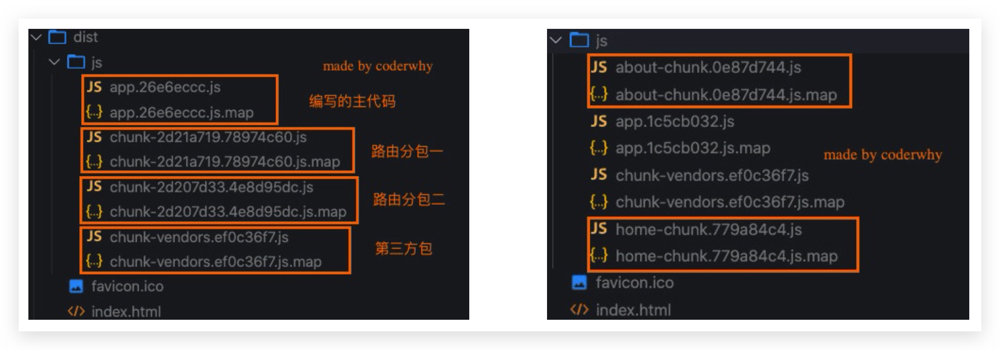
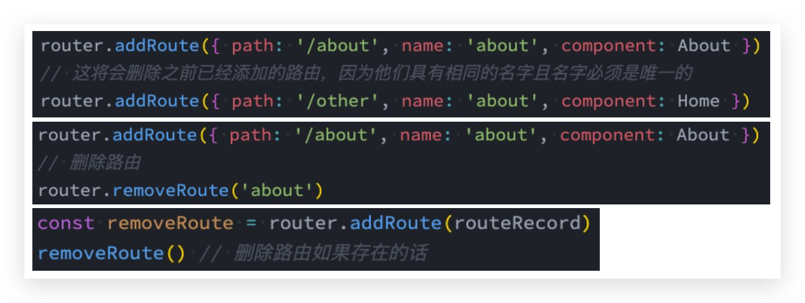

title: VueRouter
date: 2022-02-08 18:29:59
permalink: /pages/23d4f4/
categories:

  - x
  - VueRouter
tags:
  - 

# VueRouter

## 认识

目前前端流行的三大框架, 都有自己的路由实现:

* Angular的ngRouter
* React的ReactRouter
* Vue的vue-router

vue-router是基于**路由**和**组件**的

* 路由用于设定访问路径, 将**路径和组件映射**起来. 
* 在vue-router的单页面应用中, 页面的**路径的改变**就是**组件的切换**.


## 安装

目前Vue路由最新的版本是4.x版本

```bash
npm install vue-router@4
```


## 标签路由使用步骤

### 创建路由组件的组件

/src/pages/Home.vue

```vue
<template>
  <h2>Home</h2>
</template>

<script setup></script>

<style lang="scss" scoped></style>
```

/src/pages/About.vue

```vue
<template>
  <h2>About</h2>
</template>

<script setup></script>

<style lang="scss" scoped></style>
```

### 配置路由映射

组件和路径**映射关系的routes数组**; 

通过createRouter创建路由对象，并且传入routes和history模式; 

/src/router/index.js

```js
import { createRouter, createWebHistory } from 'vue-router'
import Home from '../views/Home.vue'
import About from '../views/About.vue'

const routes = [
  {
    path: '/',
    redirect: '/home',
  },
  {
    path: '/home',
    component: Home,
  },
  {
    path: '/about',
    component: About,
  },
]

const router = createRouter({
  history: createWebHistory(),
  routes,
})

export default router
```

/src/main.js

```js
import { createApp } from 'vue'
import App from './App.vue'
import router from './router'

createApp(App).use(router).mount('#app')
```


### `<router-link>`和`<router-view>`

通过`<router-link>`和`<router-view>`，使用路由: 

/src/App.vue

```vue
<template>
  <div>
    <router-link to="/home">Home</router-link> |
    <router-link to="/about">About</router-link>
    <router-view />
  </div>
</template>

<style>
.router-link-active {
  color: red;
}
</style>
```


### router-link 配置

* `to`属性:

  是一个**字符串**，或者是一个**对象**

* `replace`属性:

  设置 replace 属性的话，当点击时，会调用 router.replace()，而不是 router.push();

* `active-class`属性:

  设置激活a元素后应用的class，默认是router-link-active

* `exact-active-class`属性:

  **嵌套路由**，**链接精准激活**时，应用于渲染的 `<a>` 的 class，默认是router-link-exact-active;


### router-link 和 router-view 的 v-slot 🔥

在vue-router3.x的时候，router-link有一个tag属性，可以决定router-link到底**渲染成什么元素**，但是在vue-router4.x开始，该属性被移除了；而给我们提供了更加具有灵活性的**v-slot**的方式来定制渲染的内容;

* 首先，我们需要使用 **custom** 表示我们整个元素要自定义；如果不写，那么自定义的内容会被**包裹在一个 a 元素中**;

* 其次，我们使用v-slot来作用域插槽来获取内部传给我们的值: 
  * href:解析后的 URL;
  * route:解析后的规范化的route对象;
  * navigate:触发导航的函数;
  * isActive:是否匹配的状态;
  * isExactActive:是否是精准匹配的状态;

router-view也提供给我们一个插槽，可以用于 `<transition>` 和 `<keep-alive> `组件来包裹你的路由组件: 

*  Component:要渲染的组件;
* route:解析出的标准化路由对象;

```vue
<template>
  <div>
    <!-- props: href 跳转的链接 -->
    <!-- props: route对象 -->
    <!-- props: navigate导航函数 -->
    <!-- props: isActive 是否当前处于活跃的状态 -->
    <!-- props: isExactActive 是否当前处于精确的活跃状态 -->
    <router-link to="/home" v-slot="props" custom>
      <button @click="props.navigate">{{ props.href }}</button>
      <button @click="props.navigate">哈哈哈</button>
      <span :class="{ active: props.isActive }">{{ props.isActive }}</span>
      <span :class="{ active: props.isExactActive }">{{
        props.isExactActive
      }}</span>
      <!-- <p>{{props.route}}</p> -->
    </router-link>
    <br />

    <router-view v-slot="props">
      <transition name="why">
        <keep-alive>
          <component :is="props.Component"></component>
        </keep-alive>
      </transition>
    </router-view>
    <!-- <router-view /> -->
  </div>
</template>

<script setup>

</script>

<style>
.router-link-active {
  color: red;
}

.why-enter-from,
.why-leave-to {
  opacity: 0;
}

.why-enter-active,
.why-leave-active {
  transition: opacity 1s ease;
}
</style>
```


## 路由懒加载 🔥

当打包构建应用时，JavaScript 包会变得非常大，影响页面加载:

* 如果我们能把不同路由对应的组件分割成不同的代码块，然后当路由被访问的时候才加载对应组件，会更加高效;
* 也可以提高首屏的渲染效率;

其实这里还是我们前面讲到过的webpack的分包知识，而Vue Router默认就支持动态来导入组件:

* 这是因为component可以传入一个组件，也可以接收一个函数，该函数 需要放回一个Promise; 
* 而**import函数就是返回一个Promise**;

修改 /src/router/index.js

```js
import { createRouter, createWebHistory } from 'vue-router'

const routes = [
  {
    path: '/',
    redirect: '/home',
  },
  {
    path: '/home',
    name: 'home', // 名称
    component: () =>
      // webpackChunkName 打包起名，必须这样写！webpack的功能
      import(/* webpackChunkName: 'home-chunk' */ '../views/Home.vue'), // 动态路由。import返回Promise
    // 元数据
    meta: {
      name: 'conanan',
    },
  },
  {
    path: '/about',
    name: 'about',
    component: () => import('../views/About.vue'),
  },
]

const router = createRouter({
  history: createWebHistory(),
  routes,
})

export default router

```

执行打包命令

```bash
npm run build
```

可以看出




## 动态路由 🔥

修改 /src/router/index.js

```js
const routes = [
  {
    // 动态路由，必须完整匹配！如下'/'分割的4个参数一个不能少，也不能多
    path: '/user/:username/id/:id',
    name: 'user',
    component: () => import('../views/User.vue'),
  },
]
```

/src/App.vue

```vue
<template>
  <div>
    <router-link to="/user/conanan/id/10086">User</router-link>
    <router-view />
  </div>
</template>
```

/src/pages/User.vue

```vue
<template>
  <h2>User: {{ route.params.username }} - {{ route.params.id }}</h2>
</template>

<script setup>
import { useRouter, useRoute } from 'vue-router'

const router = useRouter()
console.log('router', router)

const route = useRoute()
const params = route.params
console.log('params', params)

const query = route.query
console.log('query', query)

// 这种方法获取到是 undefiend，很尴尬。不知道原因在哪
// import { getCurrentInstance } from 'vue'
// const { ctx } = getCurrentInstance()
// console.log(ctx.$router)
// console.log(ctx.$route)

// 在 options api 中直接调用如下：
// this.$route.params 即可
// this.$route.query 即可
// this.$router
</script>

<style lang="scss" scoped></style>
```


## NotFound 🔥

对于哪些没有匹配到的路由，我们通常会匹配到固定的某个页

修改 /src/router/index.js

```js
const routes = [
  {
    path: '/:pathMatch(.*)',
    // path: '/:pathMatch(.*)*', // 多个*，会将path根据'/'分割转为数组
    component: () => import('../views/NotFound.vue'),
  },
]
```

/src/App.vue

```vue
<template>
  <div>
    <router-link to="/notfound/aa/bb/cc">NotFound</router-link> |
    <router-view />
  </div>
</template>
```

/src/pages/NotFound.vue

```vue
<template>
  <div>
    <h2>Page Not Found</h2>
    <p>您打开的路径页面不存在, 请不要使用我们家的应用程序了~</p>
    <h1>{{ route.params.pathMatch }}</h1>
  </div>
</template>

<script setup>
import { useRoute } from 'vue-router'
const route = useRoute()
</script>

<style scoped></style>
```


## 路由的嵌套 🔥

什么是路由的嵌套呢?

* 目前我们匹配的Home、About、User等都属于底层路由，我们在它们之间可以来回进行切换; 
* 但是呢，我们Home页面本身，也可能会在多个组件之间来回切换：比如Home中包括Product、Message，它们可以在Home内部来回切换;
* 这个时候我们就需要使用嵌套路由，在Home中也**使用 router-view 来占位**之后需要渲染的组件

修改 /src/router/index.js

```js
const routes = [
  {
    path: '/home',
    name: 'home', // 名称
    component: () =>
      // webpackChunkName 打包起名，必须这样写！webpack的功能
      import(/* webpackChunkName: 'home-chunk' */ '../views/Home.vue'), // 动态路由。import返回Promise
    // 元数据
    meta: {
      name: 'conanan',
    },
    children: [
      {
        // 这里path必须为空
        path: '',
        // 这里必须写全路径
        redirect: '/home/message',
      },
      {
        // 这里的path不用拼接父route的path，并且不可以已'/'开头！！！
        path: 'message',
        name: 'message',
        component: () => import('../views/HomeMessage.vue'),
      },
      {
        path: 'shops',
        name: 'shops',
        component: () => import('../views/HomeShops.vue'),
      },
    ],
  },
]
```

/src/Home.vue

```vue
<template>
  <div>
    <h2>Home</h2>

    <router-view />

    <router-link to="/home/message">消息</router-link> |
    <router-link to="/home/shops">商品</router-link> |
    <router-link to="/home/moment">动态</router-link>
  </div>
</template>

<script setup></script>

<style lang="scss" scoped></style>
```

其他组件略


## 代码路由 🔥

修改/src/App.vue

```vue
<template>
  <div>
    <router-link to="/home">Home</router-link> |
    <router-link to="/about">About</router-link> |
    <router-link to="/user/conanan/id/10086">User</router-link> |
    <router-link to="/notfound/aa/bb/cc">NotFound</router-link> |
    <button @click="jumpToAbout">查看我！</button>
    <button @click="back">←</button>
    <button @click="forword">→</button>
    <router-view />
  </div>
</template>

<script setup>
import { useRouter } from 'vue-router'
const router = useRouter()

const jumpToAbout = () => {
  router.push({
    path: '/about',
    query: {
      q1: 'qa1',
    },
  })
}

const forword = () => {
  router.go(1)
  // 其他方法就不介绍了
}

const back = () => {
  router.go(-1)
}
</script>

<style>
.router-link-active {
  color: red;
}
</style>
```

修改/src/pages/About.vue

```vue
<template>
  <div>
    <h2>About</h2>
    <div>{{ route.query.q1 }}</div>
  </div>
</template>

<script setup>
import { useRoute } from 'vue-router'
const route = useRoute()
</script>

<style lang="scss" scoped></style>
```


## 动态添加、删除路由—权限 🔥

### 添加路由

某些情况下我们可能需要动态的来**添加路由**:

* 比如根据用户不同的权限，注册不同的路由; 
* 这个时候我们可以使用一个方法 addRoute;

如果我们是为route添加一个children路由，那么可以传入对应的name

修改 /src/router/index.js

```js
const router = createRouter({
  history: createWebHistory(),
  routes,
})

// 动态添加路由
const categoryRoute = {
  path: '/category',
  component: () => import('../views/Category.vue'),
}

// 添加顶级路由对象
router.addRoute(categoryRoute)

// 添加二级路由对象，第一个参数为路由的名称name
router.addRoute('home', {
  path: 'moment',
  component: () => import('../views/HomeMoment.vue'),
})
```


### 删除路由

不常用，**删除路由有以下三种方式:**

* 方式一：添加一个name相同的路由;
* 方式二：通过removeRoute方法，传入路由的名称; 
* 方式三：通过addRoute方法的返回值回调;



### 其他方法

* router.hasRoute()：检查路由是否存在。
* router.getRoutes()：获取一个包含所有路由记录的数组


## 路由导航守卫—拦截 🔥

### 介绍

* vue-router 提供的导航守卫主要用来通过**跳转**或**取消**的方式守卫导航。

* **全局的前置守卫beforeEach是在导航触发时会被回调的**

  它有两个参数:

  * to:即将进入的路由Route对象;
  * from:即将离开的路由Route对象;

* 它有返回值:

  * false:**取消当前导航**;
  * 不返回或者undefined:进行默认导航; 
  * 返回一个路由地址:
    * 可以是一个string类型的路径;
    * 可以是一个对象，对象中包含path、query、params等信息;

* 可选的第三个参数:next
  * 在Vue2中我们是通过next函数来决定如何进行跳转的;
  * 但是在Vue3中我们是通过返回值来控制的，不再推荐使用next函数，这是因为开发中很容易调用多次next;

修改 /src/router/index.js

```js
// 导航守卫beforeEach
let counter = 0
// to: Route对象, 即将跳转到的Route对象
// from: Route对象,
/**
 * 返回值问题:
 *    1.false: 不进行导航
 *    2.undefined或者不写返回值: 进行默认导航
 *    3.字符串: 路径, 跳转到对应的路径中
 *    4.对象: 类似于 router.push({path: "/login", query: ....})
 */
router.beforeEach((to, from) => {
  console.log(`进行了${++counter}路由跳转`)
  // if (to.path.indexOf("/home") !== -1) {
  //   return "/login"
  // }
  if (to.path !== '/login') {
    const token = window.localStorage.getItem('token')
    if (!token) {
      return '/login'
    }
  }
})
```


### 登录守卫功能

/src/Login.vue

```vue
<template>
  <div>
    <button @click="loginClick">登录</button>
  </div>
</template>

<script setup>
import { useRouter } from 'vue-router'

const router = useRouter()

const loginClick = () => {
  window.localStorage.setItem('token', 'why')

  router.push({
    path: '/home',
  })
}
</script>

<style scoped></style>
```

注册路由

```js
{
  path: '/login',
  component: () => import('../views/Login.vue'),
},
```

修改 /src/router/index.js

```js
// 导航守卫beforeEach
router.beforeEach((to, from) => {
  if (to.path !== '/login') {
    const token = window.localStorage.getItem('token')
    if (!token) {
      return '/login'
    }
  }
})
```


### 其他导航守卫

Vue还提供了很多的[其他守卫函数](https://next.router.vuejs.org/zh/guide/advanced/navigation-guards.html)，目的都是在某一个时刻给予我们回调，让我们可以更好的控制程序的流程或者功能

**完整的导航解析流程**:

* 导航被触发。
* 在失活的组件里调用 beforeRouteLeave 守卫。
* 调用全局的 beforeEach 守卫。
* 在重用的组件里调用 beforeRouteUpdate 守卫(2.2+)。
* 在路由配置里调用 beforeEnter。
* 解析异步路由组件。
* 在被激活的组件里调用 beforeRouteEnter。
* 调用全局的 beforeResolve 守卫(2.5+)。
* 导航被确认。
* 调用全局的 afterEach 钩子。
* 触发 DOM 更新。
* 调用 beforeRouteEnter 守卫中传给 next 的回调函数，创建好的组件实例会作为回调函数的参数传入。
