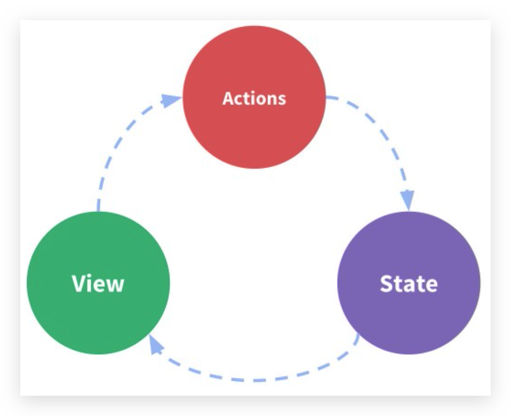

# 状态管理

## 什么是状态管理

在开发中，我们会的应用程序需要处理各种各样的数据，这些 数据需要保存在我们应用程序中的某一个位置，对于这些数据 的管理我们就称之为是 **状态管理**。

在前面我们是如何管理自己的状态呢?

* 在Vue开发中，我们使用组件化的开发方式;

* 而在组件中我们定义data或者在setup中返回使用的数据， 这些数据我们称之为state;

* 在模块template中我们可以使用这些数据，模块最终会被 渲染成DOM，我们称之为View;

* 在模块中我们会产生一些行为事件，处理这些行为事件时， 有可能会修改state，这些行为事件我们称之为actions;

## 复杂的状态管理

JavaScript开发的应用程序，已经变得越来越复杂了:

* JavaScript需要管理的状态越来越多，越来越复杂;
* 这些状态包括服务器返回的数据、缓存数据、用户操作产生的数据等等;
* 也包括一些UI的状态，比如某些元素是否被选中，是否显示加载动效，当前分页;

当我们的应用遇到**多个组件共享状态**时，单向数据流的简洁性很容易被破坏:

* 多个视图依赖于同一状态;
* 来自不同视图的行为需要变更同一状态;

我们是否可以通过组件数据的传递来完成呢?

* 对于一些简单的状态，确实可以通过props的传递或者Provide的方式来共享状态;

* 但是对于复杂的状态管理来说，显然单纯通过传递和共享的方式是不足以解决问题的，比如**兄弟组件如何共享数据**呢?
