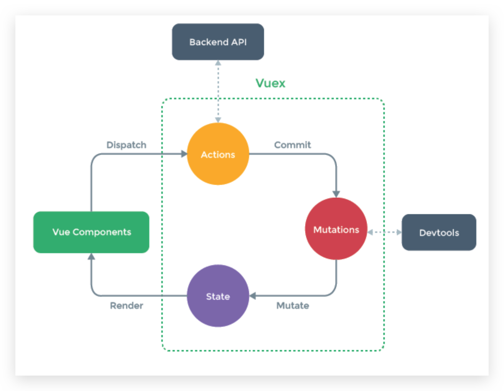
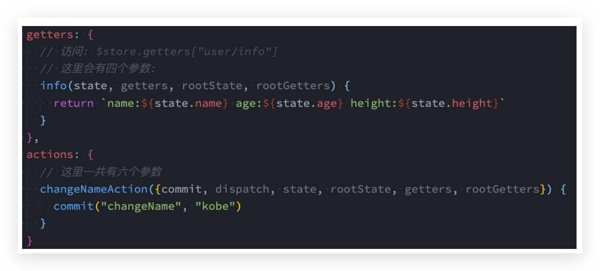

# Vuex

## Vuex的状态管理

管理不断变化的state本身是非常困难的:

* 状态之间相互会存在依赖，一个状态的变化会引起另一个状态的变化，View页面也有可能会引起状态的变化;

* 当应用程序复杂时，state在什么时候，因为什么原因而发生了变化，发生了怎么样的变化，会变得非常难以控制和追踪;

因此，我们是否可以考虑**将组件的内部状态抽离出来**，以一个**全局单例**的方式来管理呢?

* 在这种模式下，我们的组件树构成了一个巨大的 “视图View”;

* 不管在树的哪个位置，任何组件都能**获取状态**或者**触发行为**;

* 通过定义和隔离状态管理中的各个概念，并通过强制性的规则来维护**视图和状态间的独立性**，我们的代码边会变得更加结构化和易于维护、跟踪;

这就是Vuex背后的基本思想，它借鉴了Flux、Redux、Elm（纯函数语言，redux有借鉴它的思想）

每一个Vuex应用的核心就是store(仓库)：store本质上是一个容器，它包含着你的应用中大部分的状态(state)



**Vuex和单纯的全局对象有什么区别呢**？

* Vuex的状态存储是**响应式**的。当Vue组件从store中读取状态的时候，若store中的状态发生变化，那么相应的组件也会被更新
* 你**不能直接改变store中的状态**。
  * 改变store中的状态的唯一途径就显示**提交 (commit) mutation**;
  * 这样使得我们可以方便的**跟踪每一个状态的变化**，从而让我们能够通过一些工具帮助我们更好的管理应用的状态


## 安装

这里使用的是vuex4.x，安装的时候需要添加 next 指定版本（实际根据当前版本决定添加next与否）

```bash
 npm install vuex@next
```

安装 Vue DevTools 浏览器插件 🔥


## 单一状态树 🔥

Vuex 使用**单一状态树**:

* 用**一个对象就包含了全部**的应用层级状（**store只有一个，但是可以分模块**）
* 采用的是SSOT，Single Source of Truth，也可以翻译成单一数据源; 
* 这也意味着，每个应用将仅仅包含一个 store 实例;
* 单状态树和模块化并不冲突，后面我们会讲到module的概念;

单一状态树的优势:

* 如果你的状态信息是保存到多个Store对象中的，那么之后的管理和维护等等都会变得特别困难; 
* 所以Vuex也使用了单一状态树来管理应用层级的全部状态;
* 单一状态树能够让我们最直接的方式找到某个状态的片段，而且在之后的维护和调试过程中，也可以非常方便的管理和维护;


## 创建 store 🔥

使用步骤:

* 创建Store对象，/src/store/index.js

  ```js
  import { createStore } from 'vuex'
  
  export default createStore({
    state: {
    },
    mutations: {
    },
    actions: {
    },
    modules: {
    }
  })
  
  ```

* 在app中通过插件安装，/src/main.js

  ```js
  import { createApp } from 'vue'
  import App from './App.vue'
  import store from './store'
  
  createApp(App).use(store).mount('#app')
  ```

在组件中使用store，我们按照如下的方式: 

* 在模板中使用;
* 在options api中使用，比如computed; 
* 在setup中使用;


## state & mapState 🔥

/src/store/index.js

```js
import { createStore } from 'vuex'

export default createStore({
  state: {
    counter: 100,
    name: 'conanan',
    age: 18,
    height: 188,
  },
  mutations: {},
  actions: {},
  modules: {},
})
```


### options 中使用

```vue
<template>
  <div>
    <h2>Home:{{ $store.state.counter }}</h2>
    <h2>Home:{{ sCounter }}</h2>
    <h2>Home:{{ sName }}</h2>
    <!-- <h2>Home:{{ age }}</h2>
    <h2>Home:{{ height }}</h2> -->
  </div>
</template>

<script>
import { mapState } from 'vuex'

export default {
  computed: {
    fullName() {
      return 'Kobe Bryant'
    },
    // 其他的计算属性, 从state获取
    // 1 数组
    // ...mapState(["counter", "name", "age", "height"])
    // 2 对象，可起别名
    ...mapState({
      sCounter: (state) => state.counter,
      sName: (state) => state.name,
    }),
  },
}
</script>
```


### composition 中使用 🔥

```vue
<template>
  <div>
    <h2>Home:{{ $store.state.counter }}</h2>
    <hr>
    <h2>{{sCounter}}</h2>
    <h2>{{counter}}</h2>
    <h2>{{name}}</h2>
    <h2>{{age}}</h2>
    <h2>{{height}}</h2>
    <hr>
  </div>
</template>

<script>
  import { mapState, useStore } from 'vuex'
  import { computed } from 'vue'

  export default {
    computed: {
      fullName: function() {
        return "1fdasfdasfad"
      },
      ...mapState(["name", "age"])
    },

    setup() {
      const store = useStore()
      const sCounter = computed(() => store.state.counter)
      // const sName = computed(() => store.state.name)
      // const sAge = computed(() => store.state.age)

      const storeStateFns = mapState(["counter", "name", "age", "height"])

      // {name: function, age: function, height: function}
      // {name: ref, age: ref, height: ref}
      const storeState = {}
      Object.keys(storeStateFns).forEach(fnKey => {
        const fn = storeStateFns[fnKey].bind({$store: store})
        storeState[fnKey] = computed(fn)
      })

      return {
        sCounter,
        ...storeState
      }
    }
  }
</script>
```

mapState返回的是值为function的对象，所以不能直接解构，需遍历并使用计算属性，封装后见 **Vuex封装—最终**

使用

```vue
<template>
  <div>
    <h2>Home:{{ $store.state.counter }}</h2>
    <hr />
    <h2>{{ counter }}</h2>
    <h2>{{ name }}</h2>
    <h2>{{ age }}</h2>
    <h2>{{ height }}</h2>
    <h2>{{ sCounter }}</h2>
    <h2>{{ sName }}</h2>
    <hr />
  </div>
</template>

<script>
// import { useState } from '../hooks/useVuex'

// export default {
//   setup() {
//     const storeState = useState(['counter', 'name', 'age', 'height'])
//     const storeState2 = useState({
//       sCounter: (state) => state.counter,
//       sName: (state) => state.name,
//     })

//     return {
//       ...storeState,
//       ...storeState2,
//     }
//   },
// }
//
</script>

<script setup>
import { useState } from '../hooks/useVuex'

const { counter, name, age, height } = useState([
  'counter',
  'name',
  'age',
  'height',
])
const { sCounter, sName } = useState({
  sCounter: (state) => state.counter,
  sName: (state) => state.name,
})
</script>
```


## getters & mapGetters 封装 🔥

某些属性我们可能需要**经过变化（运算）后**来使用，这个时候可以使用getters

/src/store/index.js，要展示如下books的总价格等等

```js
import { createStore } from 'vuex'

export default createStore({
  state: {
    counter: 100,
    name: 'conanan',
    age: 18,
    height: 188,
    books: [
      { name: '深入Vuejs', price: 200, count: 3 },
      { name: '深入Webpack', price: 240, count: 5 },
      { name: '深入React', price: 130, count: 1 },
      { name: '深入Node', price: 220, count: 2 },
    ],
  },
  mutations: {},
  actions: {},
  modules: {},
  getters: {
    // 调用其他 getter
    totalPrice(state, getters) {
      let totalPrice = 0
      for (const book of state.books) {
        totalPrice += book.count * book.price
      }
      return totalPrice * getters.currentDiscount
    },
    currentDiscount(state) {
      return state.discount * 0.9
    },
    // 传递参数
    totalPriceCountGreaterN(state, getters) {
      return function (n) {
        let totalPrice = 0
        for (const book of state.books) {
          if (book.count > n) {
            totalPrice += book.count * book.price
          }
        }
        return totalPrice * getters.currentDiscount
      }
    },
  },
})
```


### options 中使用

```vue
<template>
  <div>
    <h2>总价值: {{ $store.getters.totalPrice }}</h2>
    <h2>总价值: {{ $store.getters.totalPriceCountGreaterN(1) }}</h2>
    <hr />
    <h2>{{ sNameInfo }}</h2>
    <h2>{{ sAgeInfo }}</h2>
    <h2>{{ ageInfo }}</h2>
    <h2>{{ heightInfo }}</h2>
    <hr />
  </div>
</template>

<script>
import { mapGetters } from 'vuex'

export default {
  computed: {
    ...mapGetters(['nameInfo', 'ageInfo', 'heightInfo']),
    ...mapGetters({
      sNameInfo: 'nameInfo',
      sAgeInfo: 'ageInfo',
    }),
  },
  setup() {},
}
</script>
```


### composition 中使用 🔥

同样的 mapGetters 返回的是值为function的对象，所以不能直接解构，需遍历并使用计算属性，封装后见 **Vuex封装—最终**

使用

```vue
<template>
  <div>
    <h2>总价值: {{ $store.getters.totalPrice }}</h2>
    <h2>总价值: {{ $store.getters.totalPriceCountGreaterN(1) }}</h2>
    <hr />
    <h2>{{ nameInfo }}</h2>
    <h2>{{ ageInfo }}</h2>
    <h2>{{ heightInfo }}</h2>
    <hr />
  </div>
</template>

<script>
// import { useGetters } from '../hooks/useVuex'

// export default {
//   computed: {},
//   setup() {
//     const storeGetters = useGetters(['nameInfo', 'ageInfo', 'heightInfo'])
//     return {
//       ...storeGetters,
//     }
//   },
// }
</script>

<script setup>
import { useGetters } from '../hooks/useVuex'

const { nameInfo, ageInfo, heightInfo } = useGetters([
  'nameInfo',
  'ageInfo',
  'heightInfo',
])
</script>
```


## mutations & commit & mapMutations 🔥

### 注意：必须是同步函数

* **mutation 必须是同步函数**
* 这是因为devtool工具会记录mutation的日记，每一条mutation被记录，devtools都需要捕捉到前一状态和后一状态的快照。但是在mutation中执行异步操作，就无法追踪到数据的变化，所以Vuex的重要原则中要求 mutation必须是同步函数


### mutations & commit

/src/store/index.js

```js
import { createStore } from 'vuex'
import { INCREMENT_N } from './mutation-types'

export default createStore({
  state: {
    counter: 100,
    name: 'conanan',
    age: 18,
    height: 188,
    books: [
      { name: '深入Vuejs', price: 200, count: 3 },
      { name: '深入Webpack', price: 240, count: 5 },
      { name: '深入React', price: 130, count: 1 },
      { name: '深入Node', price: 220, count: 2 },
    ],
    discount: 0.6,
  },
  mutations: {
    increment(state) {
      state.counter++
    },
    decrement(state) {
      state.counter--
    },
    // 10 -> payload
    // {n: 10, name: "why", age: 18} -> payload
    [INCREMENT_N](state, payload) {
      console.log(payload)
      state.counter += payload.n
    },
  },
  actions: {},
  modules: {},
  getters: {
    
  },
})
```

/src/sotre/mutation-types.js

```js
export const INCREMENT_N = "increment_n"
```

commit 使用

```vue
<template>
  <div>
    <h2>当前计数: {{ $store.state.counter }}</h2>
    <hr>
      <button @click="$store.commit('increment')">+1</button>
      <button @click="$store.commit('decrement')">-1</button>
      <button @click="addTen">+10</button>
    <hr>
  </div>
</template>

<script>
  import { INCREMENT_N } from '../store/mutation-types'

  export default {
    methods: {
      addTen() {
        // this.$store.commit('incrementN', 10)
        // this.$store.commit('incrementN', {n: 10, name: "why", age: 18})
        // 另外一种提交风格
        this.$store.commit({
          type: INCREMENT_N,
          n: 10, 
          name: "why", 
          age: 18
        })
      }
    }
  }
</script>
```


### options 中使用

```vue
<template>
  <div>
    <h2>当前计数: {{ $store.state.counter }}</h2>
    <hr />
    <button @click="increment">+1</button>
    <button @click="add">+1</button>
    <button @click="decrement">-1</button>
    <button @click="increment_n({ n: 10 })">+10</button>
    <hr />
  </div>
</template>

<script>
import { mapMutations } from 'vuex'

import { INCREMENT_N } from '../store/mutation-types'

export default {
  methods: {
    ...mapMutations(['increment', 'decrement', INCREMENT_N]),
    ...mapMutations({
      add: 'increment',
    }),
  },
}
</script>
```


### composition 中使用 🔥

```vue
<template>
  <div>
    <h2>当前计数: {{ $store.state.counter }}</h2>
    <hr />
    <button @click="increment">+1</button>
    <button @click="add">+1</button>
    <button @click="decrement">-1</button>
    <button @click="increment_n({ n: 10 })">+10</button>
    <hr />
  </div>
</template>

<script>
// import { useMutations } from '../hooks/useVuex'
// import { INCREMENT_N } from '../store/mutation-types'

// export default {
//   setup() {
//     console.log('11')
//     const mutations1 = useMutations(['increment', 'decrement', INCREMENT_N])
//     const mutations2 = useMutations({
//       add: 'increment',
//     })
//     return {
//       ...mutations1,
//       ...mutations2,
//     }
//   },
// }
</script>

<script setup>
import { useMutations } from '../hooks/useVuex'
import { INCREMENT_N } from '../store/mutation-types'

// 这里的解构只能用 increment_n 表示了，暂时没有其他办法
const { increment, decrement, increment_n } = useMutations([
  'increment',
  'decrement',
  INCREMENT_N,
])
const { add } = useMutations({
  add: 'increment',
})
</script>
```


## actions & dispatch & mapActions 🔥

/src/store/index.js

```js
import { createStore } from 'vuex'
import axios from 'axios'
import { INCREMENT_N } from './mutation-types'

export default createStore({
  state: {
    counter: 100,
    name: 'conanan',
    age: 18,
    height: 188,
    books: [
      { name: '深入Vuejs', price: 200, count: 3 },
      { name: '深入Webpack', price: 240, count: 5 },
      { name: '深入React', price: 130, count: 1 },
      { name: '深入Node', price: 220, count: 2 },
    ],
    discount: 0.6,
    banners: [],
  },
  mutations: {
    increment(state) {
      state.counter++
    },
    decrement(state) {
      state.counter--
    },
    // 10 -> payload
    // {n: 10, name: "why", age: 18} -> payload
    [INCREMENT_N](state, payload) {
      console.log(payload)
      state.counter += payload.n
    },
    addBannerData(state, payload) {
      state.banners = payload
    },
  },
  actions: {
    // 放函数
    // 1.参数问题
    incrementAction(context, payload) {
      console.log(payload)
      setTimeout(() => {
        context.commit('increment')
      }, 1000)
    },
    // 2.context的其他属性
    decrementAction({
      commit,
      dispatch,
      state,
      rootState,
      getters,
      rootGetters,
    }) {
      commit('decrement')
    },
    getHomeMultidata(context) {
      return new Promise((resolve, reject) => {
        axios
          .get('http://123.207.32.32:8000/home/multidata')
          .then((res) => {
            context.commit('addBannerData', res.data.data.banner.list)
            resolve({ name: 'coderwhy', age: 18 })
          })
          .catch((err) => {
            reject(err)
          })
      })
    },
  },
  modules: {},
  getters: {
    
  },
})

```


### 注意：可以包含异步操作

* Action**提交的是mutation**，而**不是直接变更状态**
* Action可以**包含任意异步操作**


### context 🔥

* context是一个**和store实例均有相同方法和属性**的context对象;
* 所以我们可以从其中获取到 commit 方法来提交一个 mutation，或者通过 context.state 和 context.getters 来获取 state 和 getters。当然还有其他参数。
* 但是为什么它不是store对象呢?这个等到我们讲**Modules**时再具体来说;


### actions 返回值 🔥

Action 通常是异步的，那么如何知道 action 什么时候结束呢?

* 我们可以通过让action**返回Promise**，在Promise的then中来处理完成后的操作;


### options 中使用

```vue
<template>
  <div>
    <h2>当前计数: {{ $store.state.counter }}</h2>
    <hr />
    <button @click="incrementAction">+1</button>
    <button @click="decrementAction">-1</button>
    <button @click="add">+1</button>
    <button @click="sub">-1</button>
    <hr />
  </div>
</template>

<script>
import { mapActions } from 'vuex';

export default {
  methods: {
    ...mapActions(["incrementAction", "decrementAction"]),
    ...mapActions({
      add: "incrementAction",
      sub: "decrementAction"
    })
  },
}
</script>
```


### composition 中使用 🔥

```vue
<template>
  <div>
    <h2>当前计数: {{ $store.state.counter }}</h2>
    <hr />
    <button @click="incrementAction">+1</button>
    <button @click="decrementAction">-1</button>
    <button @click="add">+1</button>
    <button @click="sub">-1</button>
    <hr />
  </div>
</template>

<script>
// import { mapActions } from 'vuex'
// import { useActions } from '../hooks/useVuex'

// export default {
//   setup() {
//     const actions = mapActions(['incrementAction', 'decrementAction'])
//     const actions2 = mapActions({
//       add: 'incrementAction',
//       sub: 'decrementAction',
//     })
//     console.log('actions', actions)
//     console.log('actions2', actions2)
//     return {
//       ...actions,
//       ...actions2,
//     }
//   },
// }
</script>

<script setup>
import { useActions } from '../hooks/useVuex'

const { incrementAction, decrementAction } = useActions([
  'incrementAction',
  'decrementAction',
])

const { add, sub } = useActions({
  add: 'incrementAction',
  sub: 'decrementAction',
})
</script>
```


## module 🔥

### 什么是Module

* 由于使用单一状态树，应用的所有状态会集中到一个比较大的对象，当应用非常复杂时，store 就有可能变得相当臃肿;
* 为了解决以上问题，Vuex 允许我们将 store 分割成**模块(module)**; 
* 每个模块拥有自己的 state、mutation、action、getter、甚至是嵌套子模块;


### store

/src/store/index.js

```js
import { createStore } from "vuex"
import home from './modules/home'
import user from './modules/user'

const store = createStore({
  state() {
    return {
      rootCounter: 100
    }
  },
  getters: {
    doubleRootCounter(state) {
      return state.rootCounter * 2
    }
  },
  mutations: {
    increment(state) {
      state.rootCounter++
    }
  },
  modules: {
    home,
    user
  }
});

export default store;
```

/src/store/modules/home.js

```js
const homeModule = {
  namespaced: true,
  state() {
    return {
      homeCounter: 100
    }
  },
  getters: {
    doubleHomeCounter(state, getters, rootState, rootGetters) {
      return state.homeCounter * 2
    },
    otherGetter(state) {
      return 100
    }
  },
  mutations: {
    increment(state) {
      state.homeCounter++
    }
  },
  actions: {
    incrementAction({commit, dispatch, state, rootState, getters, rootGetters}) {
      commit("increment")
      commit("increment", null, {root: true})

      // dispatch
      // dispatch("incrementAction", null, {root: true})
    }
  }
}

export default homeModule
```

/src/store/modules/user.js

```js
const userModule = {
  namespaced: true,
  state() {
    return {
      userCounter: 10
    }
  },
  getters: {

  },
  mutations: {

  },
  actions: {

  }
}

export default userModule
```


### state 使用

```vue
<template>
  <div>
    <h2>{{ $store.state.rootCounter }}</h2>
    <h2>{{ $store.state.home.homeCounter }}</h2>
    <h2>{{ $store.state.user.userCounter }}</h2>
  </div>
</template>

<script>
  export default {
    setup() {
    }
  }
</script>

<style scoped>

</style><template>
  <div>
    <h2>{{ $store.state.rootCounter }}</h2>
    <h2>{{ $store.state.home.homeCounter }}</h2>
    <h2>{{ $store.state.user.userCounter }}</h2>
  </div>
</template>

<script>
  export default {
    setup() {
    }
  }
</script>
```


### module的局部状态

对于模块内部的 mutation 和 getter，接收的第一个参数是**模块的局部状态对象**


### module的命名空间 🔥

默认情况下，模块内部的 action 和mutation 仍然是注册在**全局的命名空间**中的: 

* 这样使得多个模块能够对同一个 action 或 mutation 作出响应;
* **Getter 同样也默认注册在全局命名空间**;

如果我们希望模块具有更高的封装度和复用性，可以添加 **namespaced: true** 的方式使其成为带命名空间的模块: 

* 当模块被注册后，它的所有 getter、action 及 mutation 都会自动根据模块注册的路径调整命名

```vue
<template>
  <div>
    <h2>root:{{ $store.state.rootCounter }}</h2>
    <h2>home:{{ $store.state.home.homeCounter }}</h2>
    <h2>user:{{ $store.state.user.userCounter }}</h2>

    <hr>
    <h2>{{ $store.getters["home/doubleHomeCounter"] }}</h2>

    <button @click="homeIncrement">home+1</button>
    <button @click="homeIncrementAction">home+1</button>
  </div>
</template>

<script>
  export default {
    methods: {
      homeIncrement() {
        this.$store.commit("home/increment")
      },
      homeIncrementAction() {
        this.$store.dispatch("home/incrementAction")
      }
    }
  }
</script>
```

* 访问 state 时：`$store.state.user.xxx`
* 访问其他3个：`$store.commit("user/changeName")`




### module修改或派发根组件

如果我们希望在action中修改root中的state，那么有如下的方式

```js
actions: {
    incrementAction({commit, dispatch, state, rootState, getters, rootGetters}) {
      commit("increment")
      // null 是 payload
      commit("increment", null, {root: true})

      // dispatch 同样
      // dispatch("incrementAction", null, {root: true})
    }
  }
```


### module的辅助函数 🔥

如果辅助函数有三种使用方法:

* 方式一:通过完整的模块空间名称来查找;
* 方式二:第一个参数传入模块空间名称，后面写上要使用的属性; 
* 方式三:通过 createNamespacedHelpers 生成一个模块的辅助函数;

```vue
<template>
  <div>
    <hr>
    <h2>{{ homeCounter }}</h2>
    <h2>{{ doubleHomeCounter }}</h2>
    <!-- <h2>{{ doubleRootCounter }}</h2> -->
    <button @click="increment">home+1</button>
    <button @click="incrementAction">home+1</button>
    <hr>
  </div>
</template>

<script>
  import { createNamespacedHelpers, mapState, mapGetters, mapMutations, mapActions } from "vuex";

  import { useState, useGetters } from '../hooks/index'

  // const { mapState, mapGetters, mapMutations, mapActions } = createNamespacedHelpers("home")

  export default {
    computed: {
      // 1.写法一:
      // ...mapState({
      //   homeCounter: state => state.home.homeCounter
      // }),
      // ...mapGetters({
      //   doubleHomeCounter: "home/doubleHomeCounter"
      // })

      // 2.写法二:
      // ...mapState("home", ["homeCounter"]),
      // ...mapGetters("home", ["doubleHomeCounter"])

      // 3.写法三:
      // ...mapState(["homeCounter"]),
      // ...mapGetters(["doubleHomeCounter"])
    },
    methods: {
      // 1.写法一:
      // ...mapMutations({
      //   increment: "home/increment"
      // }),
      // ...mapActions({
      //   incrementAction: "home/incrementAction"
      // }),

      // 2.写法二
      // ...mapMutations("home", ["increment"]),
      // ...mapActions("home", ["incrementAction"]),
      
      // 3.写法三:
      // ...mapMutations(["increment"]),
      // ...mapActions(["incrementAction"]),
    },

    setup() {
      // {homeCounter: function}
      // const state = useState(["rootCounter"])
      // const rootGetters = useGetters(["doubleRootCounter"])
      // const getters = useGetters("home", ["doubleHomeCounter"])

      // const mutations = mapMutations(["increment"])
      // const actions = mapActions(["incrementAction"])

      return {
        // ...state,
        // ...getters,
        // ...rootGetters
        // ...mutations,
        // ...actions
      }
    }
  }
</script>
```


## Vuex 封装

### mapState & mapGetters 封装 ①

封装不够彻底

/src/hooks/index.js

```js
import { useGetters } from './useGetters';
import { useState } from './useState';

export {
  useGetters,
  useState
}
```

/src/hooks/useState.js

```js
import { mapState } from 'vuex'
import { useMapper } from './useMapper'

export function useState(mapper) {
  return useMapper(mapper, mapState)
}
```

/src/hooks/useGetters.js

```js
import { mapGetters } from 'vuex'
import { useMapper } from './useMapper'

export function useGetters(mapper) {
  return useMapper(mapper, mapGetters)
}
```

/src/hooks/useMapper.js

```js
import { computed } from 'vue'
import { useStore } from 'vuex'

export function useMapper(mapper, mapFn) {
  // 拿到store独享
  const store = useStore()

  // 获取到对应的对象的functions: {name: function, age: function}
  const storeStateFns = mapFn(mapper)

  // 对数据进行转换
  const storeState = {}
  Object.keys(storeStateFns).forEach(fnKey => {
    const fn = storeStateFns[fnKey].bind({$store: store})
    storeState[fnKey] = computed(fn)
  })

  return storeState
}
```


### 没有模块封装 🔥

/src/hooks/useVuex.js

```js
import { computed } from 'vue'
import { useStore, mapState, mapGetters, mapMutations, mapActions } from 'vuex'

export function useState(mapper) {
  return useMapper(mapper, mapState, 'computed')
}

export function useGetters(mapper) {
  return useMapper(mapper, mapGetters, 'computed')
}

export function useMutations(mapper) {
  return useMapper(mapper, mapMutations, 'function')
}

export function useActions(mapper) {
  return useMapper(mapper, mapActions, 'function')
}

export function useMapper(mapper, mapFn, type) {
  // 拿到store独享
  const store = useStore()

  // 获取到对应的对象的functions: {name: function, age: function}
  const storeFns = mapFn(mapper)

  // 对数据进行转换
  const storeInfo = {}
  Object.keys(storeFns).forEach((fnKey) => {
    const fn = storeFns[fnKey].bind({ $store: store })
    storeInfo[fnKey] = type === 'computed' ? computed(fn) : fn
  })

  return storeInfo
}
```


### 最终 🔥

/src/hooks/useVuex.js，但是没有传递module时，这里也没有从index中找啊？

```js
import { computed } from 'vue'
import {
  useStore,
  mapState,
  mapGetters,
  mapMutations,
  mapActions,
  createNamespacedHelpers,
} from 'vuex'

export function useState(moduleName, mapper) {
  let mapperFn = mapState
  if (typeof moduleName === 'string' && moduleName.length > 0) {
    mapperFn = createNamespacedHelpers(moduleName).mapState
  }
  return useMapper(mapper, mapperFn, 'computed')
}

export function useGetters(moduleName, mapper) {
  let mapperFn = mapGetters
  if (typeof moduleName === 'string' && moduleName.length > 0) {
    mapperFn = createNamespacedHelpers(moduleName).mapGetters
  }
  return useMapper(mapper, mapperFn, 'computed')
}

export function useMutations(moduleName, mapper) {
  let mapperFn = mapMutations
  if (typeof moduleName === 'string' && moduleName.length > 0) {
    mapperFn = createNamespacedHelpers(moduleName).mapMutations
  }
  return useMapper(mapper, mapperFn, 'function')
}

export function useActions(moduleName, mapper) {
  let mapperFn = mapActions
  if (typeof moduleName === 'string' && moduleName.length > 0) {
    mapperFn = createNamespacedHelpers(moduleName).mapActions
  }
  return useMapper(mapper, mapperFn, 'function')
}

export function useMapper(mapper, mapFn, type) {
  // 拿到store独享
  const store = useStore()

  // 获取到对应的对象的functions: {name: function, age: function}
  const storeFns = mapFn(mapper)

  // 对数据进行转换
  const storeInfo = {}
  Object.keys(storeFns).forEach((fnKey) => {
    const fn = storeFns[fnKey].bind({ $store: store })
    storeInfo[fnKey] = type === 'computed' ? computed(fn) : fn
  })

  return storeInfo
}
```


## 注意 🔥

上面示例中 setup() 和 setup script 不能共存，否则执行的是 setup script 代码
